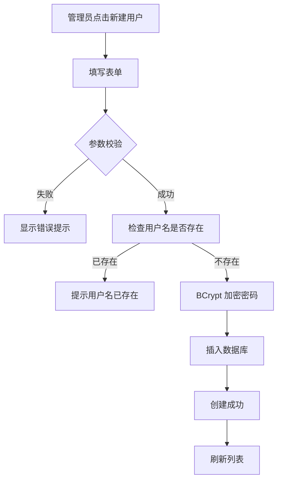
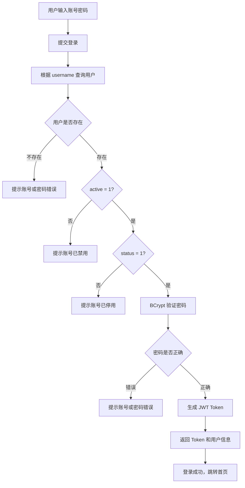

# 用户管理模块 - 产品需求文档 (PRD)

## 1. 文档信息

| 字段 | 内容 |
|-----|------|
| 模块名称 | 用户管理 (User Management) |
| 所属系统 | Harnax 管理后台 |
| 文档版本 | V1.0 |
| 编写日期 | 2026-04-20 |
| 优先级 | 🔴 P0（核心基础模块） |

---

## 2. 模块概述

### 2.1 功能定位

用户管理模块是 Harnax 平台的基础核心模块，负责管理系统用户的完整生命周期，包括：
- 用户的创建、查询、更新、删除（CRUD）
- 用户状态管理（启用/禁用）
- 管理员权限控制
- 用户认证与授权

### 2.2 核心价值

1. **统一用户管理**: 集中管理平台所有用户，支持管理员统一管理
2. **权限控制基础**: 通过 `is_admin` 字段实现管理员/普通用户权限分离
3. **数据安全**: 逻辑删除机制、密码加密存储、状态控制保障数据安全
4. **审计追踪**: 记录创建时间、更新时间，支持操作追溯

---

## 3. 数据实体设计

### 3.1 用户实体 (SysUser)

#### 3.1.1 数据库表结构

**表名**: `sys_user`  
**说明**: 系统用户表

| 字段名               | 数据类型 | 长度  | 可空 | 默认值                          | 说明                             | 约束 |
|-------------------|---------|-----|------|------------------------------|--------------------------------|------|
| `id`              | BIGINT | 20  | ❌ 否 | AUTO_INCREMENT               | 用户 ID（主键）                      | PRIMARY KEY |
| `username`        | VARCHAR | 50  | ❌ 否 | -                            | 用户名（登录账号）                      | UNIQUE KEY, NOT NULL |
| `password`        | VARCHAR | 100 | ❌ 否 | -                            | 密码（前端 base64，然后后端 BCrypt 加密存储） | NOT NULL |
| `nickname`        | VARCHAR | 50  | ❌ 否 | -                            | 昵称（显示名称）                       | - |
| `email`           | VARCHAR | 100 | ❌ 否 | -                            | 邮箱地址                           | - |
| `phone`           | VARCHAR | 20  | ❌ 否 | -                            | 手机号                            | - |
| `gender`          | TINYINT | 2   | ✅ 是 | 2                            | 性别 (0:女 1:男 2:未知)              | - |
| `avatar`          | VARCHAR | 255 | ✅ 是 | ""                           | 头像 URL                         | - |
| `status`          | TINYINT | 2   | ❌ 否 | 1                            | 状态 (0:禁用 1:启用)                 | - |
| `is_admin`        | TINYINT | 2   | ❌ 否 | 0                            | 是否管理员 (0:否 1:是)                | - |
| `active`          | TINYINT | 2   | ❌ 否 | 1                            | 逻辑删除标识 (0:已删除 1:正常)            | - |
| `last_login_time` | DATETIME | -   | ❌ 否 | CURRENT\_TIMESTAMP           | 最近一次登陆时间                       | - |
| `create_time`     | DATETIME | -   | ❌ 否 | CURRENT\_TIMESTAMP           | 创建时间                           | - |
| `update_time`     | DATETIME | -   | ❌ 否 | CURRENT\_TIMESTAMP ON UPDATE | 更新时间                           | - |

**索引设计**:
- `PRIMARY KEY (id)`: 主键索引
- `UNIQUE KEY uk_username (username)`: 用户名唯一索引
- `UNIQUE KEY uk_email (email)`: 邮箱唯一索引
- `UNIQUE KEY uk_phone (phone)`: 手机号唯一索引

#### 3.1.2 字段详细说明

**必填字段 (NOT NULL)**:

| 字段 | 业务规则 | 校验规则 | 示例值 |
|-----|---------|---------|--------|
| `username` | 用户登录账号，全局唯一 | - 长度：1-50 字符<br>- 格式：仅允许字母、数字、下划线<br>- 正则：`^[a-zA-Z0-9_]+$` | `admin`, `zhangsan`, `user_001` |
| `password` | 用户登录密码，BCrypt 加密存储 | - 长度：6-100 字符<br>- 前端传输明文，后端加密 | `123456` → `$2a$10$...` |
| `nickname` | 用户显示名称，用于 UI 展示 | - 长度：0-50 字符 | `张三`, `Admin` |
| `email` | 用户邮箱，用于通知和找回密码 | - 邮箱格式校验<br>- 正则：标准邮箱格式 | `zhangsan@example.com` |
| `phone` | 用户手机号，用于短信通知 | - 手机号格式校验<br>- 正则：`^1[3-9]\d{9}$` | `13800138000` |

**可选字段 (NULLABLE)**:

| 字段 | 业务规则 | 校验规则 | 示例值 |
|-----|---------|---------|--------|
| `gender` | 用户性别 | - 枚举值：0(女), 1(男), 2(未知)<br>- 默认值：2 | `0`, `1`, `2` |
| `avatar` | 用户头像 URL | - URL 格式校验<br>- 最大长度：255 字符 | `https://example.com/avatar.jpg` |

**系统字段**:

| 字段 | 业务规则 | 说明 |
|-----|---------|------|
| `status` | 0:禁用（不可登录）<br>1:启用（可登录）<br>默认值：1 | 控制用户是否可登录系统 |
| `is_admin` | 0:普通用户<br>1:管理员<br>默认值：0 | 控制用户权限级别，管理员可访问用户管理页面 |
| `active` | 0:已删除（逻辑删除）<br>1:正常<br>默认值：1 | 逻辑删除标识，不物理删除数据 |
| `last_login_time` | 登录时自动更新 | 记录用户最近一次登录时间 |
| `create_time` | 创建时自动填充 | 记录用户创建时间 |
| `update_time` | 每次更新自动刷新 | 记录最后一次修改时间 |

---

### 3.2 DTO 对象设计

#### 3.2.1 创建请求 (SysUserCreateRequest)

| 字段 | 类型 | 必填 | 校验规则 | 默认值 | 说明 |
|-----|------|------|---------|--------|------|
| `username` | String | ✅ 是 | - 正则：`^[a-zA-Z0-9_]+$`<br>- 长度：1-50 | - | 用户名 |
| `password` | String | ✅ 是 | - 长度：6-100 | - | 密码（明文） |
| `nickname` | String | ✅ 是 | - 长度：0-50 | `""` | 昵称 |
| `email` | String | ✅ 是 | - 邮箱格式 | `""` | 邮箱 |
| `phone` | String | ✅ 是 | - 正则：`^1[3-9]\d{9}$` | `""` | 手机号 |
| `gender` | Int | ❌ 否 | - 枚举：0,1,2 | `2` | 性别 |
| `avatar` | String | ❌ 否 | - URL 格式 | `""` | 头像 URL |

**注意事项**:
- 创建时 `password` 为必填，后端会进行 BCrypt 加密

---

#### 3.2.2 更新请求 (SysUserUpdateRequest)

| 字段 | 类型 | 必填 | 校验规则 | 说明 |
|-----|------|------|---------|------|
| `id` | Long | ✅ 是 | - 路径参数 | 用户 ID（从 URL 获取） |
| `username` | String | ❌ 否 | - 只读，不可修改 | 用户名（更新时不允许修改） |
| `nickname` | String | ❌ 否 | - 长度：0-50 | 昵称 |
| `email` | String | ❌ 否 | - 邮箱格式 | 邮箱 |
| `phone` | String | ❌ 否 | - 正则：`^1[3-9]\d{9}$` 或空 | 手机号 |
| `gender` | Int | ❌ 否 | - 枚举：0,1,2 | 性别 |
| `avatar` | String | ❌ 否 | - URL 格式 | 头像 URL |

**更新规则**:
- 所有字段为 `null` 时不更新该字段（部分更新）
- `username` 标记为只读，更新接口不接受用户名修改
- `status` 不在这里更新，有统一的 toggle 接口更新状态

---

#### 3.2.3 响应对象 (SysUserResponse)

| 字段           | 类型 | 说明 | 示例值 |
|--------------|------|------|--------|
| `id`         | Long | 用户 ID | `1` |
| `username`   | String | 用户名 | `admin` |
| `nickname`   | String | 昵称 | `管理员` |
| `email`      | String | 邮箱 | `admin@example.com` |
| `phone`      | String | 手机号 | `13800138000` |
| `gender`     | Int | 性别 | `1` |
| `avatar`     | String | 头像 URL | `https://example.com/avatar.jpg` |
| `status`     | Int | 状态 | `1` |
| `is_admin`   | Int | 是否管理员 | `1` |
| `last_login_time` | LocalDateTime | 最近一次登录时间 | `2026-03-05 12:00:00` |
| `createTime` | LocalDateTime | 创建时间 | `2026-03-05 12:00:00` |
| `updateTime` | LocalDateTime | 更新时间 | `2026-03-05 12:00:00` |

**注意事项**:
- 响应中**不包含** `password` 字段（安全考虑）
- 响应中**不包含** `active` 字段（内部使用）

---

## 4. CRUD 操作逻辑

### 4.1 创建用户 (Create)

#### 4.1.1 接口信息

- **接口路径**: `POST /admin/users`
- **权限要求**: 管理员 (`is_admin = 1`)
- **Content-Type**: `application/json`

#### 4.1.2 请求示例

```json
{
  "username": "zhangsan",
  "password": "123456",
  "nickname": "张三",
  "email": "zhangsan@example.com",
  "phone": "13800138000",
  "gender": 1,
  "avatar": "https://example.com/avatar.jpg",
  "status": 1,
  "is_admin": 0
}
```

#### 4.1.3 业务逻辑

```
1. 接收 SysUserCreateRequest 请求
   ↓
2. 参数校验（@Valid）
   - username 格式校验
   - password 长度校验
   - email 格式校验
   - phone 格式校验
   ↓
3. 检查用户名是否已存在
   - 查询数据库：SELECT * FROM sys_user WHERE username = #{username} AND active = 1
   - 如果存在 → 抛出 BizException("用户名已存在")
   ↓
4. 密码加密
   - 使用 BCrypt 加密：BCrypt.hashpw(rawPassword, BCrypt.gensalt())
   ↓
5. 构建 SysUser 实体
   - 设置默认值：status=1, is_admin=0, active=1
   - 设置时间：createTime, updateTime = LocalDateTime.now()
   ↓
6. 插入数据库
   - INSERT INTO sys_user (...)
   ↓
7. 返回结果
   - 成功：ResultVo.success()
   - 失败：ResultVo.error("创建用户失败")
```

#### 4.1.4 异常处理

| 异常场景 | 错误码 | 错误信息 | 处理方式 |
|---------|--------|---------|---------|
| 用户名已存在 | 400 | "用户名已存在" | 提示用户更换用户名 |
| 参数校验失败 | 400 | 具体校验错误信息 | 显示表单校验错误 |
| 数据库异常 | 500 | "创建用户失败" | 记录日志，提示重试 |
| 无权限 | 403 | "无权限操作" | 拦截器拦截 |

---

### 4.2 查询用户列表 (Read - List)

#### 4.2.1 接口信息

- **接口路径**: `GET /admin/users/page`
- **权限要求**: 管理员
- **请求方式**: Query Parameters

#### 4.2.2 请求参数

| 参数名 | 类型 | 必填 | 默认值 | 说明 | 示例值 |
|--------|------|------|--------|------|--------|
| `pageNum` | Int | ❌ 否 | 1 | 页码 | `1` |
| `pageSize` | Int | ❌ 否 | 10 | 每页大小 | `10` |
| `keyword` | String | ❌ 否 | - | 模糊搜索关键字 | `zhang` |
| `status` | Int | ❌ 否 | - | 状态筛选 (0/1) | `1` |

#### 4.2.3 响应示例

```json
{
  "code": 200,
  "message": "success",
  "data": {
    "total": 100,
    "size": 10,
    "current": 1,
    "pages": 10,
    "records": [
      {
        "id": 1,
        "username": "admin",
        "nickname": "管理员",
        "email": "admin@example.com",
        "phone": "13800138000",
        "gender": 1,
        "avatar": "https://example.com/avatar.jpg",
        "status": 1,
        "is_admin": 1,
        "createTime": "2026-03-05T12:00:00",
        "updateTime": "2026-03-05T12:00:00"
      }
    ]
  }
}
```

#### 4.2.4 业务逻辑

```
1. 接收查询参数
   ↓
2. 构建查询条件
   - active = 1（只查询未删除用户）
   - keyword 模糊搜索：username LIKE '%{keyword}%' OR nickname LIKE '%{keyword}%'
   - status 精确匹配（如果有传参）
   ↓
3. 执行分页查询
   - 使用 PageHelper 分页插件
   - SELECT * FROM sys_user WHERE ... ORDER BY create_time DESC
   ↓
4. 转换为 SysUserResponse
   - 排除 password 和 active 字段
   ↓
5. 返回分页结果
```

#### 4.2.5 SQL 示例

```xml
<select id="selectUserPage" resultType="SysUser">
    SELECT * FROM sys_user
    WHERE active = 1
    <if test="keyword != null and keyword != ''">
        AND (username LIKE CONCAT('%', #{keyword}, '%') 
             OR nickname LIKE CONCAT('%', #{keyword}, '%'))
    </if>
    <if test="status != null">
        AND status = #{status}
    </if>
    ORDER BY create_time DESC
</select>
```

---

### 4.3 查询用户详情 (Read - Detail)

#### 4.3.1 接口信息

- **接口路径**: `GET /admin/users/{id}`
- **权限要求**: 管理员

#### 4.3.2 业务逻辑

```
1. 接收用户 ID（路径参数）
   ↓
2. 查询数据库
   - SELECT * FROM sys_user WHERE id = #{id} AND active = 1
   ↓
3. 判断用户是否存在
   - 不存在 → 抛出 BizException("用户不存在")
   ↓
4. 转换为 SysUserResponse
   ↓
5. 返回用户详情
```

#### 4.3.3 异常处理

| 异常场景 | 错误信息 | 处理方式 |
|---------|---------|---------|
| 用户不存在 | "用户不存在" | 提示 404 |
| 用户已删除 | "用户不存在" | 同不存在处理 |

---

### 4.4 更新用户 (Update)

#### 4.4.1 接口信息

- **接口路径**: `PUT /admin/users/update/{userId}`
- **权限要求**: 管理员
- **Content-Type**: `application/json`

#### 4.4.2 请求示例

```json
{
  "nickname": "张三（更新）",
  "email": "zhangsan_new@example.com",
  "phone": "13900139000",
  "gender": 1
}
```

#### 4.4.3 业务逻辑

```
1. 接收 userId 和 SysUserUpdateRequest
   ↓
2. 查询原用户信息
   - SELECT * FROM sys_user WHERE id = #{userId} AND active = 1
   - 不存在 → 抛出 BizException("用户不存在")
   ↓
3. 参数校验
   - email 格式
   - phone 格式
   - password 长度（如果有传）
   ↓
4. 部分更新（只更新非 null 字段）
   - nickname != null → 更新 nickname
   - email != null → 更新 email
   - phone != null → 更新 phone
   - gender != null → 更新 gender
   - avatar != null → 更新 avatar
   - password != null → 加密后更新 password
   - is_admin != null → 更新 is_admin
   ↓
5. 更新时间
   - updateTime = LocalDateTime.now()
   ↓
6. 执行更新
   - UPDATE sys_user SET ... WHERE id = #{userId}
   ↓
7. 返回结果
```

#### 4.4.4 更新规则

| 字段 | 更新规则 | 说明 |
|-----|---------|------|
| `username` | ❌ 不允许修改 | 用户名作为唯一标识，创建后不可修改 |
| `password` | ⚠️ 可选更新 | 为空则不修改，不为空则加密后更新 |
| `nickname` | ✅ 可更新 | - |
| `email` | ✅ 可更新 | - |
| `phone` | ✅ 可更新 | - |
| `gender` | ✅ 可更新 | - |
| `avatar` | ✅ 可更新 | - |
| `status` | ⚠️ 建议用独立接口 | 使用 `toggleUserStatus` 接口 |
| `is_admin` | ✅ 可更新 | 仅管理员可修改 |

#### 4.4.5 注意事项

⚠️ **重要**:
- 更新操作是**部分更新**，只传递需要修改的字段
- 不传递的字段保持原值不变
- `username` 字段在更新接口中标记为只读（`accessMode = READ_ONLY`）

---

### 4.5 切换用户状态 (Toggle Status)

#### 4.5.1 接口信息

- **接口路径**: `PUT /admin/users/toggle/{userId}`
- **权限要求**: 管理员
- **请求参数**: Query Parameter `status`

#### 4.5.2 请求示例

```
PUT /admin/users/toggle/1?status=0
```

#### 4.5.3 业务逻辑

```
1. 接收 userId 和 status
   ↓
2. 查询用户
   - SELECT * FROM sys_user WHERE id = #{userId} AND active = 1
   - 不存在 → 抛出 BizException("用户不存在")
   ↓
3. 更新状态
   - UPDATE sys_user SET status = #{status}, update_time = NOW() WHERE id = #{userId}
   ↓
4. 返回结果
   - 成功：ResultVo.success()
   - 失败：ResultVo.error("更新用户失败")
```

#### 4.5.4 状态说明

| status 值 | 说明 | 影响 |
|-----------|------|------|
| `0` | 禁用 | 用户无法登录系统，但数据保留 |
| `1` | 启用 | 用户可以正常登录 |

#### 4.5.5 使用场景

- 用户违规：禁用账号
- 员工离职：禁用账号
- 临时封禁：禁用后恢复

---

### 4.6 删除用户 (Delete)

#### 4.6.1 接口信息

- **接口路径**: `DELETE /admin/users/{userId}`
- **权限要求**: 管理员

#### 4.6.2 业务逻辑

```
1. 接收 userId
   ↓
2. 查询用户
   - SELECT * FROM sys_user WHERE id = #{userId} AND active = 1
   - 不存在 → 抛出 BizException("用户不存在")
   ↓
3. 逻辑删除（非物理删除）
   - UPDATE sys_user SET active = 0, update_time = NOW() WHERE id = #{userId}
   ↓
4. 返回结果
```

#### 4.6.3 删除规则

✅ **逻辑删除**（推荐）:
- 仅修改 `active` 字段为 0
- 数据保留在数据库中
- 用户无法登录（查询时过滤 active=0）
- 可追溯历史记录

❌ **物理删除**（不推荐）:
- 直接 DELETE 记录
- 数据永久丢失
- 无法追溯

#### 4.6.4 删除影响

| 影响范围 | 说明 |
|---------|------|
| 登录 | 用户无法登录（active=0 被过滤） |
| 关联数据 | 用户创建的资源仍保留（Agent、Model 等） |
| 数据追溯 | 可通过数据库查询历史记录 |

---

### 4.7 根据用户名查询 (GetByUsername)

#### 4.7.1 使用场景

- 用户登录时查询用户
- 检查用户名是否已存在

#### 4.7.2 业务逻辑

```
1. 接收 username
   ↓
2. 查询数据库
   - SELECT * FROM sys_user WHERE username = #{username} AND active = 1
   ↓
3. 返回结果
   - 找到：返回 SysUser 实体
   - 未找到：返回 null
```

#### 4.7.3 注意事项

- 此接口**不对外暴露**为 REST API
- 仅用于 Service 层内部调用
- 登录认证时调用

---

## 5. 前端页面设计

### 5.1 页面布局

```
┌─────────────────────────────────────────────────────┐
│  用户管理                                            │
├─────────────────────────────────────────────────────┤
│  [搜索框: keyword]  [状态: 全部▼]  [搜索] [新建用户]  │
├─────────────────────────────────────────────────────┤
│  ┌────┬────────┬────────┬──────────┬──────┬────┬───┐│
│  │ ID │ 用户名  │ 昵称    │ 邮箱      │ 状态 │ 操作 ││
│  ├────┼────────┼────────┼──────────┼──────┼────┼───┤│
│  │ 1  │ admin  │ 管理员  │ admin@.. │ ✅   │ ✏️🗑️││
│  │ 2  │ zhangsan│ 张三  │ zhang@.. │ ✅   │ ✏️🗑️││
│  └────┴────────┴────────┴──────────┴──────┴────┴───┘│
│                                        [1] 2 3 4 5  │
└─────────────────────────────────────────────────────┘
```

### 5.2 表格列定义

| 列名 | 字段 | 宽度 | 显示格式 | 说明 |
|-----|------|------|---------|------|
| ID | id | 80px | 数字 | 主键 ID |
| 用户名 | username | 150px | 文本 | 登录账号 |
| 昵称 | nickname | 120px | 文本 | 显示名称 |
| 邮箱 | email | 200px | 文本 | 邮箱地址 |
| 手机号 | phone | 130px | 文本 | 手机号 |
| 性别 | gender | 80px | 标签：男/女/未知 | 0:女, 1:男, 2:未知 |
| 是否管理员 | isAdmin | 100px | 标签：是/否 | 是(1), 否(0) |
| 状态 | status | 100px | 开关组件 | 启用/禁用 |
| 创建时间 | createTime | 180px | 日期时间 | YYYY-MM-DD HH:mm:ss |
| 操作 | - | 150px | 按钮组 | 编辑、删除 |

### 5.3 搜索表单

| 字段 | 类型 | 占位符 | 说明 |
|-----|------|--------|------|
| keyword | Input | "请输入用户名或昵称" | 模糊搜索 |
| status | Select | "全部" | 选项：全部/启用/禁用 |

### 5.4 新建/编辑表单

| 字段 | 类型 | 必填 | 校验规则 | 默认值 |
|-----|------|------|---------|--------|
| 用户名 | Input | ✅ | 字母、数字、下划线，1-50 字符 | - |
| 密码 | Input.Password | ✅ (新建) | 6-100 字符 | - |
| 昵称 | Input | ❌ | 最大 50 字符 | - |
| 邮箱 | Input | ❌ | 邮箱格式 | - |
| 手机号 | Input | ❌ | 中国大陆手机号 | - |
| 性别 | Radio | ❌ | 男/女/未知 | 未知 |
| 头像 URL | Input | ❌ | URL 格式 | - |
| 是否管理员 | Switch | ❌ | 是/否 | 否 |
| 状态 | Switch | ❌ | 启用/禁用 | 启用 |

**新建 vs 编辑区别**:
- 新建时 `password` 必填
- 编辑时 `username` 禁用（只读）
- 编辑时 `password` 选填（为空则不修改）

---

## 6. 权限控制

### 6.1 访问权限

| 操作 | 普通用户 | 管理员 | 说明 |
|-----|---------|--------|------|
| 查看用户列表 | ❌ | ✅ | 仅管理员可见 |
| 查看用户详情 | ❌ | ✅ | - |
| 创建用户 | ❌ | ✅ | - |
| 更新用户 | ❌ | ✅ | - |
| 切换状态 | ❌ | ✅ | - |
| 删除用户 | ❌ | ✅ | - |

### 6.2 前端权限控制

```typescript
// 路由配置
{
  path: '/user',
  name: '用户管理',
  icon: 'user',
  access: 'isAdmin',  // 仅管理员可访问
  component: './user/management',
}

// 按钮权限
{access?.isAdmin && <Button>新建用户</Button>}
```

### 6.3 后端权限控制

```kotlin
// JWT 拦截器验证
if (!user.isAdmin) {
    throw BizException("无权限操作")
}
```

---

## 7. 安全性设计

### 7.1 密码安全

✅ **BCrypt 加密**:
```kotlin
// 加密
val encodedPassword = BCrypt.hashpw(rawPassword, BCrypt.gensalt())

// 验证
val isMatch = BCrypt.checkpw(rawPassword, encodedPassword)
```

✅ **密码策略**:
- 最小长度：6 字符
- 最大长度：100 字符
- 不限制复杂度（可根据需求增强）

### 7.2 数据隔离

✅ **逻辑删除**:
- 所有查询自动过滤 `active = 0` 的数据
- 删除操作仅修改 `active` 字段

✅ **敏感字段过滤**:
- 响应中不包含 `password` 字段
- 响应中不包含 `active` 字段

### 7.3 接口安全

✅ **JWT 认证**: 所有接口需携带 Token  
✅ **权限校验**: 管理员接口校验 `is_admin` 字段  
✅ **参数校验**: 使用 `@Valid` 注解校验请求参数  
✅ **SQL 注入防护**: MyBatis 参数化查询

---

## 8. 异常场景处理

### 8.1 完整异常矩阵

| 场景 | 触发条件 | 错误码 | 错误信息 | 前端处理 |
|-----|---------|--------|---------|---------|
| 用户名已存在 | 创建/更新时用户名重复 | 400 | "用户名已存在" | 表单提示 |
| 用户不存在 | 查询/更新/删除时 ID 无效 | 404 | "用户不存在" | 提示并返回列表 |
| 参数校验失败 | 请求参数不符合规则 | 400 | 具体校验信息 | 表单显示错误 |
| 无权限 | 非管理员访问 | 403 | "无权限操作" | 跳转 403 页面 |
| 密码长度错误 | 密码 < 6 或 > 100 | 400 | "密码长度必须在 6-100 之间" | 表单提示 |
| 邮箱格式错误 | 邮箱不符合标准格式 | 400 | "邮箱格式不正确" | 表单提示 |
| 手机号格式错误 | 手机号不符合规则 | 400 | "手机号格式不正确" | 表单提示 |
| 数据库异常 | SQL 执行失败 | 500 | "操作失败，请重试" | Toast 提示 |

---

## 9. 业务流程图

### 9.1 用户创建流程



### 9.2 用户登录流程



---

## 10. 测试用例

### 10.1 功能测试

| 用例 ID | 测试场景 | 前置条件 | 操作步骤 | 预期结果 |
|---------|---------|---------|---------|---------|
| TC-001 | 创建用户-成功 | 管理员登录 | 填写完整信息提交 | 创建成功，列表显示新用户 |
| TC-002 | 创建用户-用户名重复 | 管理员登录 | 使用已存在的用户名 | 提示"用户名已存在" |
| TC-003 | 创建用户-密码过短 | 管理员登录 | 密码输入"123" | 提示"密码长度必须在 6-100 之间" |
| TC-004 | 创建用户-邮箱格式错误 | 管理员登录 | 邮箱输入"invalid" | 提示"邮箱格式不正确" |
| TC-005 | 查询用户列表-模糊搜索 | 有用户数据 | 输入 keyword="zhang" | 显示匹配的用户 |
| TC-006 | 查询用户列表-状态筛选 | 有用户数据 | 选择 status=0 | 只显示禁用用户 |
| TC-007 | 更新用户-修改昵称 | 管理员登录 | 修改昵称为"新昵称" | 更新成功 |
| TC-008 | 更新用户-修改密码 | 管理员登录 | 输入新密码 | 密码更新，可用新密码登录 |
| TC-009 | 切换用户状态-禁用 | 管理员登录 | 切换开关为禁用 | 用户状态变为 0，无法登录 |
| TC-010 | 删除用户-逻辑删除 | 管理员登录 | 点击删除按钮 | active=0，列表不显示 |

### 10.2 集成测试（Testcontainers）

已实现完整集成测试，参考文件：
- `SysUserServiceImplIntegrationTest.kt`
- 使用 Testcontainers 启动真实 MySQL
- 覆盖完整 CRUD 流程
- 测试数据隔离和异常处理

---

## 11. 性能优化

### 11.1 数据库优化

✅ **索引设计**:
- `uk_username`: 用户名唯一索引，加速登录查询
- 主键索引：加速按 ID 查询

✅ **分页优化**:
- 使用 PageHelper 插件
- 避免 OFFSET 过大时的性能问题

### 11.2 查询优化

✅ **只查询必要字段**:
```xml
<!-- 列表查询不返回 password -->
SELECT id, username, nickname, email, phone, gender, avatar, status, is_admin, create_time, update_time
FROM sys_user
```

✅ **逻辑删除过滤**:
- 所有查询自动添加 `WHERE active = 1`

---

## 12. 扩展规划

### 12.1 短期优化（V1.2）

- [ ] 批量导入用户（Excel）
- [ ] 批量导出用户
- [ ] 批量启用/禁用
- [ ] 密码强度校验（大小写+数字+特殊字符）

### 12.2 中期优化（V2.0）

- [ ] 用户头像上传（OSS 存储）
- [ ] 登录日志记录
- [ ] 操作审计日志
- [ ] 多因素认证（MFA）

### 12.3 长期优化（V3.0）

- [ ] SSO 单点登录集成
- [ ] LDAP/AD 域集成
- [ ] 用户角色权限细化（RBAC）
- [ ] 用户分组管理

---

## 13. 附录

### 13.1 枚举值字典

**性别 (gender)**:
| 值 | 说明 |
|----|------|
| 0 | 女 |
| 1 | 男 |
| 2 | 未知（默认） |

**状态 (status)**:
| 值 | 说明 |
|----|------|
| 0 | 禁用（不可登录） |
| 1 | 启用（可登录，默认） |

**是否管理员 (is_admin)**:
| 值 | 说明 |
|----|------|
| 0 | 普通用户（默认） |
| 1 | 管理员 |

**逻辑删除 (active)**:
| 值 | 说明 |
|----|------|
| 0 | 已删除 |
| 1 | 正常（默认） |

### 13.2 相关文件清单

**后端文件**:
- Entity: `SysUser.kt`
- DTO: `SysUserCreateRequest.kt`, `SysUserUpdateRequest.kt`, `SysUserResponse.kt`
- Service: `SysUserService.kt`, `SysUserServiceImpl.kt`
- Controller: `SysUserController.kt`
- Mapper: `SysUserMapper.kt`, `SysUserMapper.xml`

**前端文件**:
- 页面: `harnax-webui/src/pages/user/management/index.tsx`
- 服务: `harnax-webui/src/services/ant-design-pro/user.ts`
- 路由: `harnax-webui/config/routes.ts`

**测试文件**:
- 单元测试: `SysUserServiceImplTest.kt`
- 集成测试: `SysUserServiceImplIntegrationTest.kt`

### 13.3 SQL 脚本

```sql
-- 创建用户表
CREATE TABLE `sys_user` (
    `id` BIGINT(20) NOT NULL AUTO_INCREMENT COMMENT '用户 ID',
    `username` VARCHAR(50) NOT NULL COMMENT '用户名',
    `password` VARCHAR(100) NOT NULL COMMENT '密码',
    `nickname` VARCHAR(50) DEFAULT NULL COMMENT '昵称',
    `email` VARCHAR(100) DEFAULT NULL COMMENT '邮箱',
    `phone` VARCHAR(20) DEFAULT NULL COMMENT '手机号',
    `gender` TINYINT(2) DEFAULT 2 COMMENT '性别 (0:女 1:男 2:未知)',
    `avatar` VARCHAR(255) DEFAULT NULL COMMENT '头像 URL',
    `status` TINYINT(2) DEFAULT 1 COMMENT '状态 (0:禁用 1:使用)',
    `is_admin` TINYINT(2) DEFAULT 0 COMMENT '是否是管理员（0:否，1:是）',
    `active` TINYINT(2) DEFAULT 1 COMMENT '状态 (0:已删除 1:未删除)',
    `create_time` DATETIME DEFAULT CURRENT_TIMESTAMP COMMENT '创建时间',
    `update_time` DATETIME DEFAULT CURRENT_TIMESTAMP ON UPDATE CURRENT_TIMESTAMP COMMENT '更新时间',
    PRIMARY KEY (`id`),
    UNIQUE KEY `uk_username` (`username`)
) ENGINE=InnoDB DEFAULT CHARSET=utf8mb4 COMMENT='用户表';
```

---

*文档结束 - 用户管理模块 PRD V1.0*
