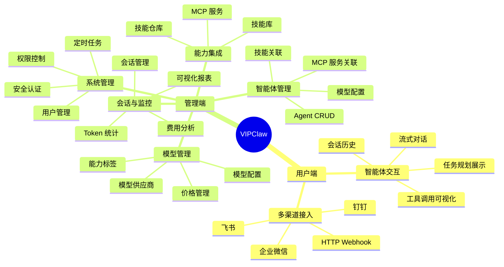
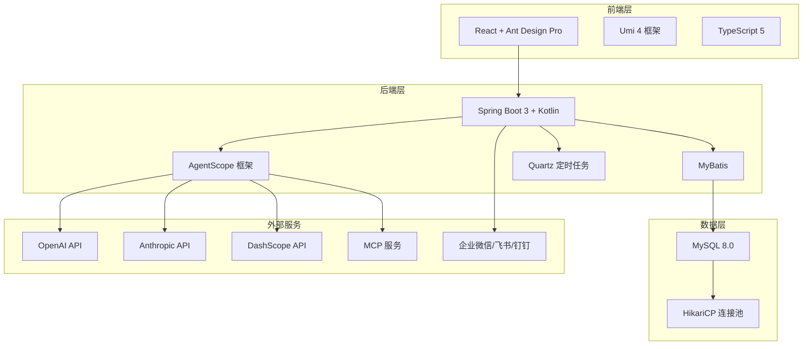
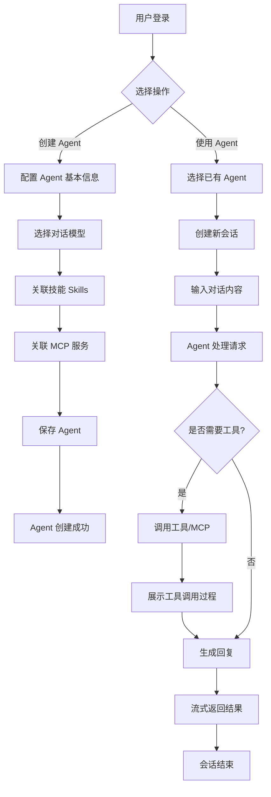
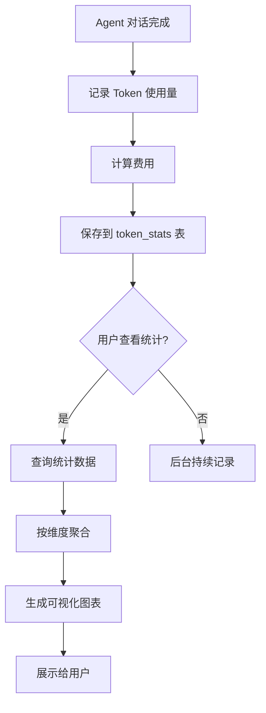
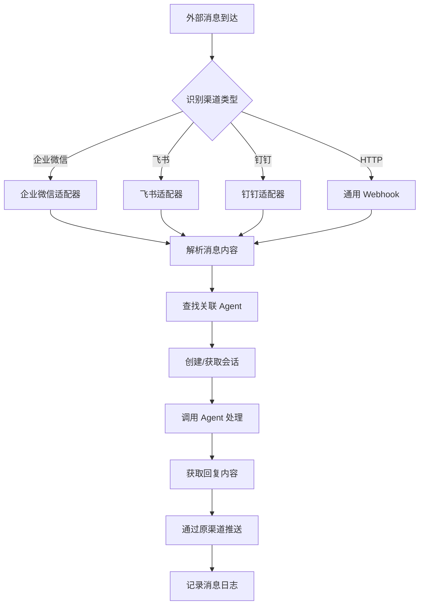
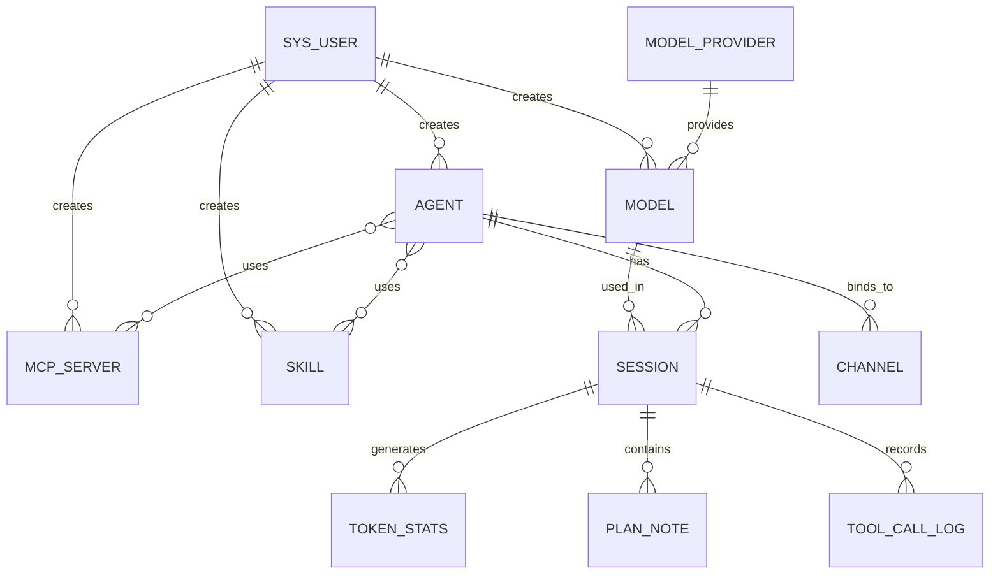

# VIPClaw 产品需求文档 (PRD)

## 1. 文档信息

| 字段 | 内容 |
|-----|------|
| 产品名称 | VIPClaw - 企业级 AI Agent 管理平台 |
| 文档版本 | V1.0 |
| 编写日期 | 2026-04-20 |
| 编写人 | AI Assistant |
| 最后更新 | 2026-04-20 |
| 项目状态 | 已上线（持续迭代中） |

---

## 2. 项目背景

### 2.1 业务目标

随着大语言模型（LLM）技术的快速发展，企业迫切需要统一的平台来管理多种 AI 模型、构建智能体（Agent）、并将其集成到现有业务流程中。VIPClaw 旨在解决以下核心问题：

1. **模型碎片化**: 企业使用多个 AI 供应商（OpenAI、Anthropic、DashScope 等），需要统一管理入口
2. **Agent 构建复杂**: 开发 AI Agent 需要整合模型、工具、技能，缺乏可视化编排工具
3. **成本不透明**: Token 消耗难以追踪和统计，缺乏费用监控和预警机制
4. **企业集成困难**: 将 AI 能力接入企业微信、飞书、钉钉等内部系统需要大量开发工作
5. **权限与安全**: 多用户环境下需要完善的权限控制和数据隔离机制

**预期目标**:
- 降低 AI Agent 开发门槛，非技术人员也能配置和使用 Agent
- 统一管理多模型供应商，实现模型能力的标准化接入
- 提供完整的 Token 消耗监控，帮助企业控制 AI 使用成本
- 支持企业级多渠道接入，快速将 AI 能力部署到业务系统

### 2.2 目标用户

| 用户类型 | 用户画像 | 核心诉求 |
|---------|---------|---------|
| AI 应用开发者 | 25-35 岁，技术人员，熟悉 AI 技术栈 | 快速构建和调试 Agent，灵活配置模型和技能 |
| 企业 IT 管理员 | 30-45 岁，运维/架构师，关注系统稳定性 | 统一管理 AI 资源，监控成本，保障安全 |
| 业务运营人员 | 25-40 岁，非技术背景，使用 Agent 处理业务 | 简单易用的对话界面，无需编码即可使用 AI |
| 企业管理层 | 35-50 岁，决策者，关注 ROI 和效率提升 | 查看使用统计和费用报表，评估 AI 投入产出 |

### 2.3 核心价值主张

**"一站式 AI Agent 编排与企业管理平台，让企业轻松构建、部署和监控智能应用。"**

---

## 3. 产品架构

### 3.1 功能架构图

### 3.2 用户角色定义

| 角色名称 | 角色描述 | 主要权限 |
|---------|---------|---------|
| 普通用户 | 使用 Agent 进行对话和任务处理 | 查看和使用公开的 Agent、模型、技能；管理自己创建的资源 |
| 管理员 | 系统管理员，负责平台运维和资源管理 | 所有资源的 CRUD、用户管理、系统配置、查看所有数据 |
| 超级管理员 | 平台最高权限管理员 | 管理员权限 + 系统级配置、全局统计、安全策略管理 |

### 3.3 技术架构

---

## 4. 核心业务流程

### 4.1 Agent 创建与对话流程

### 4.2 Token 消耗统计流程

### 4.3 多渠道消息推送流程

---

## 5. 详细功能说明

### 5.1 智能体管理模块

#### 5.1.1 Agent 列表与查询

| 字段 | 说明 |
|-----|------|
| **功能编号** | F-AGENT-01 |
| **功能描述** | 用户可以查看、搜索和筛选自己创建或公开的智能体列表 |
| **前置条件** | 用户已登录 |
| **优先级** | P0 |

**页面元素**：

| 元素 | 类型 | 说明 | 校验规则 |
|-----|------|-----|---------|
| 搜索框 | 输入框 | 按 Agent 名称模糊搜索 | 最大 100 字符 |
| 状态筛选 | 下拉选择 | 全部/启用/停用 | - |
| 数据表格 | 表格 | 展示 Agent 列表 | 分页显示，默认 10 条/页 |
| 新建按钮 | 按钮 | 打开创建表单 | 需要登录 |

**交互逻辑**：

1. 用户进入 Agent 管理页面
2. 系统查询当前用户创建的 Agent 和 is_public=1 的 Agent
3. 用户可输入名称进行搜索，点击搜索按钮触发查询
4. 用户可选择状态筛选条件
5. 表格展示 Agent 名称、描述、模型、状态、创建人、创建时间
6. 点击分页控件切换页面

**异常处理**：

| 异常场景 | 处理方式 |
|---------|---------|
| 网络请求失败 | 显示错误提示，提供重试按钮 |
| 无数据 | 显示空状态提示，引导用户创建 Agent |

---

#### 5.1.2 Agent 创建

| 字段 | 说明 |
|-----|------|
| **功能编号** | F-AGENT-02 |
| **功能描述** | 用户创建新的 AI Agent，配置基本信息、模型、技能和 MCP 服务 |
| **前置条件** | 用户已登录，系统中至少有一个可用模型 |
| **优先级** | P0 |

**页面元素**：

| 元素 | 类型 | 说明 | 校验规则 |
|-----|------|-----|---------|
| Agent 名称 | 输入框 | 智能体名称 | 必填，1-100 字符，全局唯一 |
| Agent 描述 | 文本域 | 智能体功能描述 | 选填，最大 500 字符 |
| 系统提示词 | Markdown 编辑器 | Agent 的系统角色设定 | 必填，支持 Markdown 语法 |
| 对话模型 | 下拉选择 | 选择 AI 模型 | 必填，从可用模型列表选择 |
| 关联技能 | 多选框 | 选择要关联的技能 | 选填，支持多选 |
| 关联 MCP | 动态表单 | 配置 MCP 服务及是否允许跳过 | 选填，每个 MCP 可设置 enable_skip |
| 所有者 | 输入框 | Agent 所有者标识 | 选填，默认当前用户 |
| 状态 | 单选按钮 | 启用/禁用 | 默认启用 |
| 是否公开 | 开关 | 是否对其他用户可见 | 默认不公开 |

**交互逻辑**：

1. 用户点击"新建 Agent"按钮
2. 系统弹出创建表单对话框
3. 用户填写必填字段（名称、系统提示词、模型）
4. 用户可选择关联技能和 MCP 服务
5. 点击"保存"按钮提交表单
6. 系统校验数据，创建 Agent 记录
7. 创建成功后关闭对话框，刷新列表，显示成功提示

**异常处理**：

| 异常场景 | 处理方式 |
|---------|---------|
| 名称已存在 | 提示"Agent 名称已存在，请使用其他名称" |
| 未选择模型 | 提示"请选择对话模型" |
| 网络请求失败 | 提示"创建失败，请重试" |

---

#### 5.1.3 Agent 状态切换

| 字段 | 说明 |
|-----|------|
| **功能编号** | F-AGENT-03 |
| **功能描述** | 用户可以启用或禁用 Agent，禁用后该 Agent 不可被使用 |
| **前置条件** | Agent 已存在 |
| **优先级** | P0 |

**交互逻辑**：

1. 用户在 Agent 列表中点击状态开关
2. 系统调用状态切换接口
3. 切换成功后更新表格中的状态显示
4. 显示操作成功提示

**异常处理**：

| 异常场景 | 处理方式 |
|---------|---------|
| Agent 不存在 | 提示"Agent 不存在" |
| 网络请求失败 | 开关恢复原状态，提示"操作失败" |

---

### 5.2 模型管理模块

#### 5.2.1 模型列表与筛选

| 字段 | 说明 |
|-----|------|
| **功能编号** | F-MODEL-01 |
| **功能描述** | 用户查看模型列表，支持多维度筛选和价格范围查询 |
| **前置条件** | 用户已登录 |
| **优先级** | P0 |

**页面元素**：

| 元素 | 类型 | 说明 | 校验规则 |
|-----|------|-----|---------|
| 名称搜索 | 输入框 | 按模型名称搜索 | 最大 100 字符 |
| 供应商筛选 | 下拉选择 | 按供应商过滤 | - |
| 能力标签 | 多选标签 | 联网/推理/工具/MCP/视觉 | 支持多选 |
| 价格范围 | 数字输入框 | 最低价格和最高价格 | 非负数 |
| 数据表格 | 表格 | 展示模型列表 | 显示名称、供应商、类型、能力标签、价格、状态 |

**交互逻辑**：

1. 用户进入模型管理页面
2. 系统加载模型列表和供应商选项
3. 用户可组合多个筛选条件
4. 点击"查询"按钮触发筛选
5. 表格实时更新显示结果

---

#### 5.2.2 模型创建与能力配置

| 字段 | 说明 |
|-----|------|
| **功能编号** | F-MODEL-02 |
| **功能描述** | 用户创建新模型，配置模型参数和能力标签 |
| **前置条件** | 至少有一个可用的模型供应商 |
| **优先级** | P0 |

**页面元素**：

| 元素 | 类型 | 说明 | 校验规则 |
|-----|------|-----|---------|
| 模型名称 | 输入框 | 显示名称 | 必填，1-100 字符 |
| 模型标识 | 输入框 | 调用模型的标识（如 gpt-4） | 必填，全局唯一 |
| 供应商 | 下拉选择 | 选择模型供应商 | 必填 |
| 模型类型 | 单选 | chat/embedding | 默认 chat |
| 支持联网 | 开关 | 是否支持联网搜索 | 默认关闭 |
| 支持推理 | 开关 | 是否支持深度推理 | 默认关闭 |
| 支持工具 | 开关 | 是否支持工具调用 | 默认关闭 |
| 支持 MCP | 开关 | 是否支持 MCP 协议 | 默认关闭 |
| 支持视觉 | 开关 | 是否支持图像理解 | 默认关闭 |
| 价格 | 数字输入框 | 元/百万 Token | 必填，非负数 |

**交互逻辑**：

1. 用户点击"新建模型"按钮
2. 填写模型基本信息和能力标签
3. 输入价格（用于 Token 费用计算）
4. 点击"保存"提交表单
5. 系统校验并创建模型记录

---

### 5.3 MCP 服务管理模块

#### 5.3.1 MCP 服务创建

| 字段 | 说明 |
|-----|------|
| **功能编号** | F-MCP-01 |
| **功能描述** | 用户配置 MCP 服务，支持 stdio、SSE、StreamableHTTP 三种类型 |
| **前置条件** | 用户已登录 |
| **优先级** | P0 |

**页面元素**：

| 元素 | 类型 | 说明 | 校验规则 |
|-----|------|-----|---------|
| MCP 名称 | 输入框 | 服务名称 | 必填，全局唯一 |
| MCP 描述 | 文本域 | 服务功能描述 | 选填 |
| 服务类型 | 单选 | stdio/SSE/StreamableHTTP | 必填 |
| 执行命令 | 输入框 | stdio 类型的启动命令 | 类型为 stdio 时必填 |
| 服务地址 | 输入框 | SSE/HTTP 类型的 URL | 类型为 SSE/HTTP 时必填 |

**交互逻辑**：

1. 用户选择 MCP 类型
2. 根据类型动态显示对应字段（stdio 显示命令，SSE/HTTP 显示 URL）
3. 填写完成后点击保存
4. 系统可进行连通性测试（可选）

---

### 5.4 会话管理模块

#### 5.4.1 流式对话交互

| 字段 | 说明 |
|-----|------|
| **功能编号** | F-SESSION-01 |
| **功能描述** | 用户与 Agent 进行实时对话，支持流式输出和工具调用可视化 |
| **前置条件** | Agent 已创建并启用 |
| **优先级** | P0 |

**页面元素**：

| 元素 | 类型 | 说明 | 校验规则 |
|-----|------|-----|---------|
| 消息列表 | 滚动容器 | 展示对话历史 | 支持自动滚动到底部 |
| 输入框 | 多行文本 | 用户输入消息 | 最大 4000 字符 |
| 发送按钮 | 按钮 | 发送消息 | 输入框非空时可点击 |
| 工具调用卡片 | 折叠面板 | 展示工具调用过程 | 可展开/收起 |
| 任务规划面板 | 侧边栏 | 展示 Agent 的任务分解 | 实时同步 |

**交互逻辑**：

1. 用户选择 Agent，系统创建新会话
2. 用户输入消息并点击发送
3. 系统通过 SSE 建立流式连接
4. Agent 处理请求，实时返回内容
5. 如需调用工具，显示工具调用卡片
6. 任务规划面板实时展示 Agent 的思考过程
7. 对话完成后自动保存会话记录

**异常处理**：

| 异常场景 | 处理方式 |
|---------|---------|
| SSE 连接断开 | 自动重连，提示"连接已恢复" |
| Agent 处理超时 | 提示"Agent 响应超时，请重试" |
| 工具调用失败 | 显示错误信息，Agent 继续处理 |

---

### 5.5 Token 监控模块

#### 5.5.1 Token 消耗统计

| 字段 | 说明 |
|-----|------|
| **功能编号** | F-TOKEN-01 |
| **功能描述** | 用户查看 Token 消耗统计，支持多维度分析和可视化展示 |
| **前置条件** | 系统中存在 Token 使用记录 |
| **优先级** | P0 |

**页面元素**：

| 元素 | 类型 | 说明 | 校验规则 |
|-----|------|-----|---------|
| 统计卡片 | 数字面板 | 总 Token 数、总费用、平均每次对话消耗 | - |
| 日期选择器 | 日期范围 | 选择统计时间范围 | 默认最近 30 天 |
| 筛选条件 | 下拉选择 | 按 Agent/模型/用户筛选 | 可选 |
| 趋势图 | 折线图 | Token 消耗趋势 | 按日期聚合 |
| 占比图 | 饼图 | 各模型使用占比 | 按模型聚合 |
| 明细表格 | 表格 | Token 使用明细 | 支持分页和导出 |

**交互逻辑**：

1. 用户进入 Token 监控页面
2. 系统加载统计数据和图表
3. 用户可调整日期范围和筛选条件
4. 图表和表格实时更新
5. 支持导出统计数据为 Excel

---

### 5.6 用户管理模块

#### 5.6.1 用户权限控制

| 字段 | 说明 |
|-----|------|
| **功能编号** | F-USER-01 |
| **功能描述** | 管理员管理系统用户，设置管理员权限和菜单可见性 |
| **前置条件** | 当前用户是管理员 |
| **优先级** | P0 |

**页面元素**：

| 元素 | 类型 | 说明 | 校验规则 |
|-----|------|-----|---------|
| 用户列表 | 表格 | 展示所有用户 | 分页显示 |
| 管理员标识 | 标签 | 显示是否为管理员 | - |
| 状态开关 | 开关 | 启用/禁用用户 | 点击即生效 |
| 新建用户按钮 | 按钮 | 打开创建表单 | 仅管理员可见 |

**交互逻辑**：

1. 管理员进入用户管理页面
2. 查看用户列表，包括用户名、昵称、邮箱、角色、状态
3. 点击"新建用户"创建新用户
4. 设置用户是否为管理员（is_admin 字段）
5. 非管理员用户看不到"用户管理"菜单

---

### 5.7 定时任务模块

#### 5.7.1 任务调度管理

| 字段 | 说明 |
|-----|------|
| **功能编号** | F-JOB-01 |
| **功能描述** | 管理员配置和管理 Quartz 定时任务 |
| **前置条件** | 当前用户是管理员 |
| **优先级** | P0 |

**页面元素**：

| 元素 | 类型 | 说明 | 校验规则 |
|-----|------|-----|---------|
| 任务列表 | 表格 | 展示所有定时任务 | 显示名称、组名、Cron、状态 |
| Cron 表达式 | 输入框 | 定时任务执行时间 | 必填，校验 Cron 格式 |
| 执行类 | 输入框 | Java/Kotlin 类全路径 | 必填 |
| 并发策略 | 单选 | 允许/禁止并发 | 默认允许 |
| 操作按钮 | 按钮组 | 启动/暂停/执行/删除 | 根据状态动态显示 |

**交互逻辑**：

1. 管理员创建定时任务，配置 Cron 表达式和执行类
2. 点击"启动"按钮激活任务
3. Quartz 按 Cron 表达式自动执行
4. 可查看任务执行日志
5. 支持暂停、恢复、立即执行、删除操作

---

## 6. 非功能需求

### 6.1 性能要求

| 指标 | 要求 | 说明 |
|-----|------|------|
| 接口响应时间 | ≤ 200ms（P95） | 常规 CRUD 操作 |
| 流式对话延迟 | ≤ 500ms（首字） | SSE 流式输出首字时间 |
| 页面加载时间 | ≤ 3s | 首屏加载完成 |
| 并发用户数 | ≥ 100 | 同时在线用户 |
| Agent 并发会话 | ≥ 50 | 单个 Agent 同时处理会话数 |
| 数据库查询 | ≤ 100ms | 带索引的查询 |

### 6.2 安全要求

- [x] **敏感数据加密存储**: API Key、密码等敏感信息加密存储（BCrypt）
- [x] **接口权限校验**: 所有接口需 JWT 认证，基于角色的权限控制
- [x] **防 SQL 注入**: 使用 MyBatis 参数化查询，禁止拼接 SQL
- [x] **防 XSS 攻击**: 前端输入内容转义处理
- [x] **操作日志记录**: 记录用户登录、关键操作日志
- [x] **Token 黑名单**: 支持 Token 失效和登出
- [x] **数据隔离**: 基于 creator 和 is_public 字段实现数据可见性控制
- [x] **图形验证码**: 登录时防止暴力破解

### 6.3 兼容性要求

| 维度 | 支持范围 |
|-----|---------|
| 浏览器 | Chrome 90+, Safari 14+, Edge 90+, Firefox 88+ |
| 设备 | PC（主）、Tablet（适配）、Mobile（基础功能） |
| 分辨率 | 1920×1080（推荐）、1366×768（最小支持） |
| 操作系统 | Windows 10+, macOS 11+, Linux（主流发行版） |

### 6.4 可用性要求

| 指标 | 要求 |
|-----|------|
| 系统可用性 | ≥ 99.5% |
| 故障恢复时间 | ≤ 30 分钟 |
| 数据备份 | 每日自动备份 |
| 监控告警 | 系统异常实时告警 |

### 6.5 可扩展性要求

- 支持新增模型供应商（插件化架构）
- 支持新增 Channel 类型（适配器模式）
- 支持自定义技能和 MCP 服务
- 数据库支持水平扩展（分库分表预留）

---

## 7. 数据字典

### 7.1 核心实体关系

### 7.2 关键字段说明

| 字段名 | 类型 | 说明 | 示例值 |
|--------|------|------|--------|
| is_public | TINYINT(1) | 是否公开（0:私有，1:公开） | 1 |
| creator | VARCHAR(100) | 创建人用户名 | admin |
| active | TINYINT(1) | 是否可用（0:已删除，1:正常） | 1 |
| status | TINYINT(1) | 启用状态（0:禁用，1:启用） | 1 |
| is_admin | TINYINT(2) | 是否管理员（0:否，1:是） | 1 |

---

## 8. 迭代规划

### 8.1 版本规划

| 版本 | 包含功能 | 预计上线时间 | 状态 |
|-----|---------|-------------|------|
| MVP | 用户管理、Agent 管理、模型管理、基础对话 | 2026-01 | ✅ 已完成 |
| V1.0 | MCP 服务、技能库、会话管理、Token 监控 | 2026-03 | ✅ 已完成 |
| V1.1 | Channel 多渠道、定时任务、PlanNote 任务规划 | 2026-04 | ✅ 已完成 |
| V1.2 | 工具调用日志、可视化报表优化、权限增强 | 2026-05 | 🔄 进行中 |
| V2.0 | 性能监控、费用预警、Agent 模板市场、批量操作 | 2026-07 | 📋 规划中 |
| V2.1 | 多语言支持、移动端适配、Webhook 通知 | 2026-09 | 📋 规划中 |

### 8.2 当前版本重点（V1.2）

1. **工具调用日志增强**: 详细记录 Agent 工具调用的输入输出和状态
2. **可视化报表优化**: 增加更多图表类型，支持自定义时间范围
3. **权限体系增强**: 细化操作权限，支持资源级别的权限控制
4. **性能优化**: 优化数据库查询，增加缓存机制

---

## 9. 质量检查

### 9.1 技术负责人视角

**实现难度评估**:
- ✅ Agent 流式对话: 中等难度（SSE + AgentScope 集成）
- ✅ MCP 服务集成: 中等难度（三种协议适配）
- ✅ Token 统计: 低难度（常规 CRUD + 聚合查询）
- ⚠️ 多渠道接入: 较高难度（各平台 API 差异大）

**性能风险**:
- Agent 并发会话可能导致内存占用过高，需监控 JVM 堆内存
- Token 统计数据量大时聚合查询较慢，建议增加定时预聚合
- SSE 长连接需合理配置超时和心跳机制

**安全建议**:
- API Key 应加密存储，建议引入 KMS 服务
- 增加接口限流机制，防止恶意调用
- 定期审计用户操作日志

### 9.2 挑剔用户视角

**操作便捷性**:
- ✅ Agent 创建流程清晰，向导式配置
- ✅ 模型筛选条件丰富，快速定位目标模型
- ⚠️ 建议增加 Agent 复制功能，快速创建相似 Agent
- ⚠️ 建议增加批量操作（批量启用/禁用/删除）

**流程合理性**:
- ✅ Agent 创建 → 配置模型 → 关联技能/MCP → 开始对话，流程顺畅
- ✅ Token 监控维度全面，可查看总消耗和明细
- ⚠️ 建议增加费用预警功能，避免超额消耗
- ⚠️ 建议增加 Agent 模板市场，预置常用配置

### 9.3 运营负责人视角

**数据分析能力**:
- ✅ Token 消耗统计完善，支持多维度分析
- ✅ 可视化图表直观展示使用趋势
- ⚠️ 建议增加 ROI 分析（AI 投入 vs 业务产出）
- ⚠️ 建议增加用户活跃度分析

**营销推广**:
- ✅ 公开/私有机制支持 Agent 共享
- ⚠️ 建议增加 Agent 使用排行榜，促进活跃
- ⚠️ 建议增加使用案例库，降低新用户门槛

### 9.4 测试工程师视角

**异常场景覆盖**:
- ✅ 网络请求失败、数据校验、权限控制
- ⚠️ 需补充：并发场景测试（多用户同时操作同一 Agent）
- ⚠️ 需补充：大数据量测试（百万级 Token 统计记录）
- ⚠️ 需补充：长时间运行测试（Agent 持续运行 24 小时）

**边界问题**:
- Agent 名称长度限制、特殊字符处理
- Token 统计费用计算精度（小数点后 4 位）
- Cron 表达式格式校验
- SSE 连接断线重连机制

---

## 10. 附录

### 10.1 术语表

| 术语 | 解释 |
|-----|------|
| Agent（智能体） | 基于大语言模型的 AI 助手，可配置模型、技能、工具 |
| MCP（Model Context Protocol） | 模型上下文协议，用于模型与外部工具的标准化交互 |
| Skill（技能） | 可复用的能力包，通常以 Markdown 文件描述 |
| Token | 大语言模型处理文本的基本单位，用于计费 |
| SSE（Server-Sent Events） | 服务器推送事件，用于实时流式数据传输 |
| Channel（通道） | 消息推送渠道，如企业微信、飞书、钉钉 |
| Quartz | Java 定时任务调度框架 |
| is_public | 资源公开标识，控制其他用户是否可见 |
| creator | 资源创建人，用于数据权限控制 |

### 10.2 技术栈清单

**后端**:
- Spring Boot 3.5.8
- Kotlin 2.2.20
- AgentScope 1.0.10
- MyBatis
- Quartz
- MySQL 8.0
- JWT (jjwt)

**前端**:
- React 18
- Ant Design 5
- Umi 4
- TypeScript 5

### 10.3 参考文档

- [AgentScope 官方文档](https://agentscope.io)
- [MCP Protocol Specification](https://modelcontextprotocol.io)
- [Spring Boot Documentation](https://spring.io/projects/spring-boot)
- [Ant Design Pro](https://pro.ant.design)
- [项目 Feature List](./feature_list.md)

### 10.4 变更记录

| 版本 | 日期 | 变更内容 | 变更人 |
|-----|------|---------|--------|
| V1.0 | 2026-04-20 | 初始版本，完整 PRD 文档 | AI Assistant |

---

*文档结束 - VIPClaw PRD V1.0*
