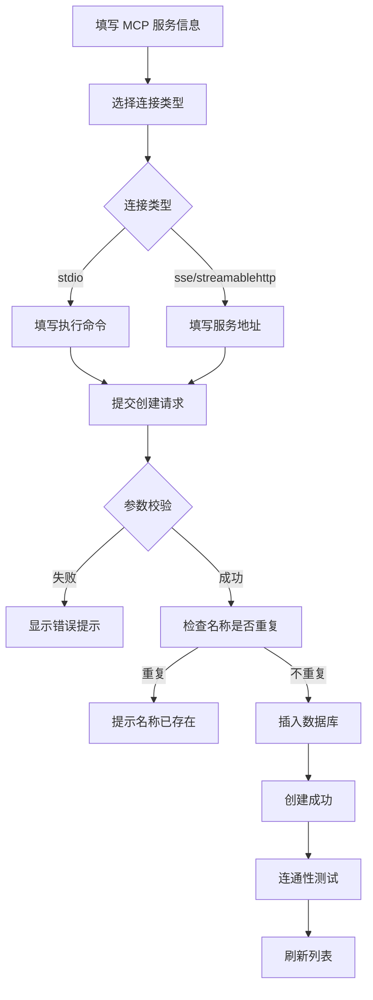
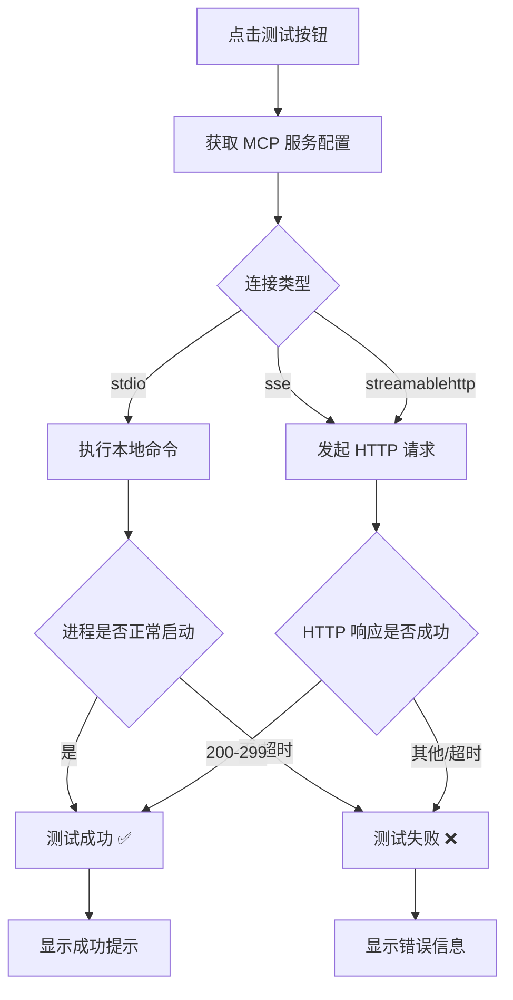
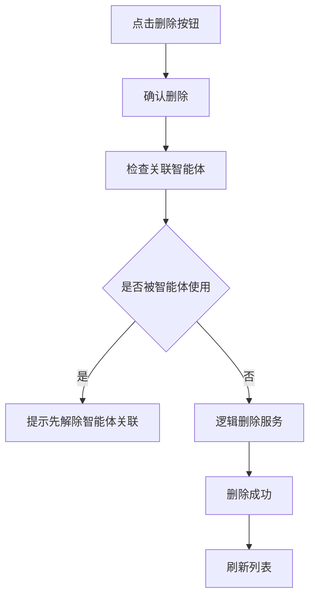

# MCP 服务管理模块 - 产品需求文档 (PRD)

## 1. 文档信息

| 字段 | 内容 |
|-----|------|
| 模块名称 | MCP 服务管理 (MCP Server Management) |
| 所属系统 | VIPClaw 管理后台 |
| 文档版本 | V1.0 |
| 编写日期 | 2026-04-20 |
| 优先级 | 🔴 P0（核心能力模块） |

---

## 2. 模块概述

### 2.1 功能定位

MCP (Model Context Protocol) 服务管理模块负责管理模型上下文协议服务器的配置，包括：
- MCP 服务基本信息（名称、描述）
- MCP 连接类型配置（stdio/sse/streamablehttp）
- 不同连接类型的专属配置（命令/URL）
- 服务状态管理
- 连通性测试

### 2.2 核心价值

1. **扩展 AI 能力**: 通过 MCP 协议为 AI Agent 提供外部工具和数据源
2. **多种连接方式**: 支持 stdio（本地进程）、SSE（服务器推送）、StreamableHTTP（流式 HTTP）三种连接模式
3. **灵活集成**: 可接入文件系统、数据库、API 等各种外部服务
4. **统一管理**: 集中管理所有 MCP 服务配置，支持启用/禁用控制

### 2.3 MCP 协议简介

**Model Context Protocol (MCP)** 是一种开放协议，用于标准化 AI 模型与外部工具和数据源的交互方式。通过 MCP，AI Agent 可以：
- 调用外部工具（如文件系统操作、数据库查询）
- 访问实时数据（如天气、股票、新闻）
- 与第三方服务集成（如 GitHub、Slack、Jira）

---

## 3. 数据实体设计

### 3.1 MCP 服务实体 (McpServer)

#### 3.1.1 数据库表结构

**表名**: `mcp_server`  
**说明**: MCP 服务表

| 字段名 | 数据类型 | 长度 | 可空 | 默认值 | 说明 | 约束 |
|--------|---------|------|------|--------|------|------|
| `id` | BIGINT | 20 | ❌ 否 | AUTO_INCREMENT | MCP 服务 ID（主键） | PRIMARY KEY |
| `name` | VARCHAR | 100 | ❌ 否 | - | MCP 服务名称 | UNIQUE KEY, NOT NULL |
| `description` | TEXT | - | ✅ 是 | NULL | MCP 服务描述 | - |
| `type` | VARCHAR | 20 | ❌ 否 | - | MCP 类型（stdio/sse/streamablehttp） | NOT NULL |
| `command` | VARCHAR | 500 | ✅ 是 | NULL | 执行命令（仅 stdio 类型） | - |
| `url` | VARCHAR | 500 | ✅ 是 | NULL | 服务地址（sse/streamablehttp 类型） | - |
| `status` | TINYINT | 1 | ✅ 是 | 1 | 状态 (0:禁用 1:启用) | - |
| `is_public` | TINYINT | 1 | ✅ 是 | 1 | 是否公开 (0:否 1:是) | - |
| `creator` | VARCHAR | 100 | ✅ 是 | - | 创建人用户名 | - |
| `active` | TINYINT | 1 | ✅ 是 | 1 | 逻辑删除标识 (0:已删除 1:正常) | - |
| `create_time` | DATETIME | - | ✅ 是 | CURRENT_TIMESTAMP | 创建时间 | - |
| `update_time` | DATETIME | - | ✅ 是 | CURRENT_TIMESTAMP ON UPDATE | 更新时间 | - |

**索引设计**:
- `PRIMARY KEY (id)`: 主键索引
- `UNIQUE KEY uk_name (name)`: 服务名称唯一索引

---

#### 3.1.2 字段详细说明

**必填字段 (NOT NULL)**:

| 字段 | 业务规则 | 校验规则 | 示例值 |
|-----|---------|---------|--------|
| `name` | MCP 服务名称，全局唯一标识 | - 长度：1-100 字符<br>- 英文、数字、中文、下划线、连字符 | `filesystem-mcp`, `github-tools` |
| `type` | MCP 连接类型 | - 枚举：stdio, sse, streamablehttp | `stdio` |

**可选字段 (NULLABLE)**:

| 字段 | 业务规则 | 校验规则 | 示例值 |
|-----|---------|---------|--------|
| `description` | MCP 服务描述信息 | - 最大长度：65535 字符 | `文件系统操作工具集` |

**类型专属字段**:

| 字段 | 适用类型 | 业务规则 | 校验规则 | 示例值 |
|-----|---------|---------|---------|--------|
| `command` | **仅 stdio** | 本地进程启动命令 | - 最大长度：500 字符<br>- type=stdio 时必填 | `npx -y @modelcontextprotocol/server-filesystem /tmp` |
| `url` | **sse / streamablehttp** | 远程服务地址 | - 最大长度：500 字符<br>- type=sse/streamablehttp 时必填<br>- URL 格式校验 | `http://localhost:3000/sse` |

**系统字段**:

| 字段 | 业务规则 | 说明 |
|-----|---------|------|
| `status` | 0:禁用<br>1:启用（默认） | 控制 MCP 服务是否可用 |
| `is_public` | 0:私有<br>1:公开（默认） | 控制其他用户是否可见 |
| `creator` | 创建人用户名 | 数据权限控制 |
| `active` | 0:已删除<br>1:正常（默认） | 逻辑删除标识 |

---

### 3.2 MCP 连接类型详解

#### 3.2.1 stdio（标准输入输出）

**工作原理**: 通过本地进程的标准输入输出进行通信

**特点**:
- ✅ 适合本地工具和服务
- ✅ 低延迟，高性能
- ✅ 无需网络配置
- ❌ 仅限本地部署

**配置要求**:
- 必须提供 `command` 字段
- `url` 字段忽略

**典型示例**:
```bash
# 文件系统 MCP
npx -y @modelcontextprotocol/server-filesystem /tmp

# 数据库 MCP
npx -y @modelcontextprotocol/server-postgres postgresql://localhost/mydb

# Git 工具 MCP
npx -y @modelcontextprotocol/server-git
```

---

#### 3.2.2 SSE（Server-Sent Events）

**工作原理**: 通过 HTTP SSE 推送事件，服务端主动推送消息

**特点**:
- ✅ 服务端主动推送
- ✅ 单向通信（服务端→客户端）
- ✅ 适合实时数据流
- ❌ 不适合高频率双向交互

**配置要求**:
- 必须提供 `url` 字段（SSE 端点）
- `command` 字段忽略

**典型示例**:
```
http://localhost:3000/sse
https://mcp.example.com/events
```

---

#### 3.2.3 streamablehttp（流式 HTTP）

**工作原理**: 通过 HTTP 流式传输，支持双向通信

**特点**:
- ✅ 双向通信
- ✅ 支持复杂交互
- ✅ 适合远程服务
- ✅ 跨网络可用
- ❌ 配置相对复杂

**配置要求**:
- 必须提供 `url` 字段（HTTP 端点）
- `command` 字段忽略

**典型示例**:
```
http://localhost:3000/mcp
https://mcp.example.com/stream
```

---

### 3.3 DTO 对象设计

#### 3.3.1 创建请求 (McpServerCreateRequest)

| 字段 | 类型 | 必填 | 校验规则 | 默认值 | 说明 |
|-----|------|------|---------|--------|------|
| `name` | String | ✅ 是 | - 非空<br>- 长度：1-100 | - | MCP 服务名称 |
| `description` | String | ❌ 否 | - 最大 65535 | `null` | 描述 |
| `type` | String | ✅ 是 | - 非空<br>- 枚举：stdio, sse, streamablehttp | - | 连接类型 |
| `command` | String | ❌ 否 | - 最大 500<br>- **type=stdio 时必填** | `null` | 执行命令 |
| `url` | String | ❌ 否 | - 最大 500<br>- **type=sse/streamablehttp 时必填**<br>- URL 格式 | `null` | 服务地址 |
| `status` | Int | ❌ 否 | - 枚举：0,1 | `null` | 状态 |

**类型校验规则**:
```
IF type == "stdio":
    command 必填
    url 忽略
    
IF type == "sse" OR type == "streamablehttp":
    url 必填
    command 忽略
```

---

#### 3.3.2 更新请求 (McpServerUpdateRequest)

| 字段 | 类型 | 必填 | 校验规则 | 默认值 | 说明 |
|-----|------|------|---------|--------|------|
| `id` | Long | ✅ 是 | - 路径参数 | - | MCP 服务 ID |
| `name` | String | ❌ 否 | - 长度：1-100 | `""` | 服务名称 |
| `description` | String | ❌ 否 | - 最大 65535 | `""` | 描述 |
| `type` | String | ❌ 否 | - 枚举：stdio, sse, streamablehttp | `"streamablehttp"` | 连接类型 |
| `command` | String | ❌ 否 | - 最大 500 | `""` | 执行命令 |
| `url` | String | ❌ 否 | - 最大 500<br>- URL 格式 | `""` | 服务地址 |
| `status` | Int | ❌ 否 | - 枚举：0,1 | `0` | 状态 |
| `isPublic` | Int | ❌ 否 | - 枚举：0,1 | `0` | 是否公开 |

**更新规则**:
- 采用部分更新模式
- 修改 `type` 时需注意对应的 `command` 或 `url` 字段

---

#### 3.3.3 响应对象 (McpServerResponse)

| 字段 | 类型 | 说明 | 示例值 |
|-----|------|------|--------|
| `id` | Long | MCP 服务 ID | `1` |
| `name` | String | 服务名称 | `filesystem-mcp` |
| `description` | String | 描述 | `文件系统操作工具集` |
| `type` | String | 连接类型 | `stdio` |
| `command` | String | 执行命令 | `npx -y @modelcontextprotocol/server-filesystem /tmp` |
| `url` | String | 服务地址 | `http://localhost:3000/sse` |
| `status` | Int | 状态 | `1` |
| `isPublic` | Int | 是否公开 | `1` |
| `creator` | String | 创建人 | `admin` |
| `createTime` | LocalDateTime | 创建时间 | `2026-03-12T12:00:00` |
| `updateTime` | LocalDateTime | 更新时间 | `2026-03-12T12:00:00` |

---

## 4. CRUD 操作逻辑

### 4.1 创建 MCP 服务 (Create)

#### 4.1.1 接口信息

- **接口路径**: `POST /admin/mcp-servers`
- **权限要求**: 登录用户

#### 4.1.2 请求示例（stdio 类型）

```json
{
  "name": "filesystem-mcp",
  "description": "文件系统操作工具集",
  "type": "stdio",
  "command": "npx -y @modelcontextprotocol/server-filesystem /tmp",
  "status": 1
}
```

#### 4.1.3 请求示例（streamablehttp 类型）

```json
{
  "name": "github-tools",
  "description": "GitHub API 集成工具",
  "type": "streamablehttp",
  "url": "https://mcp.github.com/tools",
  "status": 1
}
```

#### 4.1.4 业务逻辑

```
1. 接收 McpServerCreateRequest 请求
   ↓
2. 参数校验（@Valid）
   - name 非空且长度校验
   - type 非空且为合法枚举值
   ↓
3. 类型专属字段校验
   - IF type == "stdio":
     * 检查 command 非空
     * 如果为空 → 抛出 BizException("stdio 类型必须提供执行命令")
   - IF type == "sse" OR type == "streamablehttp":
     * 检查 url 非空
     * 检查 url 格式合法
     * 如果为空或格式错误 → 抛出 BizException("该类型必须提供服务地址")
   ↓
4. 检查服务名称是否已存在
   - 查询数据库：SELECT * FROM mcp_server WHERE name = #{name} AND active = 1
   - 如果存在 → 抛出 BizException("MCP 服务名称已存在")
   ↓
5. 构建 McpServer 实体
   - 设置默认值：status=1, is_public=1, active=1
   - 设置 creator：当前登录用户名
   - 设置时间：createTime, updateTime = LocalDateTime.now()
   ↓
6. 插入数据库
   - INSERT INTO mcp_server (...)
   ↓
7. 返回创建结果（true/false）
```

#### 4.1.5 异常处理

| 异常场景 | 错误码 | 错误信息 | 处理方式 |
|---------|--------|---------|---------|
| 服务名称已存在 | 400 | "MCP 服务名称已存在" | 提示用户更换名称 |
| stdio 类型缺少 command | 400 | "stdio 类型必须提供执行命令" | 提示填写 command 字段 |
| 远程类型缺少 url | 400 | "该类型必须提供服务地址" | 提示填写 url 字段 |
| url 格式错误 | 400 | "服务地址格式不正确" | 提示检查 URL 格式 |
| 参数校验失败 | 400 | 具体校验错误信息 | 显示表单校验错误 |
| 数据库异常 | 500 | "创建 MCP 服务失败" | 记录日志，提示重试 |

---

### 4.2 查询 MCP 服务列表 (Read - List)

#### 4.2.1 接口信息

- **接口路径**: `GET /admin/mcp-servers/page`
- **权限要求**: 登录用户
- **数据权限**: 查询自己创建的 + is_public=1 的服务

#### 4.2.2 请求参数

| 参数名 | 类型 | 必填 | 默认值 | 说明 | 示例值 |
|--------|------|------|--------|------|--------|
| `current` | Int | ❌ 否 | 1 | 当前页码 | `1` |
| `size` | Int | ❌ 否 | 10 | 每页大小 | `10` |
| `keyword` | String | ❌ 否 | - | 模糊搜索（名称/描述） | `file` |
| `status` | Int | ❌ 否 | - | 状态筛选 (0/1) | `1` |
| `types` | String | ❌ 否 | - | 类型筛选（逗号分隔） | `stdio,sse` |

#### 4.2.3 响应示例

```json
{
  "code": 200,
  "message": "success",
  "data": {
    "total": 5,
    "size": 10,
    "current": 1,
    "pages": 1,
    "records": [
      {
        "id": 1,
        "name": "filesystem-mcp",
        "description": "文件系统操作工具集",
        "type": "stdio",
        "command": "npx -y @modelcontextprotocol/server-filesystem /tmp",
        "url": null,
        "status": 1,
        "isPublic": 1,
        "creator": "admin",
        "createTime": "2026-03-12T12:00:00",
        "updateTime": "2026-03-12T12:00:00"
      }
    ]
  }
}
```

#### 4.2.4 业务逻辑

```
1. 接收查询参数和当前用户名
   ↓
2. 构建查询条件
   - active = 1
   - (is_public = 1 OR creator = #{currentUsername})
   - keyword 模糊搜索（如果有传参）：
     * name LIKE '%#{keyword}%' OR description LIKE '%#{keyword}%'
   - status 精确匹配（如果有传参）
   - types 包含匹配（如果有传参）：
     * type IN ('stdio', 'sse')
   ↓
3. 执行分页查询
   - 使用 PageHelper 分页插件
   - SELECT * FROM mcp_server WHERE ... ORDER BY create_time DESC
   ↓
4. 返回分页结果
```

---

### 4.3 查询 MCP 服务详情 (Read - Detail)

#### 4.3.1 接口信息

- **接口路径**: `GET /admin/mcp-servers/{id}`
- **权限要求**: 登录用户

#### 4.3.2 业务逻辑

```
1. 接收 MCP 服务 ID
   ↓
2. 查询数据库
   - SELECT * FROM mcp_server WHERE id = #{id} AND active = 1
   ↓
3. 判断服务是否存在
   - 不存在 → 抛出 BizException("MCP 服务不存在")
   ↓
4. 数据权限校验
   - 如果 is_public=0 且 creator != 当前用户 → 抛出 BizException("无权限查看")
   ↓
5. 返回 McpServer 实体
```

---

### 4.4 更新 MCP 服务 (Update)

#### 4.4.1 接口信息

- **接口路径**: `PUT /admin/mcp-servers/{id}`
- **权限要求**: 登录用户（仅创建人可修改）

#### 4.4.2 请求示例

```json
{
  "name": "filesystem-mcp-v2",
  "description": "升级版文件系统工具",
  "type": "stdio",
  "command": "npx -y @modelcontextprotocol/server-filesystem /tmp /var/data",
  "status": 1,
  "isPublic": 1
}
```

#### 4.4.3 业务逻辑

```
1. 接收 MCP 服务 ID 和 McpServerUpdateRequest
   ↓
2. 查询原服务信息
   - SELECT * FROM mcp_server WHERE id = #{id} AND active = 1
   - 不存在 → 抛出 BizException("MCP 服务不存在")
   ↓
3. 权限校验
   - 如果 creator != 当前用户 → 抛出 BizException("无权限修改")
   ↓
4. 部分更新（只更新传入的字段）
   - name != "" → 更新 name（需检查名称唯一性）
   - description != "" → 更新 description
   - type != "streamablehttp" → 更新 type（需校验专属字段）
   - command != "" → 更新 command
   - url != "" → 更新 url（需校验 URL 格式）
   - status 有值 → 更新 status
   - isPublic 有值 → 更新 is_public
   ↓
5. 更新时间
   - updateTime = LocalDateTime.now()
   ↓
6. 执行更新
   - UPDATE mcp_server SET ... WHERE id = #{id}
   ↓
7. 返回更新结果（true/false）
```

---

### 4.5 切换 MCP 服务状态 (Toggle)

#### 4.5.1 接口信息

- **接口路径**: `PUT /admin/mcp-servers/{id}/status`
- **权限要求**: 登录用户（仅创建人可操作）

#### 4.5.2 业务逻辑

```
1. 接收 MCP 服务 ID 和目标状态
   ↓
2. 查询服务
   - SELECT * FROM mcp_server WHERE id = #{id} AND active = 1
   - 不存在 → 抛出 BizException("MCP 服务不存在")
   ↓
3. 权限校验
   - 如果 creator != 当前用户 → 抛出 BizException("无权限操作")
   ↓
4. 更新状态
   - status = #{status}（0 或 1）
   - updateTime = NOW()
   ↓
5. 执行更新
   - UPDATE mcp_server SET status = #{status}, update_time = NOW() WHERE id = #{id}
   ↓
6. 返回更新结果（true/false）
```

---

### 4.6 删除 MCP 服务 (Delete)

#### 4.6.1 接口信息

- **接口路径**: `DELETE /admin/mcp-servers/{id}`
- **权限要求**: 登录用户（仅创建人可删除）

#### 4.6.2 业务逻辑

```
1. 接收 MCP 服务 ID
   ↓
2. 查询服务
   - SELECT * FROM mcp_server WHERE id = #{id} AND active = 1
   - 不存在 → 抛出 BizException("MCP 服务不存在")
   ↓
3. 权限校验
   - 如果 creator != 当前用户 → 抛出 BizException("无权限删除")
   ↓
4. 检查关联数据
   - SELECT COUNT(*) FROM agent_config WHERE mcp_server_id = #{id} AND active = 1
   - 如果有关联智能体 → 抛出 BizException("该 MCP 服务被智能体使用，无法删除")
   ↓
5. 逻辑删除
   - UPDATE mcp_server SET active = 0, update_time = NOW() WHERE id = #{id}
   ↓
6. 返回删除结果（true/false）
```

#### 4.6.3 删除前置校验

⚠️ **重要**: 删除 MCP 服务前必须检查是否被智能体引用

```sql
-- 检查关联智能体数量
SELECT COUNT(*) FROM agent_config 
WHERE mcp_server_id = #{mcpServerId} AND active = 1
```

如果 `COUNT > 0`，则不允许删除，提示用户先从智能体中移除该 MCP 服务。

---

### 4.7 连通性测试 (Connectivity Test)

#### 4.7.1 接口信息

- **接口路径**: `POST /admin/mcp-servers/{id}/test`
- **权限要求**: 登录用户

#### 4.7.2 业务逻辑

```
1. 接收 MCP 服务 ID
   ↓
2. 查询服务
   - SELECT * FROM mcp_server WHERE id = #{id} AND active = 1
   ↓
3. 判断服务类型
   ↓
4. 执行连通性测试
   ↓
   IF type == "stdio":
     - 执行 command 命令
     - 检查进程是否正常启动
     - 设置超时时间：30 秒
   ↓
   IF type == "sse" OR type == "streamablehttp":
     - 发起 HTTP 请求到 url
     - 检查 HTTP 响应状态
     - 设置超时时间：10 秒
   ↓
5. 判断结果
   - 成功 → 返回 true
   - 失败（超时/错误）→ 返回 false
   ↓
6. 返回测试结果
```

#### 4.7.3 stdio 类型测试示例

```kotlin
fun testStdio(command: String): Boolean {
    val process = ProcessBuilder(command.split(" "))
        .redirectInput(ProcessBuilder.Redirect.PIPE)
        .redirectOutput(ProcessBuilder.Redirect.PIPE)
        .redirectError(ProcessBuilder.Redirect.PIPE)
        .start()
    
    // 等待 30 秒
    val success = process.waitFor(30, TimeUnit.SECONDS)
    
    if (success) {
        val exitCode = process.exitValue()
        return exitCode == 0
    } else {
        process.destroy()
        return false
    }
}
```

#### 4.7.4 远程类型测试示例

```kotlin
fun testRemote(url: String, type: String): Boolean {
    val client = HttpClient.newBuilder()
        .connectTimeout(Duration.ofSeconds(10))
        .build()
    
    val request = HttpRequest.newBuilder()
        .uri(URI.create(url))
        .GET()
        .build()
    
    val response = client.send(request, BodyHandlers.ofString())
    return response.statusCode() in 200..299
}
```

---

## 5. 前端页面设计

### 5.1 页面布局

```
┌──────────────────────────────────────────────────────────────┐
│  MCP 服务管理                                                 │
├──────────────────────────────────────────────────────────────┤
│  搜索: [keyword]  状态:[全部▼]  类型:[全部▼]  [搜索] [重置]   │
│                                              [新建 MCP 服务]  │
├──────────────────────────────────────────────────────────────┤
│  ┌──┬──────────────┬──────────┬──────────┬────────┬──────┬──┐│
│  │ID│ 服务名称      │ 连接类型  │ 配置信息  │ 状态   │操作  ││
│  ├──┼──────────────┼──────────┼──────────┼────────┼──────┼──┤│
│  │1 │filesystem-mcp│ stdio    │npx -y... │ ✅     │🔍✏️🗑️││
│  │2 │github-tools  │streamable│https://..│ ✅     │🔍✏️🗑️││
│  │3 │weather-mcp   │ sse      │http://...│ ❌     │🔍✏️🗑️││
│  └──┴──────────────┴──────────┴──────────┴────────┴──────┴──┘│
│  共 5 条记录                                  [1]              │
└──────────────────────────────────────────────────────────────┘
```

### 5.2 表格列定义

| 列名 | 字段 | 宽度 | 显示格式 | 说明 |
|-----|------|------|---------|------|
| ID | id | 60px | 数字 | 主键 ID |
| 服务名称 | name | 200px | 文本 | MCP 服务名称 |
| 连接类型 | type | 120px | 标签 | `stdio` / `sse` / `streamablehttp` |
| 配置信息 | command/url | 300px | 文本截断 | 鼠标悬停显示完整 |
| 状态 | status | 80px | 开关 | 启用/禁用 |
| 创建人 | creator | 100px | 文本 | 用户名 |
| 创建时间 | createTime | 160px | 日期时间 | YYYY-MM-DD HH:mm:ss |
| 操作 | - | 200px | 按钮组 | 测试、查看、编辑、删除 |

### 5.3 连接类型标签展示

| 类型 | 标签颜色 | 图标 | 说明 |
|-----|---------|------|------|
| stdio | 🟢 绿色 | 💻 | 本地进程 |
| sse | 🔵 蓝色 | 📡 | 服务器推送 |
| streamablehttp | 🟣 紫色 | 🌐 | 流式 HTTP |

### 5.4 新建/编辑表单

| 字段 | 类型 | 必填 | 校验规则 | 默认值 |
|-----|------|------|---------|--------|
| 服务名称 | Input | ✅ | 最大 100 字符，唯一 | - |
| 描述 | TextArea | ❌ | 最大 65535 字符 | - |
| 连接类型 | Radio.Group | ✅ | stdio / sse / streamablehttp | `stdio` |
| 执行命令 | Input | **条件必填** | type=stdio 时必填，最大 500 字符 | - |
| 服务地址 | Input | **条件必填** | type=sse/streamablehttp 时必填，URL 格式 | - |
| 状态 | Switch | ❌ | 启用/禁用 | 启用 |

**动态表单逻辑**:
```tsx
// 根据连接类型显示/隐藏字段
{form.watch('type') === 'stdio' && (
  <Form.Item label="执行命令" required>
    <Input placeholder="npx -y @modelcontextprotocol/server-filesystem /tmp" />
  </Form.Item>
)}

{(form.watch('type') === 'sse' || form.watch('type') === 'streamablehttp') && (
  <Form.Item label="服务地址" required>
    <Input placeholder="http://localhost:3000/sse" />
  </Form.Item>
)}
```

---

## 6. 数据权限控制

### 6.1 可见性规则

| 场景 | 创建人 | 其他用户 | 说明 |
|------|--------|---------|------|
| is_public=1, creator=A | ✅ 可见 | ✅ 可见 | 公开服务，所有人可见 |
| is_public=0, creator=A | ✅ 可见 | ❌ 不可见 | 私有服务，仅创建人可见 |
| active=0 | ❌ 不可见 | ❌ 不可见 | 已删除服务 |

### 6.2 操作权限

| 操作 | 创建人 | 其他用户 | 说明 |
|-----|--------|---------|------|
| 查看 | ✅ | ✅ (is_public=1) | - |
| 编辑 | ✅ | ❌ | 仅创建人可编辑 |
| 删除 | ✅ | ❌ | 仅创建人可删除 |
| 连通性测试 | ✅ | ✅ (is_public=1) | - |

---

## 7. 常见 MCP 服务配置示例

### 7.1 文件系统 MCP（stdio）

```json
{
  "name": "filesystem-mcp",
  "description": "文件系统操作工具集，支持读写文件、列出目录等",
  "type": "stdio",
  "command": "npx -y @modelcontextprotocol/server-filesystem /tmp /var/data",
  "status": 1
}
```

**可用工具**:
- `read_file`: 读取文件内容
- `write_file`: 写入文件
- `list_directory`: 列出目录
- `create_directory`: 创建目录

---

### 7.2 GitHub 工具 MCP（streamablehttp）

```json
{
  "name": "github-tools",
  "description": "GitHub API 集成，支持仓库管理、Issue 操作等",
  "type": "streamablehttp",
  "url": "https://mcp.github.com/tools",
  "status": 1
}
```

**可用工具**:
- `create_issue`: 创建 Issue
- `list_repositories`: 列出仓库
- `create_pull_request`: 创建 PR
- `search_code`: 搜索代码

---

### 7.3 天气查询 MCP（sse）

```json
{
  "name": "weather-mcp",
  "description": "实时天气查询服务",
  "type": "sse",
  "url": "http://localhost:3000/sse",
  "status": 1
}
```

**可用工具**:
- `get_current_weather`: 获取当前天气
- `get_forecast`: 获取天气预报

---

### 7.4 数据库 MCP（stdio）

```json
{
  "name": "postgres-mcp",
  "description": "PostgreSQL 数据库操作工具",
  "type": "stdio",
  "command": "npx -y @modelcontextprotocol/server-postgres postgresql://localhost/mydb",
  "status": 1
}
```

**可用工具**:
- `query`: 执行 SQL 查询
- `list_tables`: 列出所有表
- `describe_table`: 查看表结构

---

## 8. 异常场景处理

| 场景 | 触发条件 | 错误码 | 错误信息 | 前端处理 |
|-----|---------|--------|---------|---------|
| 服务名称已存在 | 创建时 name 重复 | 400 | "MCP 服务名称已存在" | 提示更换名称 |
| stdio 类型缺少 command | 创建/更新时 type=stdio 但 command 为空 | 400 | "stdio 类型必须提供执行命令" | 提示填写 command |
| 远程类型缺少 url | 创建/更新时 type=sse/streamablehttp 但 url 为空 | 400 | "该类型必须提供服务地址" | 提示填写 url |
| MCP 服务不存在 | 查询/更新/删除时 ID 无效 | 404 | "MCP 服务不存在" | 提示并返回列表 |
| 无权限操作 | 非创建人尝试编辑/删除 | 403 | "无权限操作" | 隐藏按钮或提示 |
| 关联智能体存在 | 删除时被智能体引用 | 400 | "该 MCP 服务被智能体使用，无法删除" | 提示先解除关联 |
| 连通性测试失败 | 命令执行失败或 URL 不可达 | 200 | 返回 false | 提示检查配置 |
| 参数校验失败 | 请求参数不符合规则 | 400 | 具体校验信息 | 表单显示错误 |

---

## 9. 业务流程图

### 9.1 创建 MCP 服务流程



### 9.2 连通性测试流程



### 9.3 删除 MCP 服务流程



---

## 10. 测试用例

### 10.1 功能测试

| 用例 ID | 测试场景 | 前置条件 | 操作步骤 | 预期结果 |
|---------|---------|---------|---------|---------|
| TC-001 | 创建 MCP 服务-stdio 类型 | 管理员登录 | 填写完整 stdio 配置提交 | 创建成功，列表显示新服务 |
| TC-002 | 创建 MCP 服务-streamablehttp 类型 | 管理员登录 | 填写完整远程配置提交 | 创建成功 |
| TC-003 | 创建 MCP 服务-stdio 缺少 command | 管理员登录 | type=stdio 但不填 command | 提示"stdio 类型必须提供执行命令" |
| TC-004 | 创建 MCP 服务-远程缺少 url | 管理员登录 | type=sse 但不填 url | 提示"该类型必须提供服务地址" |
| TC-005 | 创建 MCP 服务-名称重复 | 管理员登录 | 使用已存在的 name | 提示"MCP 服务名称已存在" |
| TC-006 | 查询 MCP 服务列表-模糊搜索 | 有服务数据 | keyword="file" | 显示匹配的服务 |
| TC-007 | 查询 MCP 服务列表-类型筛选 | 有服务数据 | types="stdio,sse" | 只显示 stdio 和 sse 类型 |
| TC-008 | 更新 MCP 服务-修改描述 | 创建人登录 | 修改 description | 更新成功 |
| TC-009 | 更新 MCP 服务-切换类型 | 创建人登录 | type 从 stdio 改为 sse | 更新成功，需重新填写 url |
| TC-010 | 连通性测试-stdio 成功 | 配置正确的 command | 点击测试按钮 | 返回 true，显示成功 |
| TC-011 | 连通性测试-远程失败 | 配置错误的 url | 点击测试按钮 | 返回 false，提示连接失败 |
| TC-012 | 删除 MCP 服务-无关联智能体 | 服务未被智能体使用 | 点击删除按钮 | 删除成功 |
| TC-013 | 删除 MCP 服务-有关联智能体 | 服务被智能体引用 | 点击删除按钮 | 提示"该 MCP 服务被智能体使用，无法删除" |

---

## 11. 附录

### 11.1 枚举值字典

**MCP 类型 (type)**:
| 值 | 说明 | 必填字段 | 通信方式 |
|----|------|---------|---------|
| `stdio` | 标准输入输出（本地进程） | `command` | 进程 stdin/stdout |
| `sse` | Server-Sent Events | `url` | HTTP SSE 推送 |
| `streamablehttp` | 流式 HTTP（默认） | `url` | HTTP 流式传输 |

**状态 (status)**:
| 值 | 说明 |
|----|------|
| 0 | 禁用 |
| 1 | 启用（默认） |

**是否公开 (is_public)**:
| 值 | 说明 |
|----|------|
| 0 | 私有 |
| 1 | 公开（默认） |

### 11.2 官方 MCP 服务器推荐

| 名称 | 类型 | 命令/URL | 说明 |
|------|------|---------|------|
| @modelcontextprotocol/server-filesystem | stdio | `npx -y @modelcontextprotocol/server-filesystem /path` | 文件系统操作 |
| @modelcontextprotocol/server-postgres | stdio | `npx -y @modelcontextprotocol/server-postgres postgresql://...` | PostgreSQL 数据库 |
| @modelcontextprotocol/server-git | stdio | `npx -y @modelcontextprotocol/server-git` | Git 操作 |
| @modelcontextprotocol/server-github | streamablehttp | `https://github-mcp.example.com` | GitHub 集成 |
| @modelcontextprotocol/server-slack | streamablehttp | `https://slack-mcp.example.com` | Slack 集成 |

### 11.3 SQL 脚本

```sql
-- 创建 MCP 服务表
CREATE TABLE `mcp_server` (
    `id` BIGINT(20) NOT NULL AUTO_INCREMENT COMMENT 'MCP ID',
    `name` VARCHAR(100) NOT NULL COMMENT 'MCP 名称',
    `description` TEXT DEFAULT NULL COMMENT 'MCP 描述',
    `type` VARCHAR(20) NOT NULL COMMENT 'MCP 类型（stdio/sse/streamablehttp）',
    `command` VARCHAR(500) DEFAULT NULL COMMENT '执行命令（仅 stdio 类型生效）',
    `url` VARCHAR(500) DEFAULT NULL COMMENT '服务地址（sse/streamablehttp 类型生效）',
    `status` TINYINT(1) DEFAULT 1 COMMENT '是否启用（0:禁用，1:启用）',
    `is_public` TINYINT(1) DEFAULT 1 COMMENT '是否公开（0:否，1:是）',
    `creator` VARCHAR(100) DEFAULT NULL COMMENT '创建人',
    `active` TINYINT(1) DEFAULT 1 COMMENT '是否可用（0:被删除，1:可用）',
    `create_time` DATETIME DEFAULT CURRENT_TIMESTAMP COMMENT '创建时间',
    `update_time` DATETIME DEFAULT CURRENT_TIMESTAMP ON UPDATE CURRENT_TIMESTAMP COMMENT '更新时间',
    PRIMARY KEY (`id`),
    UNIQUE KEY `uk_name` (`name`)
) ENGINE=InnoDB DEFAULT CHARSET=utf8mb4 COMMENT='MCP 服务表';
```

### 11.4 类型校验伪代码

```kotlin
fun validateMcpServer(type: String, command: String?, url: String?) {
    when (type) {
        "stdio" -> {
            if (command.isNullOrBlank()) {
                throw BizException("stdio 类型必须提供执行命令")
            }
        }
        "sse", "streamablehttp" -> {
            if (url.isNullOrBlank()) {
                throw BizException("该类型必须提供服务地址")
            }
            if (!isValidUrl(url)) {
                throw BizException("服务地址格式不正确")
            }
        }
        else -> {
            throw BizException("不支持的 MCP 类型")
        }
    }
}

fun isValidUrl(url: String): Boolean {
    return try {
        URI(url).toURL()
        url.startsWith("http://") || url.startsWith("https://")
    } catch (e: Exception) {
        false
    }
}
```

### 11.5 相关文件清单

**后端文件**:
- Entity: `McpServer.kt`
- DTO: `McpServerCreateRequest.kt`, `McpServerUpdateRequest.kt`, `McpServerResponse.kt`
- Service: `McpServerService.kt`, `McpServerServiceImpl.kt`
- Controller: `McpServerController.kt`
- Mapper: `McpServerMapper.kt`, `McpServerMapper.xml`

**前端文件**:
- 页面: `vipclaw-webui/src/pages/mcp/index.tsx`
- 服务: `vipclaw-webui/src/services/ant-design-pro/mcpServer.ts`

### 11.6 MCP 协议规范参考

- **官方文档**: https://modelcontextprotocol.io
- **GitHub**: https://github.com/modelcontextprotocol
- **TypeScript SDK**: https://github.com/modelcontextprotocol/typescript-sdk
- **Python SDK**: https://github.com/modelcontextprotocol/python-sdk

### 11.7 安全注意事项

1. **stdio 类型**:
   - ⚠️ 执行命令具有系统权限，需严格审查
   - ⚠️ 避免执行不可信的命令
   - ✅ 建议在生产环境使用沙箱隔离

2. **远程类型**:
   - ✅ 使用 HTTPS 协议
   - ✅ 配置 CORS 策略
   - ✅ 验证 SSL 证书

3. **通用安全**:
   - ✅ 定期更新 MCP 服务版本
   - ✅ 监控服务日志
   - ✅ 设置访问权限控制

---

*文档结束 - MCP 服务管理模块 PRD V1.0*
