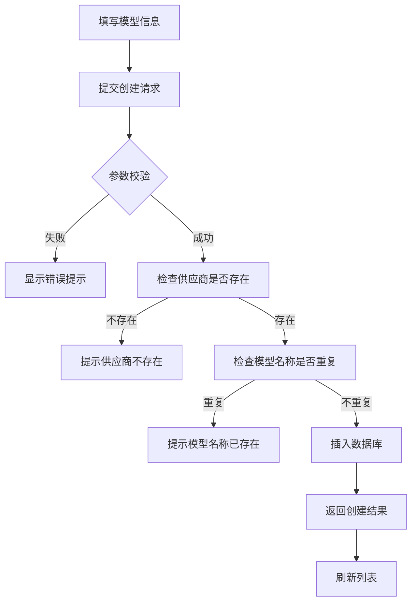
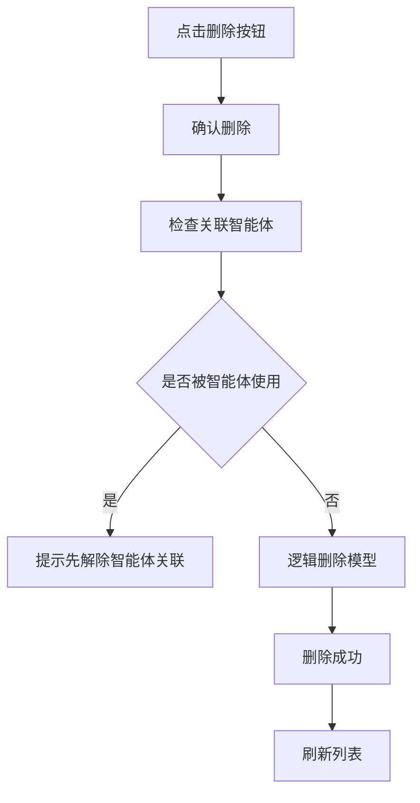
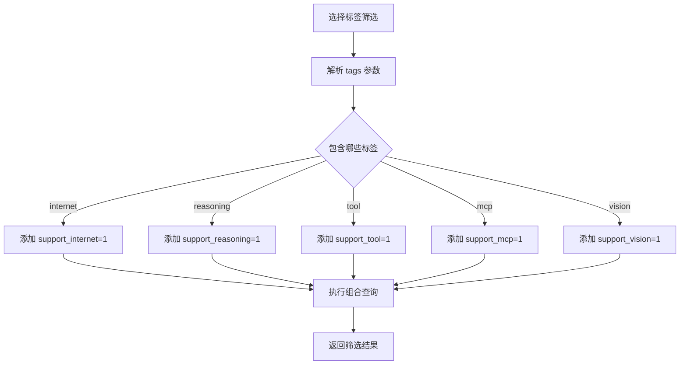

# 模型管理模块 - 产品需求文档 (PRD)

## 1. 文档信息

| 字段 | 内容 |
|-----|------|
| 模块名称 | 模型管理 (Model Management) |
| 所属系统 | VIPClaw 管理后台 |
| 文档版本 | V1.0 |
| 编写日期 | 2026-04-20 |
| 优先级 | 🔴 P0（核心基础模块） |

---

## 2. 模块概述

### 2.1 功能定位

模型管理模块负责管理 AI 模型配置信息，包括：
- 模型基本信息（名称、模型名称、描述）
- 模型能力标签（联网、推理、工具、MCP、视觉）
- 价格配置（元/百万 token）
- 模型状态管理
- 与供应商关联关系

### 2.2 核心价值

1. **模型能力标识**: 通过标签系统快速识别模型能力
2. **成本核算**: 记录模型价格，支持智能体成本计算
3. **多供应商兼容**: 统一管理不同供应商的模型
4. **灵活筛选**: 支持多维度筛选（能力、价格、类型）

### 2.3 依赖关系

```
Model (模型)
  ↓ 关联 1:N
ModelProvider (模型供应商)
```

**外键关系**: `model.provider_id` → `model_provider.id`

---

## 3. 数据实体设计

### 3.1 模型实体 (Model)

#### 3.1.1 数据库表结构

**表名**: `model`  
**说明**: 模型表

> ⚠️ **注意**: 当前生产环境表结构缺少 `is_public` 和 `creator` 字段,需要使用数据迁移脚本添加。详见 [11.3 SQL 脚本](#113-sql-脚本)。

| 字段名 | 数据类型 | 长度 | 可空 | 默认值 | 说明 | 约束 |
|--------|---------|------|------|--------|------|------|
| `id` | BIGINT | 20 | ❌ 否 | AUTO_INCREMENT | 模型 ID（主键） | PRIMARY KEY |
| `name` | VARCHAR | 100 | ❌ 否 | - | 模型名称 | NOT NULL |
| `model_name` | VARCHAR | 100 | ❌ 否 | - | 模型技术名称 | NOT NULL |
| `provider_id` | BIGINT | 20 | ❌ 否 | - | 供应商 ID | NOT NULL |
| `description` | TEXT | - | ✅ 是 | NULL | 模型描述 | - |
| `model_type` | VARCHAR | 20 | ❌ 否 | - | 模型类型 (chat/embedding) | NOT NULL |
| `support_internet` | TINYINT | 1 | ✅ 是 | 0 | 是否支持联网 (0:否 1:是) | - |
| `support_reasoning` | TINYINT | 1 | ✅ 是 | 0 | 是否支持推理 (0:否 1:是) | - |
| `support_tool` | TINYINT | 1 | ✅ 是 | 0 | 是否支持工具 (0:否 1:是) | - |
| `support_mcp` | TINYINT | 1 | ✅ 是 | 0 | 是否支持 MCP (0:否 1:是) | - |
| `support_vision` | TINYINT | 1 | ✅ 是 | 0 | 是否支持视觉 (0:否 1:是) | - |
| `price` | DECIMAL | 10,4 | ✅ 是 | 0.0000 | 价格（元/百万 token） | - |
| `status` | TINYINT | 1 | ❌ 否 | 1 | 状态 (0:禁用 1:启用) | - |
| `is_public` | TINYINT | 1 | ❌ 否 | 1 | 是否公开 (0:否 1:是) | **需迁移添加** |
| `creator` | VARCHAR | 100 | ❌ 否 | - | 创建人用户名 | **需迁移添加** |
| `active` | TINYINT | 1 | ❌ 否 | 1 | 逻辑删除标识 (0:已删除 1:正常) | - |
| `create_time` | DATETIME | - | ❌ 否 | CURRENT_TIMESTAMP | 创建时间 | - |
| `update_time` | DATETIME | - | ❌ 否 | CURRENT_TIMESTAMP ON UPDATE | 更新时间 | - |

**索引设计**:
- `PRIMARY KEY (id)`: 主键索引
- `KEY idx_provider_id (provider_id)`: 供应商 ID 索引，加速关联查询

**外键约束**:
- `provider_id` 关联 `model_provider.id`（逻辑外键，数据库层面未设置）

---

#### 3.1.2 字段详细说明

**必填字段 (NOT NULL)**:

| 字段 | 业务规则 | 校验规则 | 示例值 |
|-----|---------|---------|--------|
| `name` | 模型显示名称，用于 UI 展示 | - 长度：1-100 字符 | `GPT-4`, `通义千问-Max` |
| `model_name` | 模型技术名称，供应商 API 使用 | - 长度：1-100 字符 | `gpt-4`, `qwen-max` |
| `provider_id` | 关联的供应商 ID | - 必须存在 | `1` |
| `model_type` | 模型类型 | - 枚举：chat, embedding | `chat` |

**可选字段 (NULLABLE)**:

| 字段 | 业务规则 | 校验规则 | 示例值 |
|-----|---------|---------|--------|
| `description` | 模型描述信息 | - 最大长度：65535 字符 | `OpenAI 最强的多模态模型` |

**能力标签 (默认 0)**:

| 字段 | 说明 | 业务含义 | 示例场景 |
|-----|------|---------|---------|
| `support_internet` | 联网搜索 | 模型能否访问互联网获取实时信息 | GPT-4 + 搜索插件 |
| `support_reasoning` | 推理能力 | 是否支持深度推理和思维链 | Claude-3, GPT-4 |
| `support_tool` | 工具调用 | 是否支持 Function Calling | GPT-4, Qwen-Max |
| `support_mcp` | MCP 协议 | 是否支持 Model Context Protocol | 支持 MCP 的模型 |
| `support_vision` | 视觉能力 | 是否支持图像理解 | GPT-4V, Qwen-VL |

**其他字段**:

| 字段 | 业务规则 | 说明 |
|-----|---------|------|
| `price` | 元/百万 token，支持 4 位小数 | `0.0000` = 免费，`10.5000` = 10.5 元/百万 token |
| `status` | 0:禁用<br>1:启用（默认） | 控制模型是否可用 |
| `is_public` | 0:私有<br>1:公开（默认） | 控制其他用户是否可见 |

---

### 3.2 DTO 对象设计

#### 3.2.1 创建请求 (ModelCreateRequest)

| 字段 | 类型 | 必填 | 校验规则 | 默认值 | 说明 |
|-----|------|------|---------|--------|------|
| `name` | String | ✅ 是 | - 长度：1-100 | - | 模型名称 |
| `modelName` | String | ✅ 是 | - 长度：1-100 | - | 模型技术名称 |
| `providerId` | Long | ✅ 是 | - 必须存在 | - | 供应商 ID |
| `description` | String | ❌ 否 | - 最大 65535 | `null` | 描述 |
| `modelType` | String | ✅ 是 | - 枚举：chat, embedding | - | 模型类型 |
| `supportInternet` | Int | ❌ 否 | - 枚举：0,1 | `0` | 联网能力 |
| `supportReasoning` | Int | ❌ 否 | - 枚举：0,1 | `0` | 推理能力 |
| `supportTool` | Int | ❌ 否 | - 枚举：0,1 | `0` | 工具能力 |
| `supportMcp` | Int | ❌ 否 | - 枚举：0,1 | `0` | MCP 能力 |
| `supportVision` | Int | ❌ 否 | - 枚举：0,1 | `0` | 视觉能力 |
| `price` | Double | ❌ 否 | - ≥ 0 | `0.0` | 价格 |
| `isPublic` | Int | ❌ 否 | - 枚举：0,1 | `1` | 是否公开 |

**必填字段说明**:
- `name`: 模型显示名称，必填
- `modelName`: 模型技术名称，必填
- `providerId`: 必须指定供应商
- `modelType`: 必须指定模型类型

---

#### 3.2.2 更新请求 (ModelUpdateRequest)

| 字段 | 类型 | 必填 | 校验规则 | 说明 |
|-----|------|------|---------|------|
| `name` | String | ❌ 否 | - 长度：1-100 | 模型名称 |
| `modelName` | String | ❌ 否 | - 长度：1-100 | 模型技术名称 |
| `providerId` | Long | ❌ 否 | - 必须存在 | 供应商 ID |
| `description` | String | ❌ 否 | - 最大 65535 | 描述 |
| `modelType` | String | ❌ 否 | - 枚举：chat, embedding | 模型类型 |
| `supportInternet` | Int | ❌ 否 | - 枚举：0,1 | 联网能力 |
| `supportReasoning` | Int | ❌ 否 | - 枚举：0,1 | 推理能力 |
| `supportTool` | Int | ❌ 否 | - 枚举：0,1 | 工具能力 |
| `supportMcp` | Int | ❌ 否 | - 枚举：0,1 | MCP 能力 |
| `supportVision` | Int | ❌ 否 | - 枚举：0,1 | 视觉能力 |
| `price` | Double | ❌ 否 | - ≥ 0 | 价格 |
| `isPublic` | Int | ❌ 否 | - 枚举：0,1 | 是否公开 |

**更新规则**:
- 采用部分更新模式，所有字段为 `null` 时不更新该字段
- `id` 为路径参数，不在 DTO 中

---

#### 3.2.3 响应对象 (ModelResponse)

| 字段 | 类型 | 说明 | 示例值 |
|-----|------|------|--------|
| `id` | Long | 模型 ID | `1` |
| `name` | String | 模型名称 | `GPT-4` |
| `modelName` | String | 模型技术名称 | `gpt-4` |
| `providerId` | Long | 供应商 ID | `1` |
| `providerName` | String | 供应商名称 | `openai` |
| `description` | String | 描述 | `OpenAI 最强的模型` |
| `modelType` | String | 模型类型 | `chat` |
| `tags` | String[] | 能力标签 | `["reasoning", "tool"]` |
| `supportInternet` | Int | 联网能力 | `0` |
| `supportReasoning` | Int | 推理能力 | `1` |
| `supportTool` | Int | 工具能力 | `1` |
| `supportMcp` | Int | MCP 能力 | `0` |
| `supportVision` | Int | 视觉能力 | `0` |
| `price` | Double | 价格 | `0.0000` |
| `status` | Int | 状态 | `1` |
| `isPublic` | Int | 是否公开 | `1` |
| `creator` | String | 创建人 | `admin` |
| `createTime` | LocalDateTime | 创建时间 | `2026-03-13T12:00:00` |
| `updateTime` | LocalDateTime | 更新时间 | `2026-03-13T12:00:00` |

**标签自动计算**:
```kotlin
val tags = mutableListOf<String>()
if (supportInternet == 1) tags.add("internet")
if (supportReasoning == 1) tags.add("reasoning")
if (supportTool == 1) tags.add("tool")
if (supportMcp == 1) tags.add("mcp")
if (supportVision == 1) tags.add("vision")
```

---

## 4. CRUD 操作逻辑

### 4.1 创建模型 (Create)

#### 4.1.1 接口信息

- **接口路径**: `POST /admin/models`
- **权限要求**: 登录用户

#### 4.1.2 请求示例

```json
{
  "name": "GPT-4",
  "modelName": "gpt-4",
  "providerId": 1,
  "description": "OpenAI 最强的多模态模型",
  "modelType": "chat",
  "supportInternet": 0,
  "supportReasoning": 1,
  "supportTool": 1,
  "supportMcp": 0,
  "supportVision": 0,
  "price": 0.0000,
  "status": 1
}
```

#### 4.1.3 业务逻辑

```
1. 接收 ModelCreateRequest 请求
   ↓
2. 参数校验（@Valid）
   - providerId 非空
   - modelType 非空且合法
   ↓
3. 检查供应商是否存在
   - SELECT * FROM model_provider WHERE id = #{providerId} AND active = 1
   - 不存在 → 抛出 BizException("供应商不存在")
   ↓
4. 检查模型名称是否重复（同一供应商下）
   - SELECT * FROM model WHERE model_name = #{modelName} AND provider_id = #{providerId} AND active = 1
   - 如果存在 → 抛出 BizException("该供应商下已存在此模型")
   ↓
5. 构建 Model 实体
   - 设置默认值：status=1, is_public=1, active=1
   - 设置 creator：当前登录用户名
   - 设置时间：createTime, updateTime = LocalDateTime.now()
   ↓
6. 插入数据库
   - INSERT INTO model (...)
   ↓
7. 返回 ModelResponse
```

#### 4.1.4 异常处理

| 异常场景 | 错误码 | 错误信息 | 处理方式 |
|---------|--------|---------|---------|
| 供应商不存在 | 400 | "供应商不存在" | 提示用户检查供应商 |
| 模型名称重复 | 400 | "该供应商下已存在此模型" | 提示更换模型名称 |
| 参数校验失败 | 400 | 具体校验错误 | 表单显示错误 |
| 数据库异常 | 500 | "创建模型失败" | 记录日志，提示重试 |

---

### 4.2 查询模型列表 (Read - List)

#### 4.2.1 接口信息

- **接口路径**: `GET /admin/models/page`
- **权限要求**: 登录用户
- **数据权限**: 查询自己创建的 + is_public=1 的模型

#### 4.2.2 请求参数

| 参数名 | 类型 | 必填 | 默认值 | 说明 | 示例值 |
|--------|------|------|--------|------|--------|
| `pageNum` | Int | ❌ 否 | 1 | 页码 | `1` |
| `pageSize` | Int | ❌ 否 | 10 | 每页大小 | `10` |
| `name` | String | ❌ 否 | - | 模型名称模糊搜索 | `gpt` |
| `providerId` | Long | ❌ 否 | - | 供应商筛选 | `1` |
| `modelType` | String | ❌ 否 | - | 模型类型筛选 | `chat` |
| `status` | Int | ❌ 否 | - | 状态筛选 (0/1) | `1` |
| `tags` | String | ❌ 否 | - | 标签筛选（逗号分隔） | `internet,reasoning` |
| `minPrice` | Double | ❌ 否 | - | 最低价格 | `0.0` |
| `maxPrice` | Double | ❌ 否 | - | 最高价格 | `10.0` |

#### 4.2.3 响应示例

```json
{
  "code": 200,
  "message": "success",
  "data": {
    "total": 50,
    "size": 10,
    "current": 1,
    "pages": 5,
    "records": [
      {
        "id": 1,
        "name": "GPT-4",
        "modelName": "gpt-4",
        "providerId": 1,
        "providerName": "openai",
        "description": "OpenAI 最强的多模态模型",
        "modelType": "chat",
        "tags": ["reasoning", "tool"],
        "supportInternet": 0,
        "supportReasoning": 1,
        "supportTool": 1,
        "supportMcp": 0,
        "supportVision": 0,
        "price": 0.0000,
        "status": 1,
        "isPublic": 1,
        "creator": "admin",
        "createTime": "2026-03-13T12:00:00",
        "updateTime": "2026-03-13T12:00:00"
      }
    ]
  }
}
```

#### 4.2.4 业务逻辑

```
1. 接收查询参数和当前用户名
   ↓
2. 构建查询条件
   - active = 1
   - (is_public = 1 OR creator = #{currentUsername})
   - name 模糊搜索（如果有传参）
   - provider_id 精确匹配（如果有传参）
   - model_type 精确匹配（如果有传参）
   - status 精确匹配（如果有传参）
   - 标签筛选（如果有传参）：
     * tags 包含指定标签 → support_xxx = 1
   - 价格范围筛选（如果有传参）：
     * price >= minPrice AND price <= maxPrice
   ↓
3. 执行分页查询
   - 使用 PageHelper 分页插件
   - SELECT * FROM model WHERE ... ORDER BY create_time DESC
   ↓
4. 转换为 ModelResponse
   - 关联查询供应商名称
   - 自动生成 tags 数组
   ↓
5. 返回分页结果
```

#### 4.2.5 标签筛选逻辑

```kotlin
// 解析 tags 参数： "internet,reasoning" → ["internet", "reasoning"]
if (!tags.isNullOrEmpty()) {
    val tagList = tags.split(",")
    if ("internet" in tagList) queryWrapper.eq("support_internet", 1)
    if ("reasoning" in tagList) queryWrapper.eq("support_reasoning", 1)
    if ("tool" in tagList) queryWrapper.eq("support_tool", 1)
    if ("mcp" in tagList) queryWrapper.eq("support_mcp", 1)
    if ("vision" in tagList) queryWrapper.eq("support_vision", 1)
}
```

---

### 4.3 查询模型详情 (Read - Detail)

#### 4.3.1 接口信息

- **接口路径**: `GET /admin/models/{id}`
- **权限要求**: 登录用户

#### 4.3.2 业务逻辑

```
1. 接收模型 ID
   ↓
2. 查询数据库
   - SELECT * FROM model WHERE id = #{id} AND active = 1
   ↓
3. 判断模型是否存在
   - 不存在 → 抛出 BizException("模型不存在")
   ↓
4. 数据权限校验
   - 如果 is_public=0 且 creator != 当前用户 → 抛出 BizException("无权限查看")
   ↓
5. 转换为 ModelResponse
   - 关联查询供应商信息
   - 生成 tags 数组
   ↓
6. 返回模型详情
```

---

### 4.4 更新模型 (Update)

#### 4.4.1 接口信息

- **接口路径**: `PUT /admin/models/{id}`
- **权限要求**: 登录用户（仅创建人可修改）

#### 4.4.2 请求示例

```json
{
  "name": "GPT-4 Turbo",
  "description": "增强版 GPT-4",
  "price": 10.5000,
  "supportVision": 1
}
```

#### 4.4.3 业务逻辑

```
1. 接收模型 ID 和 ModelUpdateRequest
   ↓
2. 查询原模型信息
   - SELECT * FROM model WHERE id = #{id} AND active = 1
   - 不存在 → 抛出 BizException("模型不存在")
   ↓
3. 权限校验
   - 如果 creator != 当前用户 → 抛出 BizException("无权限修改")
   ↓
4. 部分更新（只更新传入的字段）
   - name != "" → 更新 name
   - modelName != "" → 更新 modelName
   - providerId != 0 → 更新 providerId（需校验供应商存在）
   - description != "" → 更新 description
   - modelType != "chat" → 更新 modelType
   - supportInternet 有值 → 更新 support_internet
   - supportReasoning 有值 → 更新 support_reasoning
   - supportTool 有值 → 更新 support_tool
   - supportMcp 有值 → 更新 support_mcp
   - supportVision 有值 → 更新 support_vision
   - price 有值 → 更新 price
   - status 有值 → 更新 status
   ↓
5. 更新时间
   - updateTime = LocalDateTime.now()
   ↓
6. 执行更新
   - UPDATE model SET ... WHERE id = #{id}
   ↓
7. 返回 ModelResponse
```

---

### 4.5 切换模型状态 (Toggle)

#### 4.5.1 接口信息

- **接口路径**: `PUT /admin/models/{id}/toggle`
- **权限要求**: 登录用户（仅创建人可操作）

#### 4.5.2 业务逻辑

```
1. 接收模型 ID
   ↓
2. 查询模型
   - SELECT * FROM model WHERE id = #{id} AND active = 1
   - 不存在 → 抛出 BizException("模型不存在")
   ↓
3. 权限校验
   - 如果 creator != 当前用户 → 抛出 BizException("无权限操作")
   ↓
4. 切换状态
   - status = 1 - status（0→1, 1→0）
   - updateTime = NOW()
   ↓
5. 执行更新
   - UPDATE model SET status = #{status}, update_time = NOW() WHERE id = #{id}
   ↓
6. 返回 ModelResponse
```

---

### 4.6 删除模型 (Delete)

#### 4.6.1 接口信息

- **接口路径**: `DELETE /admin/models/{id}`
- **权限要求**: 登录用户（仅创建人可删除）

#### 4.6.2 业务逻辑

```
1. 接收模型 ID
   ↓
2. 查询模型
   - SELECT * FROM model WHERE id = #{id} AND active = 1
   - 不存在 → 抛出 BizException("模型不存在")
   ↓
3. 权限校验
   - 如果 creator != 当前用户 → 抛出 BizException("无权限删除")
   ↓
4. 检查关联数据
   - SELECT COUNT(*) FROM agent_config WHERE model_id = #{id} AND active = 1
   - 如果有关联智能体 → 抛出 BizException("该模型被智能体使用，无法删除")
   ↓
5. 逻辑删除
   - UPDATE model SET active = 0, update_time = NOW() WHERE id = #{id}
   ↓
6. 返回结果
```

#### 4.6.3 删除前置校验

⚠️ **重要**: 删除模型前必须检查是否被智能体引用

```sql
-- 检查关联智能体数量
SELECT COUNT(*) FROM agent_config 
WHERE model_id = #{modelId} AND active = 1
```

如果 `COUNT > 0`，则不允许删除，提示用户先从智能体中移除该模型。

---

### 4.7 根据 ID 获取模型 (Get By ID)

#### 4.7.1 接口信息

- **接口用途**: 内部服务调用，用于获取模型实体
- **权限要求**: 无（内部服务使用）

#### 4.7.2 业务逻辑

```
1. 接收模型 ID
   ↓
2. 查询数据库
   - SELECT * FROM model WHERE id = #{id} AND active = 1
   ↓
3. 返回结果
   - 存在 → 返回 Model 实体
   - 不存在 → 返回 null
```

---

## 5. 前端页面设计

### 5.1 页面布局

```
┌─────────────────────────────────────────────────────────────────┐
│  模型管理                                                        │
├─────────────────────────────────────────────────────────────────┤
│  搜索: [name▼] 供应商:[全部▼] 类型:[全部▼] 标签:[全部▼]          │
│  价格: [___] - [___]  [搜索] [重置]            [新建模型]        │
├─────────────────────────────────────────────────────────────────┤
│  ┌──┬────────┬──────────┬──────────┬────────┬─────┬──────┬────┬──┐│
│  │ID│模型名称│技术名称   │供应商     │类型     │标签  │价格   │状态│操作││
│  ├──┼────────┼──────────┼──────────┼────────┼─────┼──────┼────┼──┤│
│  │1 │GPT-4   │gpt-4     │openai    │chat    │🧠🔧 │0.00  │✅  │🔍✏️🗑️││
│  │2 │Qwen-Max│qwen-max  │dashscope │chat    │🧠🔧🌐│10.50 │✅  │🔍✏️🗑️││
│  └──┴────────┴──────────┴──────────┴────────┴─────┴──────┴────┴──┘│
│  共 50 条记录                                    [1] 2 3 4 5      │
└─────────────────────────────────────────────────────────────────┘
```

### 5.2 表格列定义

| 列名 | 字段 | 宽度 | 显示格式 | 说明 |
|-----|------|------|---------|------|
| ID | id | 60px | 数字 | 主键 ID |
| 模型名称 | name | 150px | 文本 | 显示名称 |
| 技术名称 | modelName | 150px | 文本 | API 使用名称 |
| 供应商 | providerName | 120px | 标签 | 供应商显示名称 |
| 类型 | modelType | 80px | 标签 | `chat` / `embedding` |
| 能力标签 | tags | 200px | 多标签 | 🧠推理 🔧工具 🌐联网 📷视觉 🔗MCP |
| 价格 | price | 100px | 数字+单位 | `0.00 元/百万token` |
| 状态 | status | 80px | 开关 | 启用/禁用 |
| 创建人 | creator | 100px | 文本 | 用户名 |
| 创建时间 | createTime | 160px | 日期时间 | YYYY-MM-DD HH:mm:ss |
| 操作 | - | 150px | 按钮组 | 查看、编辑、删除 |

### 5.3 能力标签展示

| 标签 | 字段 | 图标 | 颜色 | 说明 |
|-----|------|------|------|------|
| 联网 | support_internet | 🌐 | 蓝色 | 支持互联网搜索 |
| 推理 | support_reasoning | 🧠 | 紫色 | 支持深度推理 |
| 工具 | support_tool | 🔧 | 绿色 | 支持 Function Calling |
| MCP | support_mcp | 🔗 | 橙色 | 支持 MCP 协议 |
| 视觉 | support_vision | 📷 | 粉色 | 支持图像理解 |

### 5.4 新建/编辑表单

| 字段 | 类型 | 必填 | 校验规则 | 默认值 |
|-----|------|------|---------|--------|
| 模型名称 | Input | ✅ | 最大 100 字符 | - |
| 技术名称 | Input | ✅ | 最大 100 字符 | - |
| 供应商 | Select | ✅ | 从供应商列表选择 | - |
| 模型类型 | Select | ✅ | chat / embedding | `chat` |
| 描述 | TextArea | ❌ | 最大 65535 字符 | - |
| 能力标签 | Checkbox.Group | ❌ | 多选 | `[]` |
| - ☐ 联网搜索 | Checkbox | - | - | `false` |
| - ☐ 推理能力 | Checkbox | - | - | `false` |
| - ☐ 工具调用 | Checkbox | - | - | `false` |
| - ☐ MCP 协议 | Checkbox | - | - | `false` |
| - ☐ 视觉理解 | Checkbox | - | - | `false` |
| 价格 | InputNumber | ❌ | ≥ 0，4 位小数 | `0.0000` |
| 状态 | Switch | ❌ | 启用/禁用 | 启用 |

---

## 6. 数据权限控制

### 6.1 可见性规则

| 场景 | 创建人 | 其他用户 | 说明 |
|------|--------|---------|------|
| is_public=1, creator=A | ✅ 可见 | ✅ 可见 | 公开模型，所有人可见 |
| is_public=0, creator=A | ✅ 可见 | ❌ 不可见 | 私有模型，仅创建人可见 |
| active=0 | ❌ 不可见 | ❌ 不可见 | 已删除模型 |

### 6.2 操作权限

| 操作 | 创建人 | 其他用户 | 说明 |
|-----|--------|---------|------|
| 查看 | ✅ | ✅ (is_public=1) | - |
| 编辑 | ✅ | ❌ | 仅创建人可编辑 |
| 删除 | ✅ | ❌ | 仅创建人可删除 |
| 状态切换 | ✅ | ❌ | 仅创建人可操作 |

---

## 7. 价格计算示例

### 7.1 价格单位

**单位**: 元/百万 token  
**精度**: 4 位小数

### 7.2 常见价格参考

| 模型 | 输入价格 | 输出价格 | 说明 |
|-----|---------|---------|------|
| GPT-3.5-turbo | 0.5000 | 1.5000 | 经济型 |
| GPT-4 | 10.5000 | 31.5000 | 高端型 |
| 通义千问-Turbo | 0.0000 | 0.0000 | 免费 |
| 通义千问-Max | 2.0000 | 6.0000 | 付费型 |

### 7.3 前端展示

```tsx
// 格式化价格
const formatPrice = (price: number) => {
  return `${price.toFixed(4)} 元/百万token`;
};

// 示例：
formatPrice(0.0000) → "0.0000 元/百万token"
formatPrice(10.5000) → "10.5000 元/百万token"
```

---

## 8. 异常场景处理

| 场景 | 触发条件 | 错误码 | 错误信息 | 前端处理 |
|-----|---------|--------|---------|---------|
| 供应商不存在 | 创建时 providerId 无效 | 400 | "供应商不存在" | 提示检查供应商 |
| 模型名称重复 | 创建时 modelName 重复 | 400 | "该供应商下已存在此模型" | 提示更换名称 |
| 模型不存在 | 查询/更新/删除时 ID 无效 | 404 | "模型不存在" | 提示并返回列表 |
| 无权限操作 | 非创建人尝试编辑/删除 | 403 | "无权限操作" | 隐藏按钮或提示 |
| 关联智能体存在 | 删除时被智能体引用 | 400 | "该模型被智能体使用，无法删除" | 提示先解除关联 |
| 参数校验失败 | 请求参数不符合规则 | 400 | 具体校验信息 | 表单显示错误 |

---

## 9. 业务流程图

### 9.1 创建模型流程



### 9.2 删除模型流程



### 9.3 标签筛选流程



---

## 10. 测试用例

### 10.1 功能测试

| 用例 ID | 测试场景 | 前置条件 | 操作步骤 | 预期结果 |
|---------|---------|---------|---------|---------|
| TC-001 | 创建模型-成功 | 管理员登录，有供应商 | 填写完整信息提交 | 创建成功，列表显示新模型 |
| TC-002 | 创建模型-供应商不存在 | 管理员登录 | 使用不存在的 providerId | 提示"供应商不存在" |
| TC-003 | 创建模型-名称重复 | 管理员登录 | 使用已存在的 modelName | 提示"该供应商下已存在此模型" |
| TC-004 | 查询模型列表-按供应商筛选 | 有模型数据 | 选择 providerId=1 | 只显示该供应商的模型 |
| TC-005 | 查询模型列表-按标签筛选 | 有模型数据 | 选择 tags="reasoning,tool" | 只显示同时具备这两个能力的模型 |
| TC-006 | 查询模型列表-按价格范围筛选 | 有模型数据 | 设置 minPrice=0, maxPrice=10 | 只显示价格在 0-10 之间的模型 |
| TC-007 | 更新模型-修改价格 | 创建人登录 | 修改 price 字段 | 价格更新成功 |
| TC-008 | 更新模型-添加能力标签 | 创建人登录 | 勾选 supportVision=1 | 视觉能力开启 |
| TC-009 | 删除模型-无关联智能体 | 模型未被智能体使用 | 点击删除按钮 | 删除成功 |
| TC-010 | 删除模型-有关联智能体 | 模型被智能体引用 | 点击删除按钮 | 提示"该模型被智能体使用，无法删除" |
| TC-011 | 查询模型详情 | 有模型数据 | 点击查看按钮 | 显示完整模型信息，包含供应商名称 |
| TC-012 | 切换模型状态 | 创建人登录 | 点击状态开关 | 状态切换成功 |

---

## 11. 附录

### 11.1 枚举值字典

**模型类型 (model_type)**:
| 值 | 说明 |
|----|------|
| `chat` | 对话模型（默认） |
| `embedding` | 向量嵌入模型 |

**状态 (status)**:
| 值 | 说明 |
|----|------|
| 0 | 禁用 |
| 1 | 启用（默认） |

**是否公开 (is_public)**:
| 值 | 说明 |
|----|------|
| 0 | 私有 |
| 1 | 公开（默认） |

### 11.2 常见模型配置示例

#### 11.2.1 GPT-4

```json
{
  "name": "GPT-4",
  "modelName": "gpt-4",
  "providerId": 1,
  "description": "OpenAI 最强的多模态模型",
  "modelType": "chat",
  "supportInternet": 0,
  "supportReasoning": 1,
  "supportTool": 1,
  "supportMcp": 0,
  "supportVision": 0,
  "price": 10.5000,
  "status": 1
}
```

#### 11.2.2 通义千问-Max

```json
{
  "name": "通义千问-Max",
  "modelName": "qwen-max",
  "providerId": 2,
  "description": "阿里云最强语言模型",
  "modelType": "chat",
  "supportInternet": 1,
  "supportReasoning": 1,
  "supportTool": 1,
  "supportMcp": 0,
  "supportVision": 0,
  "price": 2.0000,
  "status": 1
}
```

### 11.3 SQL 脚本

```sql
-- 创建模型表 (完整版 - 支持数据权限)
CREATE TABLE `model` (
    `id` BIGINT(20) NOT NULL AUTO_INCREMENT COMMENT 'ID',
    `name` VARCHAR(100) NOT NULL COMMENT '名称',
    `model_name` VARCHAR(100) NOT NULL COMMENT '模型名称',
    `provider_id` BIGINT(20) NOT NULL COMMENT '模型供应商ID',
    `description` TEXT DEFAULT NULL COMMENT '描述',
    `model_type` VARCHAR(20) NOT NULL COMMENT '模型类型(chat/embedding)',
    `support_internet` TINYINT(1) DEFAULT 0 COMMENT '是否支持联网(0:否,1:是)',
    `support_reasoning` TINYINT(1) DEFAULT 0 COMMENT '是否支持推理(0:否,1:是)',
    `support_tool` TINYINT(1) DEFAULT 0 COMMENT '是否支持工具(0:否,1:是)',
    `support_mcp` TINYINT(1) DEFAULT 0 COMMENT '是否支持MCP(0:否,1:是)',
    `support_vision` TINYINT(1) DEFAULT 0 COMMENT '是否支持视觉(0:否,1:是)',
    `price` DECIMAL(10,4) DEFAULT 0.0000 COMMENT '价格(元/百万token)',
    `status` TINYINT(1) DEFAULT 1 COMMENT '是否启用(0:禁用,1:启用)',
    `is_public` TINYINT(1) DEFAULT 1 COMMENT '是否公开(0:否,1:是)',
    `creator` VARCHAR(100) DEFAULT NULL COMMENT '创建人',
    `active` TINYINT(1) DEFAULT 1 COMMENT '是否可用(0:被删除,1:可用)',
    `create_time` DATETIME DEFAULT CURRENT_TIMESTAMP COMMENT '创建时间',
    `update_time` DATETIME DEFAULT CURRENT_TIMESTAMP ON UPDATE CURRENT_TIMESTAMP COMMENT '更新时间',
    PRIMARY KEY (`id`),
    KEY `idx_provider_id` (`provider_id`)
) ENGINE=InnoDB DEFAULT CHARSET=utf8mb4 COMMENT='模型表';
```

### 11.4 供应商与模型关联查询

```sql
-- 查询模型列表（包含供应商名称）
SELECT 
    m.*,
    mp.name AS provider_name,
    mp.display_name AS provider_display_name
FROM model m
LEFT JOIN model_provider mp ON m.provider_id = mp.id
WHERE m.active = 1
  AND (m.is_public = 1 OR m.creator = #{currentUsername})
ORDER BY m.create_time DESC;
```

### 11.5 相关文件清单

**后端文件**:
- Entity: `Model.kt`
- DTO: `ModelCreateRequest.kt`, `ModelUpdateRequest.kt`, `ModelResponse.kt`
- Service: `ModelService.kt`, `ModelServiceImpl.kt`
- Controller: `ModelController.kt`
- Mapper: `ModelMapper.kt`, `ModelMapper.xml`

**前端文件**:
- 页面: `vipclaw-webui/src/pages/model/service/index.tsx`
- 服务: `vipclaw-webui/src/services/ant-design-pro/model.ts`

### 11.6 与供应商模块的关联

```
┌─────────────────┐         ┌─────────────────┐
│  ModelProvider  │  1 : N  │     Model       │
│  (供应商)       │────────→│  (模型)          │
│                 │         │                 │
│ - id            │         │ - id            │
│ - name          │         │ - provider_id   │ ← 外键
│ - display_name  │         │ - name          │
│ - api_key       │         │ - model_name    │
│ - base_url      │         │ - model_type    │
└─────────────────┘         │ - price         │
                            └─────────────────┘
```

**关联规则**:
1. 一个供应商可以配置多个模型（1:N）
2. 删除供应商前必须先删除其下的所有模型
3. 模型的 providerId 必须指向有效的供应商

---

*文档结束 - 模型管理模块 PRD V1.0*
