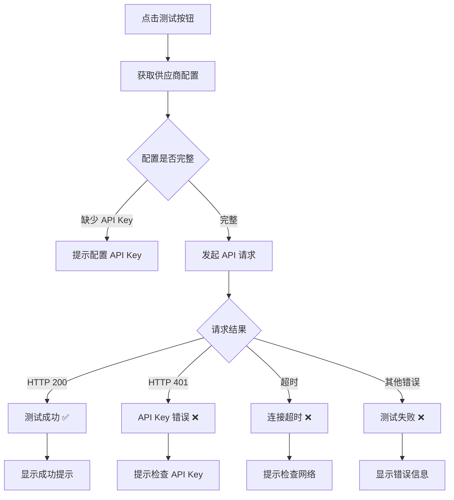
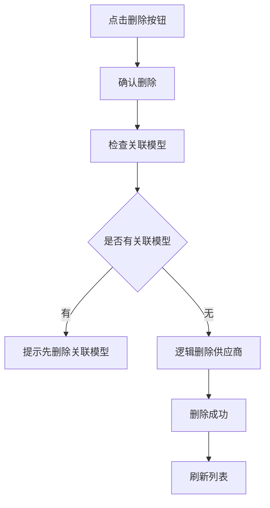

# 模型供应商管理模块 - 产品需求文档 (PRD)

## 1. 文档信息

| 字段 | 内容 |
|-----|------|
| 模块名称 | 模型供应商管理 (Model Provider Management) |
| 所属系统 | VIPClaw 管理后台 |
| 文档版本 | V1.0 |
| 编写日期 | 2026-04-20 |
| 优先级 | 🔴 P0（核心基础模块） |

---

## 2. 模块概述

### 2.1 功能定位

模型供应商管理模块负责管理 AI 模型提供商的配置信息，包括：
- 供应商基本信息（名称、显示名称）
- API 认证信息（API Key、Base URL）
- 供应商状态管理（启用/禁用）
- 连通性测试

### 2.2 核心价值

1. **统一供应商管理**: 集中管理 OpenAI、Anthropic、DashScope 等供应商配置
2. **API Key 安全**: 支持密钥配置和连通性测试
3. **多供应商支持**: 支持同时配置多个供应商，灵活切换
4. **数据隔离**: 基于 `is_public` 和 `creator` 实现数据可见性控制

---

## 3. 数据实体设计

### 3.1 模型供应商实体 (ModelProvider)

#### 3.1.1 数据库表结构

**表名**: `model_provider`  
**说明**: 模型供应商表

| 字段名 | 数据类型 | 长度 | 可空 | 默认值 | 说明 | 约束 |
|--------|---------|------|------|--------|------|------|
| `id` | BIGINT | 20 | ❌ 否 | AUTO_INCREMENT | 供应商 ID（主键） | PRIMARY KEY |
| `name` | VARCHAR | 50 | ❌ 否 | - | 供应商名称（dashscope/openai/ollama） | UNIQUE KEY, NOT NULL |
| `display_name` | VARCHAR | 100 | ❌ 否 | - | 显示名称 | NOT NULL |
| `api_key` | VARCHAR | 500 | ✅ 是 | NULL | API 密钥 | - |
| `base_url` | VARCHAR | 500 | ✅ 是 | NULL | API 地址 | - |
| `status` | TINYINT | 1 | ❌ 否 | 1 | 状态 (0:禁用 1:启用) | - |
| `is_public` | TINYINT | 1 | ❌ 否 | 1 | 是否公开 (0:否 1:是) | - |
| `creator` | VARCHAR | 100 | ❌ 否 | - | 创建人用户名 | NOT NULL |
| `active` | TINYINT | 1 | ❌ 否 | 1 | 逻辑删除标识 (0:已删除 1:正常) | - |
| `create_time` | DATETIME | - | ❌ 否 | CURRENT_TIMESTAMP | 创建时间 | - |
| `update_time` | DATETIME | - | ❌ 否 | CURRENT_TIMESTAMP ON UPDATE | 更新时间 | - |

**索引设计**:
- `PRIMARY KEY (id)`: 主键索引
- `UNIQUE KEY uk_name (name)`: 供应商名称唯一索引

#### 3.1.2 字段详细说明

**必填字段 (NOT NULL)**:

| 字段 | 业务规则 | 校验规则 | 示例值 |
|-----|---------|---------|--------|
| `name` | 供应商技术名称，全局唯一标识 | - 长度：1-50 字符<br>- 英文小写+数字+下划线<br>- 格式校验：`^[a-z0-9_]+$` | `dashscope`, `openai`, `ollama` |
| `display_name` | 供应商显示名称，用于 UI 展示 | - 长度：1-100 字符<br>- 不允许纯空格 | `阿里云百炼`, `OpenAI`, `本地模型` |
| `creator` | 创建人用户名 | - 长度：1-100 字符<br>- 由系统自动填充当前登录用户 | `admin`, `user123` |

**可选字段 (NULLABLE)**:

| 字段 | 业务规则 | 校验规则 | 示例值 |
|-----|---------|---------|--------|
| `api_key` | API 认证密钥 | - 最大长度：500 字符<br>- 敏感信息，响应时脱敏显示<br>- 建议加密存储 | `sk-xxxxxxxxxxxxxxxx` |
| `base_url` | API 基础地址 | - 最大长度：500 字符<br>- URL 格式校验：`^(https?:\/\/)?([\w.-]+)+(:\d+)?(\/[^\s]*)?$` | `https://dashscope.aliyuncs.com/compatible-mode/v1` |

**系统字段**:

| 字段 | 业务规则 | 说明 |
|-----|---------|------|
| `id` | 数据库自增主键 | 全局唯一标识符 |
| `status` | 0:禁用<br>1:启用（默认） | 控制供应商是否可用 |
| `is_public` | 0:私有<br>1:公开（默认） | 控制其他用户是否可见 |
| `active` | 0:已删除<br>1:正常（默认） | 逻辑删除标识，禁止物理删除 |
| `create_time` | 创建时间，自动填充 | 格式：`YYYY-MM-DD HH:mm:ss` |
| `update_time` | 更新时间，自动更新 | 格式：`YYYY-MM-DD HH:mm:ss` |

---

### 3.2 DTO 对象设计

#### 3.2.1 创建请求 (ModelProviderCreateRequest)

| 字段 | 类型 | 必填 | 校验规则 | 默认值 | 说明 |
|-----|------|------|---------|--------|------|
| `name` | String | ✅ 是 | - 长度：1-50<br>- 格式：`^[a-z0-9_]+$`<br>- 唯一性校验 | - | 供应商技术名称 |
| `displayName` | String | ✅ 是 | - 长度：1-100<br>- 不允许纯空格 | - | 供应商显示名称 |
| `apiKey` | String | ❌ 否 | - 长度：0-500 | `null` | API 密钥（敏感信息） |
| `baseUrl` | String | ❌ 否 | - URL 格式校验 | `null` | API 基础地址 |
| `isPublic` | Int | ❌ 否 | - 枚举：0,1 | `1` | 是否公开（0:私有 1:公开） |

**注意事项**:
- `name` 和 `displayName` 为必填字段
- `apiKey` 为敏感信息，后端需加密存储
- `isPublic` 默认为 1（公开）
- `status` 字段由系统自动填充，默认值为 1（启用），创建请求中不允许传入
- `creator`、`active`、`createTime`、`updateTime` 由系统自动填充

---

#### 3.2.2 更新请求 (ModelProviderUpdateRequest)

| 字段 | 类型 | 必填 | 校验规则 | 说明 |
|-----|------|------|---------|------|
| `name` | String | ❌ 否 | - 长度：1-50<br>- 格式：`^[a-z0-9_]+$`<br>- 唯一性校验 | 供应商技术名称 |
| `displayName` | String | ❌ 否 | - 长度：1-100<br>- 不允许纯空格 | 供应商显示名称 |
| `apiKey` | String | ❌ 否 | - 长度：0-500 | API 密钥（为空则不修改） |
| `baseUrl` | String | ❌ 否 | - URL 格式校验 | API 基础地址 |
| `isPublic` | Int | ❌ 否 | - 枚举：0,1 | 是否公开 |

**更新规则**:
- 所有字段为 `null` 时不更新该字段（部分更新）
- `apiKey` 为空字符串时不修改密钥
- `name` 更新时需校验唯一性（排除自身）
- `id` 为路径参数，不在 DTO 中

---

#### 3.2.3 响应对象 (ModelProviderResponse)

| 字段 | 类型 | 说明 | 示例值 |
|-----|------|------|--------|
| `id` | Long | 供应商 ID | `1` |
| `name` | String | 供应商技术名称 | `dashscope` |
| `displayName` | String | 显示名称 | `阿里云百炼` |
| `apiKey` | String | API 密钥（脱敏） | `sk****a1f5` |
| `baseUrl` | String | API 地址 | `https://dashscope...` |
| `status` | Int | 状态（0:禁用 1:启用） | `1` |
| `isPublic` | Int | 是否公开（0:私有 1:公开） | `1` |
| `creator` | String | 创建人用户名 | `admin` |
| `createTime` | LocalDateTime | 创建时间 | `2026-03-13T12:00:00` |
| `updateTime` | LocalDateTime | 更新时间 | `2026-03-13T12:00:00` |

**安全说明**:
- `apiKey` 在响应中需要脱敏显示（前 2 位 + **** + 后 4 位）
- 如果 `apiKey` 为空，则返回空字符串或 `null`

---

## 4. CRUD 操作逻辑

### 4.1 创建供应商 (Create)

#### 4.1.1 接口信息

- **接口路径**: `POST /admin/model-providers`
- **权限要求**: 登录用户
- **Content-Type**: `application/json`

#### 4.1.2 请求示例

```json
{
  "name": "dashscope",
  "displayName": "阿里云百炼",
  "apiKey": "sk-5404e4ddac8645a1bd3555c00376a1f5",
  "baseUrl": "https://dashscope.aliyuncs.com/compatible-mode/v1",
  "isPublic": 1
}
```

#### 4.1.3 业务逻辑

```
1. 接收 ModelProviderCreateRequest 请求
   ↓
2. 参数校验（@Valid）
   - name 必填校验、长度校验、格式校验（`^[a-z0-9_]+$`）
   - displayName 必填校验、长度校验、非纯空格校验
   - baseUrl URL 格式校验（如果有传参）
   - apiKey 长度校验（如果有传参）
   - isPublic 枚举校验（0 或 1）
   ↓
3. 检查供应商名称是否已存在
   - 查询数据库：SELECT * FROM model_provider WHERE name = #{name} AND active = 1
   - 如果存在 → 抛出 BizException("供应商名称已存在")
   ↓
4. 构建 ModelProvider 实体
   - 设置默认值：status=1, is_public=request.isPublic ?: 1, active=1
   - 设置 creator：当前登录用户名
   - 设置时间：createTime, updateTime = LocalDateTime.now()
   - apiKey 加密存储（如果有传参）
   ↓
5. 插入数据库
   - INSERT INTO model_provider (...)
   ↓
6. 返回 ModelProviderResponse
   - apiKey 脱敏处理
   - 封装为 ResultVo.success(response)
```

#### 4.1.4 异常处理

| 异常场景 | 错误码 | 错误信息 | 处理方式 |
|---------|--------|---------|---------|
| 供应商名称已存在 | 400 | "供应商名称已存在" | 提示用户更换名称 |
| name 格式错误 | 400 | "供应商名称只能包含小写字母、数字和下划线" | 表单提示格式错误 |
| displayName 为空或纯空格 | 400 | "显示名称不能为空" | 表单提示必填 |
| baseUrl 格式错误 | 400 | "API 地址格式不正确" | 表单提示 URL 格式 |
| 参数校验失败 | 400 | 具体校验错误信息 | 显示表单校验错误 |
| 数据库异常 | 500 | "创建供应商失败" | 记录日志，提示重试 |

---

### 4.2 查询供应商列表 (Read - List)

#### 4.2.1 接口信息

- **接口路径**: `GET /admin/model-providers/page`
- **权限要求**: 登录用户
- **数据权限**: 查询自己创建的 + is_public=1 的供应商

#### 4.2.2 请求参数

| 参数名 | 类型 | 必填 | 默认值 | 说明 | 示例值 |
|--------|------|------|--------|------|--------|
| `pageNum` | Int | ❌ 否 | 1 | 页码 | `1` |
| `pageSize` | Int | ❌ 否 | 10 | 每页大小 | `10` |
| `name` | String | ❌ 否 | - | 供应商名称模糊搜索 | `open` |
| `status` | Int | ❌ 否 | - | 状态筛选 (0/1) | `1` |
| `isPublic` | Int | ❌ 否 | - | 公开性筛选 (0/1) | `1` |

#### 4.2.3 响应示例

```json
{
  "code": 200,
  "message": "success",
  "data": {
    "total": 3,
    "size": 10,
    "current": 1,
    "pages": 1,
    "records": [
      {
        "id": 1,
        "name": "dashscope",
        "displayName": "阿里云百炼",
        "apiKey": "sk****a1f5",
        "baseUrl": "https://dashscope.aliyuncs.com/compatible-mode/v1",
        "status": 1,
        "isPublic": 1,
        "creator": "admin",
        "createTime": "2026-03-13T12:00:00",
        "updateTime": "2026-03-13T12:00:00"
      }
    ]
  }
}
```

#### 4.2.4 业务逻辑

```
1. 接收查询参数和当前用户名
   ↓
2. 构建查询条件
   - active = 1
   - (is_public = 1 OR creator = #{currentUsername})
   - name 模糊搜索（如果有传参）：`name LIKE '%#{name}%'`
   - status 精确匹配（如果有传参）
   - isPublic 精确匹配（如果有传参）
   ↓
3. 执行分页查询
   - 使用 PageHelper 分页插件
   - SELECT * FROM model_provider WHERE ... ORDER BY create_time DESC
   ↓
4. 转换为 ModelProviderResponse
   - apiKey 脱敏处理
   ↓
5. 返回分页结果
   - 封装为 ResultVo.success(pageResult)
```

---

### 4.3 查询供应商详情 (Read - Detail)

#### 4.3.1 接口信息

- **接口路径**: `GET /admin/model-providers/{id}`
- **权限要求**: 登录用户

#### 4.3.2 业务逻辑

```
1. 接收供应商 ID
   ↓
2. 查询数据库
   - SELECT * FROM model_provider WHERE id = #{id} AND active = 1
   ↓
3. 判断供应商是否存在
   - 不存在 → 抛出 BizException("供应商不存在")
   ↓
4. 数据权限校验
   - 如果 is_public=0 且 creator != 当前用户 → 抛出 BizException("无权限查看")
   ↓
5. 转换为 ModelProviderResponse
   - apiKey 脱敏
   ↓
6. 返回供应商详情
```

---

### 4.4 更新供应商 (Update)

#### 4.4.1 接口信息

- **接口路径**: `PUT /admin/model-providers/update/{id}`
- **权限要求**: 登录用户（仅创建人可修改）

#### 4.4.2 请求示例

```json
{
  "displayName": "阿里云百炼（更新）",
  "baseUrl": "https://dashscope.aliyuncs.com/compatible-mode/v1"
}
```

#### 4.4.3 业务逻辑

```
1. 接收供应商 ID 和 ModelProviderUpdateRequest
   ↓
2. 查询原供应商信息
   - SELECT * FROM model_provider WHERE id = #{id} AND active = 1
   - 不存在 → 抛出 BizException("供应商不存在")
   ↓
3. 权限校验
   - 如果 creator != 当前用户 → 抛出 BizException("无权限修改")
   ↓
4. 参数校验（仅对非 null 字段校验）
   - name != null → 校验长度、格式、唯一性（排除自身）
   - displayName != null → 校验长度、非纯空格
   - baseUrl != null → 校验 URL 格式
   - apiKey != null → 校验长度
   - isPublic != null → 校验枚举值（0 或 1）
   ↓
5. 部分更新（只更新非 null 字段）
   - name != null → 更新 name
   - displayName != null → 更新 displayName
   - apiKey != null && apiKey.isNotEmpty() → 更新 apiKey（加密存储）
   - baseUrl != null → 更新 baseUrl
   - isPublic != null → 更新 isPublic
   ↓
6. 更新时间
   - updateTime = LocalDateTime.now()
   ↓
7. 执行更新
   - UPDATE model_provider SET ... WHERE id = #{id}
   ↓
8. 返回 ModelProviderResponse
   - 封装为 ResultVo.success(response)
```

---

### 4.5 切换供应商状态 (Toggle)

#### 4.5.1 接口信息

- **接口路径**: `PUT /admin/model-providers/{id}/toggle`
- **权限要求**: 登录用户（仅创建人可操作）

#### 4.5.2 业务逻辑

```
1. 接收供应商 ID
   ↓
2. 查询供应商
   - SELECT * FROM model_provider WHERE id = #{id} AND active = 1
   - 不存在 → 抛出 BizException("供应商不存在")
   ↓
3. 权限校验
   - 如果 creator != 当前用户 → 抛出 BizException("无权限操作")
   ↓
4. 切换状态
   - status = 1 - status（0→1, 1→0）
   - updateTime = NOW()
   ↓
5. 执行更新
   - UPDATE model_provider SET status = #{status}, update_time = NOW() WHERE id = #{id}
   ↓
6. 返回 ModelProviderResponse
```

---

### 4.6 连通性测试 (Connectivity Test)

#### 4.6.1 接口信息

- **接口路径**: `POST /admin/model-providers/{id}/test`
- **权限要求**: 登录用户

#### 4.6.2 业务逻辑

```
1. 接收供应商 ID
   ↓
2. 查询供应商
   - SELECT * FROM model_provider WHERE id = #{id} AND active = 1
   ↓
3. 获取配置
   - apiKey
   - baseUrl
   ↓
4. 发起测试请求
   - 调用供应商 API（如：/models 端点）
   - 设置超时时间：10 秒
   ↓
5. 判断结果
   - 成功（HTTP 200）→ 返回 true
   - 失败（超时/401/其他错误）→ 返回 false
   ↓
6. 返回测试结果
```

#### 4.6.3 测试流程示例

```kotlin
fun connectivityTest(id: Long): Boolean {
    val provider = getProviderById(id)
    
    val client = HttpClient.newBuilder()
        .connectTimeout(Duration.ofSeconds(10))
        .build()
    
    val request = HttpRequest.newBuilder()
        .uri(URI.create("${provider.baseUrl}/models"))
        .header("Authorization", "Bearer ${provider.apiKey}")
        .GET()
        .build()
    
    val response = client.send(request, BodyHandlers.ofString())
    return response.statusCode() == 200
}
```

---

### 4.7 删除供应商 (Delete)

#### 4.7.1 接口信息

- **接口路径**: `DELETE /admin/model-providers/{id}`
- **权限要求**: 登录用户（仅创建人可删除）

#### 4.7.2 业务逻辑

```
1. 接收供应商 ID
   ↓
2. 查询供应商
   - SELECT * FROM model_provider WHERE id = #{id} AND active = 1
   - 不存在 → 抛出 BizException("供应商不存在")
   ↓
3. 权限校验
   - 如果 creator != 当前用户 → 抛出 BizException("无权限删除")
   ↓
4. 检查关联数据
   - SELECT COUNT(*) FROM model WHERE provider_id = #{id} AND active = 1
   - 如果有关联模型 → 抛出 BizException("该供应商下存在模型，无法删除")
   ↓
5. 逻辑删除
   - UPDATE model_provider SET active = 0, update_time = NOW() WHERE id = #{id}
   ↓
6. 返回结果
```

#### 4.7.3 删除前置校验

⚠️ **重要**: 删除供应商前必须检查是否有关联的模型数据

```sql
-- 检查关联模型数量
SELECT COUNT(*) FROM model 
WHERE provider_id = #{providerId} AND active = 1
```

如果 `COUNT > 0`，则不允许删除，提示用户先删除或迁移关联模型。

---

## 5. 前端页面设计

### 5.1 页面布局

```
┌─────────────────────────────────────────────────────┐
│  模型供应商管理                                      │
├─────────────────────────────────────────────────────┤
│  [搜索框: name]  [状态: 全部▼]  [搜索] [新建供应商]  │
├─────────────────────────────────────────────────────┤
│  ┌────┬──────────┬──────────┬────────────┬──────┬──┐│
│  │ ID │ 供应商名称│ 显示名称  │ API 地址    │ 状态 │操作││
│  ├────┼──────────┼──────────┼────────────┼──────┼──┤│
│  │ 1  │dashscope │阿里云百炼│dashscope...│ ✅   │🔍✏️🗑️││
│  │ 2  │ openai   │ OpenAI   │api.openai..│ ✅   │🔍✏️🗑️││
│  └────┴──────────┴──────────┴────────────┴──────┴──┘│
│                                        [1] 2 3      │
└─────────────────────────────────────────────────────┘
```

### 5.2 表格列定义

| 列名 | 字段 | 宽度 | 显示格式 | 说明 |
|-----|------|------|---------|------|
| ID | id | 80px | 数字 | 主键 ID |
| 供应商名称 | name | 150px | 文本 | 技术名称 |
| 显示名称 | displayName | 150px | 文本 | UI 显示名称 |
| API 密钥 | apiKey | 150px | 脱敏文本 | `sk****xxxx` |
| API 地址 | baseUrl | 250px | 文本截断 | 鼠标悬停显示完整 |
| 状态 | status | 100px | 开关组件 | 启用/禁用 |
| 创建人 | creator | 100px | 文本 | 用户名 |
| 创建时间 | createTime | 180px | 日期时间 | YYYY-MM-DD HH:mm:ss |
| 操作 | - | 180px | 按钮组 | 测试、编辑、删除 |

### 5.3 新建/编辑表单

| 字段 | 类型 | 必填 | 校验规则 | 默认值 |
|-----|------|------|---------|--------|
| 供应商名称 | Input | ✅ | 字母、数字、下划线，1-50 字符 | - |
| 显示名称 | Input | ✅ | 最大 100 字符 | - |
| API 密钥 | Input.Password | ❌ | 最大 500 字符 | - |
| API 地址 | Input | ❌ | URL 格式 | - |
| 状态 | Switch | ❌ | 启用/禁用 | 启用 |

---

## 6. API Key 安全设计

### 6.1 存储安全

✅ **数据库存储**: 明文存储（生产环境建议加密）  
✅ **响应脱敏**: 前端展示时脱敏处理  

### 6.2 脱敏规则

```kotlin
fun maskApiKey(apiKey: String): String {
    if (apiKey.length <= 6) return "****"
    return apiKey.substring(0, 2) + "****" + apiKey.substring(apiKey.length - 4)
}

// 示例：
// sk-5404e4ddac8645a1bd3555c00376a1f5 → sk****a1f5
```

### 6.3 前端展示

```tsx
// 显示脱敏后的 API Key
<Text copyable={{ text: record.apiKey }}>
  {maskApiKey(record.apiKey)}
</Text>
```

---

## 7. 数据权限控制

### 7.1 可见性规则

| 场景 | 创建人 | 其他用户 | 说明 |
|------|--------|---------|------|
| is_public=1, creator=A | ✅ 可见 | ✅ 可见 | 公开供应商，所有人可见 |
| is_public=0, creator=A | ✅ 可见 | ❌ 不可见 | 私有供应商，仅创建人可见 |
| active=0 | ❌ 不可见 | ❌ 不可见 | 已删除供应商 |

### 7.2 操作权限

| 操作 | 创建人 | 其他用户 | 说明 |
|-----|--------|---------|------|
| 查看 | ✅ | ✅ (is_public=1) | - |
| 编辑 | ✅ | ❌ | 仅创建人可编辑 |
| 删除 | ✅ | ❌ | 仅创建人可删除 |
| 连通性测试 | ✅ | ✅ (is_public=1) | - |

---

## 8. 异常场景处理

| 场景 | 触发条件 | 错误码 | 错误信息 | 前端处理 |
|-----|---------|--------|---------|---------|
| 供应商名称已存在 | 创建时名称重复 | 400 | "供应商名称已存在" | 表单提示 |
| 供应商不存在 | 查询/更新/删除时 ID 无效 | 404 | "供应商不存在" | 提示并返回列表 |
| 无权限操作 | 非创建人尝试编辑/删除 | 403 | "无权限操作" | 隐藏按钮或提示 |
| 关联模型存在 | 删除时有关联模型 | 400 | "该供应商下存在模型，无法删除" | 提示先处理关联数据 |
| 连通性测试失败 | API Key 错误或网络问题 | 200 | 返回 false | 提示检查配置 |
| 参数校验失败 | 请求参数不符合规则 | 400 | 具体校验信息 | 表单显示错误 |

---

## 9. 业务流程图

### 9.1 连通性测试流程



### 9.2 删除供应商流程



---

## 10. 测试用例

### 10.1 功能测试

| 用例 ID | 测试场景 | 前置条件 | 操作步骤 | 预期结果 |
|---------|---------|---------|---------|---------|
| TC-001 | 创建供应商-成功 | 管理员登录 | 填写完整信息提交 | 创建成功，列表显示新供应商 |
| TC-002 | 创建供应商-名称重复 | 管理员登录 | 使用已存在的名称 | 提示"供应商名称已存在" |
| TC-003 | 查询供应商列表-模糊搜索 | 有供应商数据 | 输入 name="open" | 显示匹配的供应商 |
| TC-004 | 查询供应商列表-状态筛选 | 有供应商数据 | 选择 status=0 | 只显示禁用供应商 |
| TC-005 | 更新供应商-修改显示名称 | 创建人登录 | 修改 displayName | 更新成功 |
| TC-006 | 更新供应商-修改 API Key | 创建人登录 | 输入新 API Key | 密钥更新 |
| TC-007 | 连通性测试-成功 | 配置正确的 API Key | 点击测试按钮 | 返回 true，显示成功 |
| TC-008 | 连通性测试-失败 | 配置错误的 API Key | 点击测试按钮 | 返回 false，提示错误 |
| TC-009 | 删除供应商-无关联模型 | 供应商下无模型 | 点击删除按钮 | 删除成功 |
| TC-010 | 删除供应商-有关联模型 | 供应商下有模型 | 点击删除按钮 | 提示"存在关联模型，无法删除" |

---

## 11. 附录

### 11.1 枚举值字典

**状态 (status)**:
| 值 | 说明 |
|----|------|
| 0 | 禁用 |
| 1 | 启用（默认） |

**是否公开 (is_public)**:
| 值 | 说明 |
|----|------|
| 0 | 私有 |
| 1 | 公开（默认） |

### 11.2 常见供应商配置

| name | displayName | baseUrl | 说明 |
|------|-------------|---------|------|
| `dashscope` | 阿里云百炼 | `https://dashscope.aliyuncs.com/compatible-mode/v1` | 阿里通义千问 |
| `openai` | OpenAI | `https://api.openai.com/v1` | GPT 系列 |
| `anthropic` | Anthropic | `https://api.anthropic.com/v1` | Claude 系列 |
| `ollama` | 本地模型 | `http://localhost:11434/v1` | 本地部署 |
| `deepseek` | DeepSeek | `https://api.deepseek.com/v1` | DeepSeek 模型 |

### 11.3 SQL 脚本

```sql
-- 创建模型供应商表
CREATE TABLE `model_provider` (
    `id` BIGINT(20) NOT NULL AUTO_INCREMENT COMMENT 'ID',
    `name` VARCHAR(50) NOT NULL COMMENT '服务商名称（dashscope/openai/ollama）',
    `display_name` VARCHAR(100) NOT NULL COMMENT '显示名称',
    `api_key` VARCHAR(500) DEFAULT NULL COMMENT 'API 密钥',
    `base_url` VARCHAR(500) DEFAULT NULL COMMENT 'API 地址',
    `status` TINYINT(1) DEFAULT 1 COMMENT '是否启用（0:禁用，1:启用）',
    `is_public` TINYINT(1) DEFAULT 1 COMMENT '是否公开（0:否，1:是）',
    `creator` VARCHAR(100) NOT NULL COMMENT '创建人',
    `active` TINYINT(1) DEFAULT 1 COMMENT '是否可用（0:被删除，1:可用）',
    `create_time` DATETIME DEFAULT CURRENT_TIMESTAMP COMMENT '创建时间',
    `update_time` DATETIME DEFAULT CURRENT_TIMESTAMP ON UPDATE CURRENT_TIMESTAMP COMMENT '更新时间',
    PRIMARY KEY (`id`),
    UNIQUE KEY `uk_name` (`name`)
) ENGINE=InnoDB DEFAULT CHARSET=utf8mb4 COMMENT='模型供应商表';
```

### 11.4 相关文件清单

**后端文件**:
- Entity: `ModelProvider.kt`
- DTO: `ModelProviderCreateRequest.kt`, `ModelProviderUpdateRequest.kt`, `ModelProviderResponse.kt`
- Service: `ModelProviderService.kt`, `ModelProviderServiceImpl.kt`
- Controller: `ModelProviderController.kt`
- Mapper: `ModelProviderMapper.kt`, `ModelProviderMapper.xml`

**前端文件**:
- 页面: `vipclaw-webui/src/pages/model/provider/index.tsx`
- 服务: `vipclaw-webui/src/services/ant-design-pro/modelProvider.ts`

---

*文档结束 - 模型供应商管理模块 PRD V1.0*
