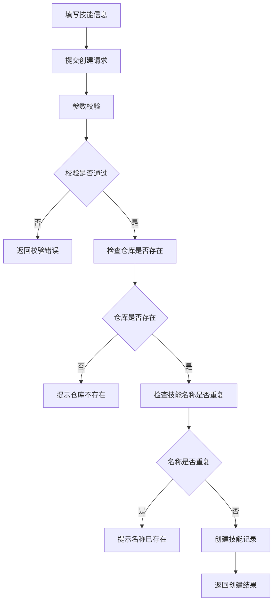
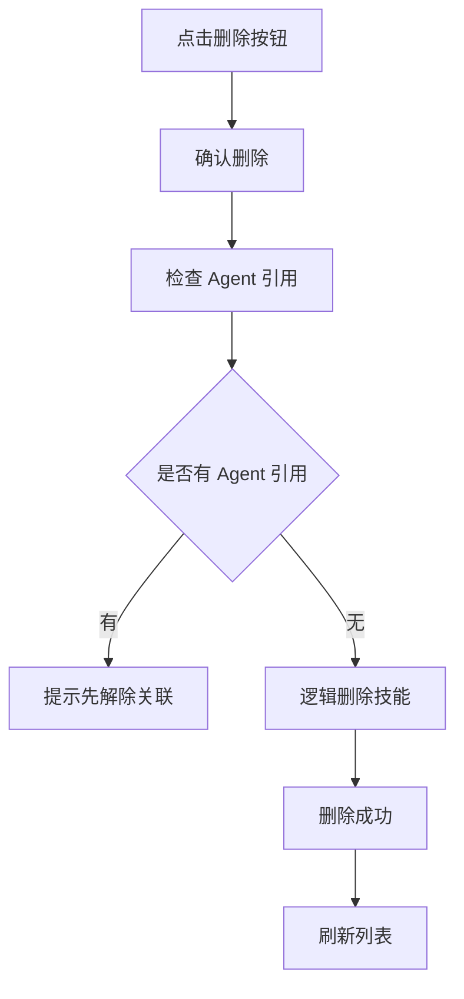

# 技能管理模块 - 产品需求文档 (PRD)

## 1. 文档信息

| 字段 | 内容 |
|-----|------|
| 模块名称 | 技能管理 (Skill Management) |
| 所属系统 | VIPClaw 管理后台 |
| 文档版本 | V1.0 |
| 编写日期 | 2026-04-22 |
| 优先级 | 🔴 P0（核心基础模块） |

---

## 2. 模块概述

### 2.1 功能定位

技能管理模块负责管理 AI Agent 的技能配置信息，包括：
- 技能基本信息（名称、描述、所属仓库）
- 技能内容（skill.md 内容、资源信息）
- 技能状态管理（启用/禁用）
- 技能与仓库的关联关系

### 2.2 核心价值

1. **统一技能管理**: 集中管理各种 AI 技能配置
2. **技能复用**: 支持技能在不同 Agent 之间复用
3. **版本控制**: 通过仓库管理技能的版本和来源
4. **数据隔离**: 基于 `is_public` 和 `creator` 实现数据可见性控制

---

## 3. 数据实体设计

### 3.1 技能实体 (Skill)

#### 3.1.1 数据库表结构

**表名**: `skill`  
**说明**: 技能表

| 字段名 | 数据类型 | 长度 | 可空 | 默认值 | 说明 | 约束 |
|--------|---------|------|------|--------|------|------|
| `id` | BIGINT | 20 | ❌ 否 | AUTO_INCREMENT | 技能 ID（主键） | PRIMARY KEY |
| `name` | VARCHAR | 100 | ❌ 否 | - | 技能名称 | UNIQUE KEY (name, repository_id), NOT NULL |
| `repository_id` | BIGINT | 20 | ❌ 否 | - | 所属仓库 ID | NOT NULL, FOREIGN KEY |
| `description` | TEXT | - | ✅ 是 | NULL | 技能描述 | - |
| `skillmd` | TEXT | - | ✅ 是 | NULL | skill.md 内容 | - |
| `resources` | TEXT | - | ✅ 是 | NULL | 资源信息（JSON 格式） | - |
| `status` | TINYINT | 1 | ❌ 否 | 1 | 状态 (0:禁用 1:启用) | - |
| `is_public` | TINYINT | 1 | ❌ 否 | 1 | 是否公开 (0:否 1:是) | - |
| `creator` | VARCHAR | 100 | ✅ 是 | NULL | 创建人用户名 | - |
| `active` | TINYINT | 1 | ❌ 否 | 1 | 逻辑删除标识 (0:已删除 1:正常) | - |
| `create_time` | DATETIME | - | ❌ 否 | CURRENT_TIMESTAMP | 创建时间 | - |
| `update_time` | DATETIME | - | ❌ 否 | CURRENT_TIMESTAMP ON UPDATE | 更新时间 | - |

**索引设计**:
- `PRIMARY KEY (id)`: 主键索引
- `UNIQUE KEY uk_name_repository_id (name, repository_id)`: 技能名称在仓库内唯一索引
- `INDEX idx_repository_id (repository_id)`: 仓库 ID 索引，优化关联查询

#### 3.1.2 字段详细说明

**必填字段 (NOT NULL)**:

| 字段 | 业务规则 | 校验规则 | 示例值 |
|-----|---------|---------|--------|
| `name` | 技能名称，同一仓库内唯一 | - 长度：1-100 字符<br>- 不允许纯空格<br>- 同一仓库内名称唯一 | `code-review`, `web-search`, `data-analysis` |
| `repository_id` | 所属技能仓库 ID | - 必须是有效的仓库 ID<br>- 关联 skill_repository 表 | `1`, `2`, `3` |

**可选字段 (NULLABLE)**:

| 字段 | 业务规则 | 校验规则 | 示例值 |
|-----|---------|---------|--------|
| `description` | 技能描述信息 | - 最大长度：65535 字符（TEXT 类型）<br>- 支持 Markdown 格式 | `用于代码审查的技能，可以检查代码质量和规范` |
| `skillmd` | skill.md 文件内容 | - 最大长度：65535 字符（TEXT 类型）<br>- Markdown 格式<br>- 包含技能的使用说明和配置 | `# Code Review\n\n## Description\n...` |
| `resources` | 资源信息（JSON 格式） | - 最大长度：65535 字符（TEXT 类型）<br>- 必须是合法的 JSON 格式<br>- 包含技能所需的资源文件路径 | `{"files": ["config.json", "prompt.txt"]}` |

**系统字段**:

| 字段 | 业务规则 | 说明 |
|-----|---------|------|
| `id` | 数据库自增主键 | 全局唯一标识符 |
| `status` | 0:禁用<br>1:启用（默认） | 控制技能是否可用 |
| `is_public` | 0:私有<br>1:公开（默认） | 控制其他用户是否可见 |
| `creator` | 创建人用户名 | 由系统自动填充当前登录用户 |
| `active` | 0:已删除<br>1:正常（默认） | 逻辑删除标识，禁止物理删除 |
| `create_time` | 创建时间，自动填充 | 格式：`YYYY-MM-DD HH:mm:ss` |
| `update_time` | 更新时间，自动更新 | 格式：`YYYY-MM-DD HH:mm:ss` |

---

### 3.2 DTO 对象设计

#### 3.2.1 创建请求 (SkillCreateRequest)

| 字段 | 类型 | 必填 | 校验规则 | 默认值 | 说明 |
|-----|------|------|---------|--------|------|
| `name` | String | ✅ 是 | - 长度：1-100<br>- 不允许纯空格<br>- 唯一性校验（同仓库内） | - | 技能名称 |
| `repositoryId` | Long | ✅ 是 | - 必须大于 0<br>- 仓库必须存在 | - | 所属仓库 ID |
| `description` | String | ❌ 否 | - 最大长度：65535 | `null` | 技能描述 |
| `skillmd` | String | ❌ 否 | - 最大长度：65535 | `null` | skill.md 内容 |
| `resources` | String | ❌ 否 | - JSON 格式校验<br>- 最大长度：65535 | `null` | 资源信息 |
| `isPublic` | Int | ❌ 否 | - 枚举：0,1 | `1` | 是否公开（0:私有 1:公开） |

**注意事项**:
- `name` 和 `repositoryId` 为必填字段
- `name` 在同一仓库内必须唯一
- `repositoryId` 必须指向一个存在的且激活的仓库
- `resources` 如果填写，必须是合法的 JSON 格式
- `creator`、`status`、`active`、`createTime`、`updateTime` 由系统自动填充

**请求示例**:
```json
{
  "name": "code-review",
  "repositoryId": 1,
  "description": "用于代码审查的技能，可以检查代码质量和规范",
  "skillmd": "# Code Review\n\n## Description\n这是一个代码审查技能...",
  "resources": "{\"files\": [\"config.json\", \"prompt.txt\"]}",
  "isPublic": 1
}
```

---

#### 3.2.2 更新请求 (SkillUpdateRequest)

| 字段 | 类型 | 必填 | 校验规则 | 说明 |
|-----|------|------|---------|------|
| `id` | Long | ✅ 是 | - 路径参数<br>- 必须存在 | 技能 ID |
| `name` | String | ❌ 否 | - 长度：1-100<br>- 不允许纯空格<br>- 唯一性校验（同仓库内，排除自身） | 技能名称 |
| `repositoryId` | Long | ❌ 否 | - 必须大于 0<br>- 仓库必须存在 | 所属仓库 ID |
| `description` | String | ❌ 否 | - 最大长度：65535 | 技能描述 |
| `skillmd` | String | ❌ 否 | - 最大长度：65535 | skill.md 内容 |
| `resources` | String | ❌ 否 | - JSON 格式校验<br>- 最大长度：65535 | 资源信息 |
| `isPublic` | Int | ❌ 否 | - 枚举：0,1 | 是否公开 |

**更新规则**:
- 所有字段为 `null` 时不更新该字段（部分更新）
- `name` 更新时需校验唯一性（排除自身，同仓库内）
- `repositoryId` 更新时需校验仓库是否存在
- `resources` 更新时需校验 JSON 格式
- `id` 为路径参数，必填

**请求示例**:
```json
{
  "name": "code-review-v2",
  "description": "更新后的代码审查技能描述",
  "skillmd": "# Code Review V2\n\n## Description\n更新后的内容..."
}
```

---

#### 3.2.3 响应对象 (SkillResponse)

| 字段 | 类型 | 说明 | 示例值 |
|-----|------|------|--------|
| `id` | Long | 技能 ID | `1` |
| `name` | String | 技能名称 | `code-review` |
| `repositoryId` | Long | 所属仓库 ID | `1` |
| `repositoryName` | String | 所属仓库名称（关联查询） | `qoder-skills` |
| `description` | String | 技能描述 | `用于代码审查的技能...` |
| `skillmd` | String | skill.md 内容 | `# Code Review\n...` |
| `resources` | String | 资源信息（JSON） | `{"files": [...]}` |
| `status` | Int | 状态（0:禁用 1:启用） | `1` |
| `isPublic` | Int | 是否公开（0:私有 1:公开） | `1` |
| `creator` | String | 创建人用户名 | `admin` |
| `createTime` | LocalDateTime | 创建时间 | `2026-03-25T12:00:00` |
| `updateTime` | LocalDateTime | 更新时间 | `2026-03-25T12:00:00` |

**说明**:
- `repositoryName` 为关联查询字段，用于前端展示
- 所有字段均对外暴露（无敏感信息）

---

## 4. CRUD 操作逻辑

### 4.1 创建技能 (Create)

#### 4.1.1 接口信息

- **接口路径**: `POST /admin/skills`
- **权限要求**: 登录用户
- **Content-Type**: `application/json`

#### 4.1.2 请求示例

```json
{
  "name": "code-review",
  "repositoryId": 1,
  "description": "用于代码审查的技能，可以检查代码质量和规范",
  "skillmd": "# Code Review\n\n## Description\n这是一个代码审查技能，用于自动检查代码质量、规范性和潜在问题。",
  "resources": "{\"files\": [\"config.json\", \"prompt.txt\"]}",
  "isPublic": 1
}
```

#### 4.1.3 业务逻辑

```
1. 接收 SkillCreateRequest 请求
   ↓
2. 参数校验（@Valid）
   - name 必填校验、长度校验、非纯空格校验
   - repositoryId 必填校验、大于 0 校验
   - description 长度校验（如果有传参）
   - skillmd 长度校验（如果有传参）
   - resources JSON 格式校验（如果有传参）
   - isPublic 枚举校验（0 或 1）
   ↓
3. 检查仓库是否存在
   - 查询数据库：SELECT * FROM skill_repository WHERE id = #{repositoryId} AND active = 1
   - 如果不存在 → 抛出 BizException("技能仓库不存在")
   ↓
4. 检查技能名称是否已存在（同仓库内）
   - 查询数据库：SELECT * FROM skill WHERE name = #{name} AND repository_id = #{repositoryId} AND active = 1
   - 如果存在 → 抛出 BizException("该仓库下技能名称已存在")
   ↓
5. 构建 Skill 实体
   - 设置默认值：status=1, is_public=request.isPublic ?: 1, active=1
   - 设置 creator：当前登录用户名
   - 设置时间：createTime, updateTime = LocalDateTime.now()
   ↓
6. 插入数据库
   - INSERT INTO skill (...)
   ↓
7. 返回 SkillResponse
   - 关联查询仓库名称
   - 封装为 ResultVo.success(response)
```

#### 4.1.4 异常处理

| 异常场景 | 错误码 | 错误信息 | 处理方式 |
|---------|--------|---------|---------|
| 技能名称已存在（同仓库） | 400 | "该仓库下技能名称已存在" | 提示用户更换名称 |
| 技能仓库不存在 | 400 | "技能仓库不存在" | 提示检查仓库 ID |
| name 为空或纯空格 | 400 | "技能名称不能为空" | 表单提示必填 |
| resources JSON 格式错误 | 400 | "资源信息格式不正确" | 表单提示 JSON 格式 |
| 参数校验失败 | 400 | 具体校验错误信息 | 显示表单校验错误 |
| 数据库异常 | 500 | "创建技能失败" | 记录日志，提示重试 |

---

### 4.2 查询技能列表 (Read - List)

#### 4.2.1 接口信息

- **接口路径**: `GET /admin/skills/page`
- **权限要求**: 登录用户
- **数据权限**: 查询自己创建的 + is_public=1 的技能

#### 4.2.2 请求参数

| 参数名 | 类型 | 必填 | 默认值 | 说明 | 示例值 |
|--------|------|------|--------|------|--------|
| `pageNum` | Int | ❌ 否 | 1 | 页码 | `1` |
| `pageSize` | Int | ❌ 否 | 10 | 每页大小 | `10` |
| `name` | String | ❌ 否 | - | 技能名称模糊搜索 | `code` |
| `repositoryId` | Long | ❌ 否 | - | 仓库 ID 筛选 | `1` |
| `status` | Int | ❌ 否 | - | 状态筛选 (0/1) | `1` |

#### 4.2.3 响应示例

```json
{
  "code": 200,
  "message": "success",
  "data": {
    "total": 5,
    "size": 10,
    "current": 1,
    "pages": 1,
    "records": [
      {
        "id": 1,
        "name": "code-review",
        "repositoryId": 1,
        "repositoryName": "qoder-skills",
        "description": "用于代码审查的技能",
        "skillmd": "# Code Review\n...",
        "resources": "{\"files\": [...]}",
        "status": 1,
        "isPublic": 1,
        "creator": "admin",
        "createTime": "2026-03-25T12:00:00",
        "updateTime": "2026-03-25T12:00:00"
      }
    ]
  }
}
```

#### 4.2.4 业务逻辑

```
1. 接收查询参数和当前用户名
   ↓
2. 构建查询条件
   - active = 1
   - (is_public = 1 OR creator = #{currentUsername})
   - name 模糊搜索（如果有传参）：`name LIKE '%#{name}%'`
   - repositoryId 精确匹配（如果有传参）
   - status 精确匹配（如果有传参）
   ↓
3. 执行分页查询
   - 使用 PageHelper 分页插件
   - SELECT * FROM skill WHERE ... ORDER BY update_time DESC
   ↓
4. 关联查询仓库信息
   - 根据 repositoryId 查询 skill_repository 表获取 repositoryName
   ↓
5. 转换为 SkillResponse
   - 填充 repositoryName 字段
   ↓
6. 返回分页结果
   - 封装为 ResultVo.success(pageResult)
```

---

### 4.3 查询技能详情 (Read - Detail)

#### 4.3.1 接口信息

- **接口路径**: `GET /admin/skills/{id}`
- **权限要求**: 登录用户

#### 4.3.2 业务逻辑

```
1. 接收技能 ID
   ↓
2. 查询数据库
   - SELECT * FROM skill WHERE id = #{id} AND active = 1
   ↓
3. 判断技能是否存在
   - 不存在 → 抛出 BizException("技能不存在")
   ↓
4. 数据权限校验
   - 如果 is_public=0 且 creator != 当前用户 → 抛出 BizException("无权限查看")
   ↓
5. 关联查询仓库信息
   - SELECT * FROM skill_repository WHERE id = #{repositoryId} AND active = 1
   ↓
6. 转换为 SkillResponse
   - 填充 repositoryName 字段
   ↓
7. 返回技能详情
```

---

### 4.4 更新技能 (Update)

#### 4.4.1 接口信息

- **接口路径**: `PUT /admin/skills/{id}`
- **权限要求**: 登录用户（仅创建人可修改）

#### 4.4.2 请求示例

```json
{
  "name": "code-review-v2",
  "description": "更新后的代码审查技能描述",
  "skillmd": "# Code Review V2\n\n## Description\n更新后的内容..."
}
```

#### 4.4.3 业务逻辑

```
1. 接收技能 ID 和 SkillUpdateRequest
   ↓
2. 查询原技能信息
   - SELECT * FROM skill WHERE id = #{id} AND active = 1
   - 不存在 → 抛出 BizException("技能不存在")
   ↓
3. 权限校验
   - 如果 creator != 当前用户 → 抛出 BizException("无权限修改")
   ↓
4. 参数校验（仅对非 null 字段校验）
   - name != null → 校验长度、非纯空格、唯一性（排除自身，同仓库内）
   - repositoryId != null → 校验仓库是否存在
   - description != null → 校验长度
   - skillmd != null → 校验长度
   - resources != null → 校验 JSON 格式
   - isPublic != null → 校验枚举值（0 或 1）
   ↓
5. 部分更新（只更新非 null 字段）
   - name != null → 更新 name
   - repositoryId != null → 更新 repositoryId
   - description != null → 更新 description
   - skillmd != null → 更新 skillmd
   - resources != null → 更新 resources
   - isPublic != null → 更新 isPublic
   ↓
6. 更新时间
   - updateTime = LocalDateTime.now()
   ↓
7. 执行更新
   - UPDATE skill SET ... WHERE id = #{id}
   ↓
8. 返回 SkillResponse
   - 关联查询仓库名称
   - 封装为 ResultVo.success(response)
```

---

### 4.5 切换技能状态 (Toggle)

#### 4.5.1 接口信息

- **接口路径**: `PUT /admin/skills/{id}/toggle`
- **权限要求**: 登录用户（仅创建人可操作）

#### 4.5.2 业务逻辑

```
1. 接收技能 ID
   ↓
2. 查询技能
   - SELECT * FROM skill WHERE id = #{id} AND active = 1
   - 不存在 → 抛出 BizException("技能不存在")
   ↓
3. 权限校验
   - 如果 creator != 当前用户 → 抛出 BizException("无权限操作")
   ↓
4. 切换状态
   - status = 1 - status（0→1, 1→0）
   - updateTime = NOW()
   ↓
5. 执行更新
   - UPDATE skill SET status = #{status}, update_time = NOW() WHERE id = #{id}
   ↓
6. 返回 SkillResponse
```

---

### 4.6 删除技能 (Delete)

#### 4.6.1 接口信息

- **接口路径**: `DELETE /admin/skills/{id}`
- **权限要求**: 登录用户（仅创建人可删除）

#### 4.6.2 业务逻辑

```
1. 接收技能 ID
   ↓
2. 查询技能
   - SELECT * FROM skill WHERE id = #{id} AND active = 1
   - 不存在 → 抛出 BizException("技能不存在")
   ↓
3. 权限校验
   - 如果 creator != 当前用户 → 抛出 BizException("无权限删除")
   ↓
4. 检查关联数据
   - 检查是否有 Agent 引用此技能
   - 查询 agent 表的 skill_list 字段（JSON 格式）
   - 如果有 Agent 引用 → 抛出 BizException("该技能被 Agent 引用，无法删除")
   ↓
5. 逻辑删除
   - UPDATE skill SET active = 0, update_time = NOW() WHERE id = #{id}
   ↓
6. 返回结果
```

#### 4.6.3 删除前置校验

⚠️ **重要**: 删除技能前必须检查是否有 Agent 引用此技能

```sql
-- 检查引用此技能的 Agent 数量
-- 注意：skill_list 是 JSON 格式，需要解析查询
-- 实际实现中需要在应用层解析 JSON 并检查
```

如果存在引用此技能的 Agent，则不允许删除，提示用户先解除关联。

---

## 5. 前端页面设计

### 5.1 页面布局

```
┌─────────────────────────────────────────────────────────────┐
│  技能管理                                                    │
├─────────────────────────────────────────────────────────────┤
│  [搜索框: name]  [仓库: 全部▼]  [状态: 全部▼]  [搜索] [新建技能]│
├─────────────────────────────────────────────────────────────┤
│  ┌────┬────────────┬──────────┬────────────┬──────┬────────┬──┐│
│  │ ID │ 技能名称    │ 所属仓库  │ 描述        │ 状态 │ 创建人 │操作││
│  ├────┼────────────┼──────────┼────────────┼──────┼────────┼──┤│
│  │ 1  │code-review │qoder-... │代码审查技能 │ ✅   │ admin  │🔍✏️🗑️││
│  │ 2  │web-search  │qoder-... │网络搜索技能 │ ✅   │ user1  │🔍✏️🗑️││
│  └────┴────────────┴──────────┴────────────┴──────┴────────┴──┘│
│                                                [1] 2 3        │
└─────────────────────────────────────────────────────────────┘
```

### 5.2 表格列定义

| 列名 | 字段 | 宽度 | 显示格式 | 说明 |
|-----|------|------|---------|------|
| ID | id | 80px | 数字 | 主键 ID |
| 技能名称 | name | 150px | 文本 | 技能名称 |
| 所属仓库 | repositoryName | 150px | 文本 | 关联仓库名称 |
| 描述 | description | 250px | 文本截断 | 鼠标悬停显示完整 |
| 状态 | status | 100px | 开关组件 | 启用/禁用 |
| 创建人 | creator | 100px | 文本 | 用户名 |
| 创建时间 | createTime | 180px | 日期时间 | YYYY-MM-DD HH:mm:ss |
| 操作 | - | 180px | 按钮组 | 查看、编辑、删除 |

### 5.3 新建/编辑表单

| 字段 | 类型 | 必填 | 校验规则 | 默认值 |
|-----|------|------|---------|--------|
| 技能名称 | Input | ✅ | 最大 100 字符，不允许纯空格 | - |
| 所属仓库 | Select | ✅ | 必须选择有效仓库 | - |
| 技能描述 | TextArea | ❌ | 支持 Markdown，最大 65535 字符 | - |
| skill.md 内容 | TextArea | ❌ | Markdown 格式，最大 65535 字符 | - |
| 资源信息 | TextArea | ❌ | JSON 格式，最大 65535 字符 | - |
| 是否公开 | Switch | ❌ | 公开/私有 | 公开 |

---

## 6. 数据权限控制

### 6.1 可见性规则

| 场景 | 创建人 | 其他用户 | 说明 |
|------|--------|---------|------|
| is_public=1, creator=A | ✅ 可见 | ✅ 可见 | 公开技能，所有人可见 |
| is_public=0, creator=A | ✅ 可见 | ❌ 不可见 | 私有技能，仅创建人可见 |
| active=0 | ❌ 不可见 | ❌ 不可见 | 已删除技能 |

### 6.2 操作权限

| 操作 | 创建人 | 其他用户 | 说明 |
|-----|--------|---------|------|
| 查看 | ✅ | ✅ (is_public=1) | - |
| 编辑 | ✅ | ❌ | 仅创建人可编辑 |
| 删除 | ✅ | ❌ | 仅创建人可删除 |
| 切换状态 | ✅ | ❌ | 仅创建人可操作 |

---

## 7. 异常场景处理

| 场景 | 触发条件 | 错误码 | 错误信息 | 前端处理 |
|-----|---------|--------|---------|---------|
| 技能名称已存在（同仓库） | 创建/更新时名称重复 | 400 | "该仓库下技能名称已存在" | 表单提示 |
| 技能不存在 | 查询/更新/删除时 ID 无效 | 404 | "技能不存在" | 提示并返回列表 |
| 技能仓库不存在 | 创建/更新时仓库 ID 无效 | 400 | "技能仓库不存在" | 提示检查仓库 ID |
| 无权限操作 | 非创建人尝试编辑/删除 | 403 | "无权限操作" | 隐藏按钮或提示 |
| 关联 Agent 存在 | 删除时有 Agent 引用 | 400 | "该技能被 Agent 引用，无法删除" | 提示先解除关联 |
| JSON 格式错误 | resources 字段格式不正确 | 400 | "资源信息格式不正确" | 表单提示 JSON 格式 |
| 参数校验失败 | 请求参数不符合规则 | 400 | 具体校验信息 | 表单显示错误 |

---

## 8. 业务流程图

### 8.1 创建技能流程



### 8.2 删除技能流程



---

## 9. 测试用例

### 9.1 功能测试

| 用例 ID | 测试场景 | 前置条件 | 操作步骤 | 预期结果 |
|---------|---------|---------|---------|---------|
| TC-001 | 创建技能-成功 | 管理员登录，仓库存在 | 填写完整信息提交 | 创建成功，列表显示新技能 |
| TC-002 | 创建技能-名称重复 | 同仓库下已有技能 | 使用已存在的名称 | 提示"该仓库下技能名称已存在" |
| TC-003 | 创建技能-仓库不存在 | 管理员登录 | 输入无效的仓库 ID | 提示"技能仓库不存在" |
| TC-004 | 查询技能列表-模糊搜索 | 有技能数据 | 输入 name="code" | 显示匹配的技能 |
| TC-005 | 查询技能列表-仓库筛选 | 有技能数据 | 选择 repositoryId=1 | 只显示该仓库的技能 |
| TC-006 | 查询技能列表-状态筛选 | 有技能数据 | 选择 status=0 | 只显示禁用技能 |
| TC-007 | 更新技能-修改名称 | 创建人登录 | 修改 name（不重复） | 更新成功 |
| TC-008 | 更新技能-修改描述 | 创建人登录 | 修改 description | 更新成功 |
| TC-009 | 更新技能-修改仓库 | 创建人登录 | 修改 repositoryId | 更新成功 |
| TC-010 | 切换技能状态 | 创建人登录 | 点击状态开关 | 状态切换成功 |
| TC-011 | 删除技能-无引用 | 技能未被 Agent 引用 | 点击删除按钮 | 删除成功 |
| TC-012 | 删除技能-有引用 | 技能被 Agent 引用 | 点击删除按钮 | 提示"被 Agent 引用，无法删除" |

---

## 10. 附录

### 10.1 枚举值字典

**状态 (status)**:
| 值 | 说明 |
|----|------|
| 0 | 禁用 |
| 1 | 启用（默认） |

**是否公开 (is_public)**:
| 值 | 说明 |
|----|------|
| 0 | 私有 |
| 1 | 公开（默认） |

### 10.2 技能与仓库关系

技能必须属于某个技能仓库，仓库是技能的容器和组织单位。

```
skill_repository (1) ────< (N) skill
```

- 一个仓库可以包含多个技能
- 一个技能只能属于一个仓库
- 技能名称在同一仓库内唯一，不同仓库可以重名

### 10.3 技能的 resources 字段格式

`resources` 字段存储 JSON 格式的资源信息，常见格式如下：

```json
{
  "files": [
    "config.json",
    "prompt.txt",
    "examples/sample.md"
  ],
  "dependencies": [
    "numpy>=1.21.0",
    "pandas>=1.3.0"
  ],
  "metadata": {
    "version": "1.0.0",
    "author": "admin",
    "tags": ["code-review", "quality"]
  }
}
```

### 10.4 SQL 脚本

```sql
-- 创建技能表
CREATE TABLE `skill` (
    `id` BIGINT(20) NOT NULL AUTO_INCREMENT COMMENT 'ID',
    `name` VARCHAR(100) NOT NULL COMMENT '技能名称',
    `repository_id` BIGINT(20) NOT NULL COMMENT '仓库ID',
    `description` TEXT DEFAULT NULL COMMENT '技能描述',
    `skillmd` TEXT DEFAULT NULL COMMENT 'skill.md 内容',
    `resources` TEXT DEFAULT NULL COMMENT '资源信息',
    `status` TINYINT(1) DEFAULT 1 COMMENT '是否启用（0:禁用，1:启用）',
    `is_public` TINYINT(1) DEFAULT 1 COMMENT '是否公开（0:否，1:是）',
    `creator` VARCHAR(100) DEFAULT NULL COMMENT '创建人',
    `active` TINYINT(1) DEFAULT 1 COMMENT '是否可用（0:被删除，1:可用）',
    `create_time` DATETIME DEFAULT CURRENT_TIMESTAMP COMMENT '创建时间',
    `update_time` DATETIME DEFAULT CURRENT_TIMESTAMP ON UPDATE CURRENT_TIMESTAMP COMMENT '更新时间',
    PRIMARY KEY (`id`),
    UNIQUE KEY `uk_name_repository_id` (`name`, `repository_id`),
    INDEX `idx_repository_id` (`repository_id`)
) ENGINE=InnoDB DEFAULT CHARSET=utf8mb4 COMMENT='技能表';
```

### 10.5 相关文件清单

**后端文件**:
- Entity: `Skill.kt`
- DTO: `SkillCreateRequest.kt`, `SkillUpdateRequest.kt`, `SkillResponse.kt`
- Service: `SkillService.kt`, `SkillServiceImpl.kt`
- Controller: `SkillController.kt`
- Mapper: `SkillMapper.kt`, `SkillMapper.xml`

**前端文件**:
- 页面: `vipclaw-webui/src/pages/skill/index.tsx`
- 组件: `vipclaw-webui/src/pages/skill/components/SkillList.tsx`
- 服务: `vipclaw-webui/src/services/ant-design-pro/skill.ts`

---

*文档结束 - 技能管理模块 PRD V1.0*
