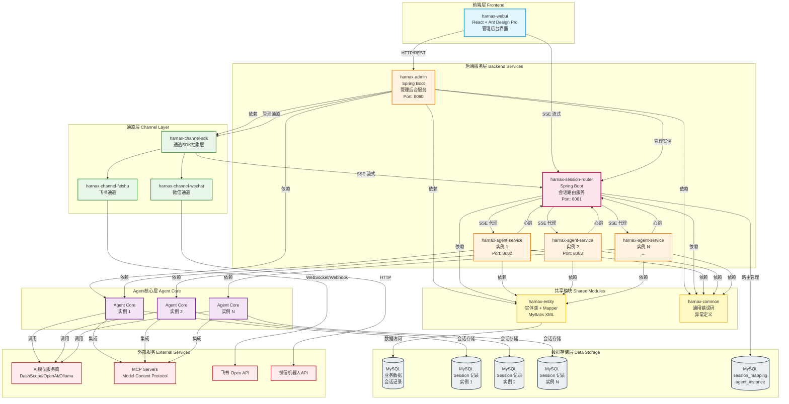

# Harnax 完整架构概览

## 📊 系统架构图（含 Session Router）



## 🔄 核心数据流

### 1. 管理后台流程
```
WebUI → HTTP/REST → harnax-admin → Entity/Mapper → MySQL
                              ↓
                         ChannelSDK（管理通道）
                              ↓
                         SessionRouter（管理实例）
```

**典型场景**: 用户在管理后台创建 Agent
1. 前端提交 Agent 配置表单
2. harnax-admin 接收请求
3. 验证权限（JWT）
4. 调用 AgentMapper 插入数据库
5. 返回创建结果

### 2. AI 对话流程 - 通过 Session Router（生产环境）
```
WebUI/Channel → SSE → Session Router (8081)
                        ↓
                  查询 Session 绑定
                        ↓
                  选择健康实例
                        ↓
                  转发到 Agent Service (8082/8083/...)
                        ↓
                  ChatService.chat()
                        ↓
                  AscopeAgentLauncher.createSingleAgent()
                        ↓
                  ReActAgent.callStream()
                        ↓
                  AgentScope → AI模型（DashScope/OpenAI）
                        ↓
                  Flux<ChatEvent> 流式返回
                        ↓
                  SSE → Session Router → WebUI/Channel 实时显示
```

**详细步骤**:
1. 用户在前端或通道输入消息
2. 请求发送到 Session Router
3. Router 查询 session_mapping 表，找到绑定的实例
4. 检查实例健康状态（心跳）
5. 转发请求到健康的 Agent Service 实例
6. Agent Service 创建 ReActAgent
7. Agent 调用 AI 模型生成响应
8. ChatEvent 通过 SSE 流式传输
9. Router 代理流式响应回客户端
10. 客户端实时显示 AI 回复

### 3. AI 对话流程 - 直连 Agent Service（开发环境）
```
WebUI → SSE → Agent Service (8082)
                  ↓
            ChatService.chat()
                  ↓
            AscopeAgentLauncher.createSingleAgent()
                  ↓
            ReActAgent.callStream()
                  ↓
            AgentScope → AI模型
                  ↓
            Flux<ChatEvent> 流式返回
                  ↓
            SSE → WebUI 实时显示
```

### 4. 通道消息流程
```
飞书/微信 → Channel Module → Channel SDK
                                ↓
                          创建 AgentContext
                                ↓
                          调用 Session Router
                                ↓
                    POST /api/router/agent/chat/stream
                                ↓
                          Router 路由到 Agent Service
                                ↓
                          AgentAdaptor.streamProcess()
                                ↓
                          AgentCore → AI响应
                                ↓
                          Flow<AgentStreamEvent>
                                ↓
                          通道回复用户
```

**典型场景**: 用户在飞书群 @机器人
1. 飞书推送消息到 WebSocket
2. harnax-channel-feishu 接收消息
3. 通过 Channel SDK 创建 AgentContext
4. 调用 Session Router 的流式接口
5. Router 路由到健康的 Agent Service
6. Agent 生成 AI 响应
7. 流式响应通过 Router 返回通道
8. 通过飞书 API 回复消息

### 5. 会话路由流程
```
Agent Service 启动 → 注册实例 → Session Router
                                    ↓
                              存储到 agent_instance 表
                                    ↓
                          定期发送心跳（每 10s）
                                    ↓
                          Router 更新 last_heartbeat
                                    ↓
                    收到请求时检查健康状态
                                    ↓
                    健康？ → 路由到该实例
                    不健康？ → 选择其他实例
```

### 6. 故障转移流程
```
Agent Service 实例故障
        ↓
Router 心跳检测超时（30s）
        ↓
标记实例为不健康
        ↓
查询该实例绑定的所有 Session
        ↓
重新路由到其他健康实例
        ↓
更新 session_mapping 表
        ↓
用户无感知，服务继续
```

## 🏗️ 部署架构

### 单实例部署（开发/测试）
```
┌─────────────┐
│   Web UI    │
│  (Port 3000)│
└──────┬──────┘
       │
       ├──────────────┐
       ↓              ↓
┌─────────────┐ ┌─────────────┐
│ harnax-admin│ │   Agent     │
│  (Port 8080)│ │  Service    │
└─────────────┘ │  (Port 8082)│
                └──────┬──────┘
                       │
                ┌──────┴──────┐
                │   MySQL     │
                │  (Port 3306)│
                └─────────────┘
```

### 多实例部署（生产环境）
```
                    ┌─────────────┐
                    │   Web UI    │
                    │  (Port 3000)│
                    └──────┬──────┘
                           │
              ┌────────────┼────────────┐
              ↓            ↓            ↓
    ┌─────────────┐ ┌─────────────┐ ┌─────────────┐
    │ harnax-admin│ │  Session    │ │   Nginx     │
    │  (Port 8080)│ │  Router     │ │  (Port 80)  │
    └─────────────┘ │  (Port 8081)│ └──────┬──────┘
                    └──────┬──────┘        │
                           │               │
              ┌────────────┼────────────┐  │
              ↓            ↓            ↓  │
    ┌─────────────┐ ┌─────────────┐ ┌─────────────┐
    │   Agent     │ │   Agent     │ │   Agent     │
    │  Service 1  │ │  Service 2  │ │  Service N  │
    │  (Port 8082)│ │  (Port 8083)│ │  (Port ...) │
    └──────┬──────┘ └──────┬──────┘ └──────┬──────┘
           │               │               │
           └───────────────┼───────────────┘
                           │
                    ┌──────┴──────┐
                    │   MySQL     │
                    │  (Port 3306)│
                    └─────────────┘
```

## 🎯 Session Router 核心价值

### 解决的问题

1. **负载均衡**
   - 多个 Agent Service 实例如何分配请求？
   - Router 根据 Session 绑定 + 健康检查智能路由

2. **故障转移**
   - 某个 Agent Service 实例挂了怎么办？
   - Router 自动检测并重新路由到其他实例

3. **Session 亲和性**
   - 同一个 Session 的多次请求如何保证一致性？
   - Router 维护 Session → Instance 的绑定关系

4. **水平扩展**
   - 如何支持更多并发用户？
   - 增加 Agent Service 实例，Router 自动发现

### 关键特性

- ✅ **自动注册**: Agent Service 启动时自动注册
- ✅ **心跳检测**: 定期检测实例健康状态
- ✅ **智能路由**: 基于绑定关系 + 健康检查
- ✅ **故障转移**: 自动 Failover，用户无感知
- ✅ **会话亲和**: Session 绑定到固定实例
- ✅ **水平扩展**: 支持无限实例扩展

## 📊 数据库设计

### Session Router 相关表

#### session_mapping 表
```sql
CREATE TABLE session_mapping (
    id BIGINT PRIMARY KEY AUTO_INCREMENT,
    session_id VARCHAR(255) NOT NULL UNIQUE COMMENT '会话ID',
    instance_id VARCHAR(255) NOT NULL COMMENT '实例ID',
    active_time TIMESTAMP DEFAULT CURRENT_TIMESTAMP COMMENT '最后活跃时间',
    created_at TIMESTAMP DEFAULT CURRENT_TIMESTAMP,
    INDEX idx_instance_id (instance_id),
    INDEX idx_active_time (active_time)
) COMMENT='Session与实例绑定关系表';
```

#### agent_instance 表
```sql
CREATE TABLE agent_instance (
    id BIGINT PRIMARY KEY AUTO_INCREMENT,
    instance_id VARCHAR(255) NOT NULL UNIQUE COMMENT '实例ID',
    host VARCHAR(255) NOT NULL COMMENT '主机地址',
    port INT NOT NULL COMMENT '端口号',
    status VARCHAR(50) DEFAULT 'ACTIVE' COMMENT '状态',
    last_heartbeat TIMESTAMP DEFAULT CURRENT_TIMESTAMP COMMENT '最后心跳时间',
    created_at TIMESTAMP DEFAULT CURRENT_TIMESTAMP,
    INDEX idx_status (status),
    INDEX idx_heartbeat (last_heartbeat)
) COMMENT='Agent服务实例注册表';
```

### 数据流

```
Agent Service 启动
    ↓
POST /api/router/instance/register
    ↓
INSERT INTO agent_instance
    ↓
定期发送心跳
    ↓
UPDATE agent_instance SET last_heartbeat = NOW()
    ↓
收到聊天请求
    ↓
SELECT instance_id FROM session_mapping WHERE session_id = ?
    ↓
SELECT * FROM agent_instance WHERE instance_id = ? AND is_healthy
    ↓
转发请求到该实例
    ↓
UPDATE session_mapping SET active_time = NOW()
```

## 🔐 安全考虑

### 认证机制

1. **Web UI → Admin**: JWT Token 认证
2. **Web UI → Router**: JWT Token 认证（可选）
3. **Router → Agent Service**: 内部信任，无需认证
4. **Channel → Router**: 无需认证（内部网络）

### 网络安全

- 生产环境所有服务在内网
- Nginx 反向代理暴露到外网
- 防火墙限制端口访问

## 🚀 性能优化

### Session Router 优化

1. **连接池**: WebClient 使用连接池
2. **异步处理**: 全程响应式，非阻塞
3. **缓存**: 实例列表缓存，减少数据库查询
4. **批量心跳**: 合并心跳请求

### Agent Service 优化

1. **实例预热**: 提前创建常用 Agent
2. **连接池**: 数据库连接池
3. **异步流式**: WebFlux 非阻塞 IO
4. **会话缓存**: 内存缓存热点 Session

## 📝 运维监控

### 关键指标

1. **Session Router**
   - 健康实例数
   - 路由请求 QPS
   - 平均响应时间
   - Failover 次数

2. **Agent Service**
   - 实例 CPU/内存使用率
   - 活跃 Session 数
   - AI 调用延迟
   - Token 消耗

3. **数据库**
   - 连接池使用率
   - 慢查询日志
   - 表空间使用

### 告警规则

- 健康实例数 < 2 → 严重告警
- 路由响应时间 > 5s → 警告
- Failover 频率 > 10/min → 警告
- 数据库连接池 > 80% → 警告

---

**文档版本**: v1.0  
**最后更新**: 2026-05-25  
**维护者**: Harnax Team
