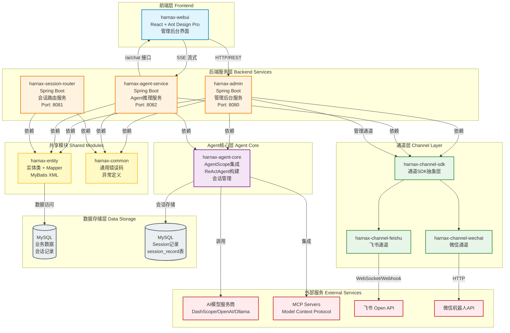

# Harnax 系统架构文档

## 📊 系统架构图



## 📋 架构说明

### 🎨 前端层

#### harnax-webui
- **技术栈**: React + Ant Design Pro + TypeScript
- **功能**: 管理后台界面
- **主要功能模块**:
  - Agent 管理
  - 模型服务商管理
  - 模型管理
  - MCP 服务器管理
  - 通道管理（飞书、微信）
  - Skill 管理
  - 用户管理
  - 定时任务管理
  - Token 统计

### 🔧 后端服务层

系统采用微服务架构，包含 3 个独立的 Spring Boot 服务：

#### 1. harnax-admin (Port 8080)
**职责**: 管理后台业务逻辑

**主要功能**:
- Agent CRUD 操作
- 模型服务商和模型管理
- MCP 服务器配置
- 通道配置和管理
- Skill 管理
- 用户认证与权限控制（JWT）
- 定时任务管理（Quartz）
- Token 统计和分析
- 租户管理

**技术特点**:
- Spring Boot 3.5.8
- Kotlin 2.2.20
- MyBatis 数据访问
- Spring Security + JWT 认证
- PageHelper 分页
- Springdoc OpenAPI (Swagger)

#### 2. harnax-agent-service (Port 8082)
**职责**: Agent 推理服务，提供 AI 对话能力

**主要功能**:
- `/ai/chat` SSE 流式接口
- ChatEvent 流式输出到前端
- Agent 实例创建和管理
- 会话管理
- 工具调用确认
- 计划和任务管理
- Token 统计
- 过程日志记录

**技术特点**:
- Spring Boot + WebFlux（支持 SSE）
- AgentScope 框架集成
- Reactor 响应式编程
- Kotlin Coroutines

**关键接口**:
```kotlin
@PostMapping("/ai/chat", produces = [MediaType.TEXT_EVENT_STREAM_VALUE])
fun chat(@RequestBody request: ChatRequest): Flux<ChatEvent>
```

#### 3. harnax-session-router (Port 8081)
**职责**: 会话路由管理，Agent 实例注册与发现

**主要功能**:
- Agent 实例注册
- 会话路由分发
- 心跳检测
- 负载均衡
- 服务发现

### 📡 通道层

#### harnax-channel-sdk
**职责**: 通道抽象SDK，提供统一的通道接入接口

**核心抽象**:
- `AgentAdaptor`: Agent 适配器接口
  - `process()`: 批量处理模式
  - `streamProcess()`: 流式处理模式
- `ChannelAdaptor`: 通道适配器接口
- `AgentStreamEvent`: 流式事件定义
  - `TextStreamEvent`: 文本流事件
  - `ThinkingStreamEvent`: 思考过程事件
  - `EndStreamEvent`: 结束事件

**设计模式**:
- 策略模式：不同通道实现统一的 AgentAdaptor
- 适配器模式：桥接通道 SDK 和 Agent 核心

#### harnax-channel-feishu
**职责**: 飞书通道实现

**支持模式**:
1. **WebSocket 模式**（推荐）
   - 实时双向通信
   - 更好的流式支持
   - 基于飞书 WebSocket SDK 2.4.0
   
2. **Webhook 模式**（兼容）
   - HTTP 回调
   - 简单部署
   - 适合简单场景

**技术特点**:
- protobuf-java 3.22.2（兼容飞书 SDK）
- Open API 集成
- content 字段必须为 JSON 字符串

#### harnax-channel-wechat
**职责**: 微信通道实现

**技术特点**:
- 微信机器人 SDK 集成
- HTTP 通信
- 支持 AI 对话

### 🤖 Agent 核心层

#### harnax-agent-core
**职责**: AgentScope 框架集成和 ReActAgent 构建

**核心组件**:

1. **AscopeAgentLauncher**
   - Agent 实例化入口
   - `createSingleAgent()`: 创建单个 Agent
   - 会话管理
   - 缓存管理

2. **ReActAgent 构建**
   - 基于 AgentScope 的 ReActAgent
   - 支持工具调用
   - 支持计划制定（PlanNotebook）
   - 支持 Skill 集成
   - 支持 MCP 工具集成

3. **会话管理**
   - `MysqlSession`: MySQL 会话存储
   - `InMemorySession`: 内存会话存储
   - `JsonSession`: JSON 文件存储
   - 会话加载器：`SessionLoader`

4. **工具系统**
   - `ToolBox`: 工具集合管理
   - `McpClientWrapper`: MCP 工具封装
   - `ShellCommandTool`: Shell 命令工具
   - 自定义工具扩展

5. **模型适配**
   - `ChatModelConfigAdaptor`: 模型配置适配器
   - 支持多种模型服务商：
     - DashScope（通义千问）
     - OpenAI（GPT）
     - Ollama（本地模型）

6. **Adaptor 实现**
   - `ChatModelConfigAdaptorImpl`: 模型配置
   - `McpConfigAdaptorImpl`: MCP 配置
   - `SkillAdaptorImpl`: Skill 加载
   - `PlanNoteAdaptorImpl`: 计划存储
   - `ProcessLogAdaptorImpl`: 过程日志
   - `TokenStatAdaptorImpl`: Token 统计
   - `ToolCallLogAdaptorImpl`: 工具调用日志
   - `ReActAgentAdaptor`: 通道 Agent 适配器

**流式输出流程**:
```
用户消息 → ChatService → AscopeAgentLauncher → ReActAgent.callStream()
  → Flux<ChatEvent> → SSE → 前端实时显示
```

### 📦 共享模块

#### harnax-entity
**职责**: 数据库实体和 Mapper，被 admin 和 agent-service 共用

**包含内容**:
1. **Entity 实体类**（18个）
   - Agent: Agent 实体
   - Channel: 通道实体
   - McpServer: MCP 服务器实体
   - Model: 模型实体
   - ModelProvider: 模型服务商实体
   - Session: 会话实体
   - Skill: Skill 实体
   - PlanNoteEntity: 计划实体
   - ProcessLogEntity: 过程日志实体
   - TokenStats: Token 统计实体
   - ToolCallLogEntity: 工具调用日志实体
   - SysUser: 用户实体
   - SysTokenBlacklist: Token 黑名单实体
   - Tenant: 租户实体
   - UserTenant: 用户租户关联实体
   - SkillRepository: Skill 仓库实体

2. **Mapper 接口**（18个）
   - 对应每个 Entity 的 MyBatis Mapper
   - 使用 `@Mapper` 注解
   - 支持 CRUD 操作
   - 使用 `@Param` 注解处理多参数

3. **MyBatis XML 映射文件**（18个）
   - SQL 语句定义
   - ResultMap 配置
   - 动态 SQL

4. **单元测试**（17个）
   - 每个 Mapper 的集成测试
   - 使用 `@MybatisTest`
   - TestContainers MySQL 测试

**包结构**:
```
com.agnetix.harnax.entity
com.agnetix.harnax.mapper
```

#### harnax-common
**职责**: 通用错误码和异常定义

**包含内容**:
- `HarnaxErrorCode`: 错误码枚举
- `HarnaxException`: 自定义异常类

### 💾 数据存储层

#### MySQL - 业务数据
**用途**: 存储系统业务数据

**主要表**:
- `agent`: Agent 配置表
- `channel`: 通道配置表
- `model`: 模型配置表
- `model_provider`: 模型服务商表
- `mcp_server`: MCP 服务器表
- `skill`: Skill 表
- `skill_repository`: Skill 仓库表
- `session`: 会话表
- `sys_user`: 用户表
- `tenant`: 租户表
- `token_stats`: Token 统计表
- `sys_token_blacklist`: Token 黑名单表

#### MySQL - Session 记录
**用途**: AgentScope 会话持久化

**表名**: `session_record`

**特点**:
- 由 `MysqlSession` 自动管理
- 支持 `createIfNotExist` 自动建表
- 存储完整的会话上下文
- 支持会话恢复

### 🌐 外部服务

#### AI 模型服务商
1. **DashScope（通义千问）**
   - 支持深度思考（enableThinking）
   - 支持网络搜索（enableSearch）
   - Streamable HTTP 传输

2. **OpenAI（GPT）**
   - 标准 OpenAI API
   - 支持流式输出

3. **Ollama**
   - 本地模型部署
   - 开源模型支持

#### MCP Servers (Model Context Protocol)
**支持的类型**:
- `stdio`: 标准输入输出模式
- `sse`: Server-Sent Events 模式
- `streamablehttp`: 可流式 HTTP 模式

**功能**:
- 提供外部工具能力
- 扩展 Agent 功能边界
- 动态工具注册

#### 飞书 Open API
- 消息发送和接收
- WebSocket 连接管理
- 事件订阅

#### 微信机器人 API
- 消息收发
- 群组管理
- 用户交互

## 🔄 关键数据流

### 1. 管理后台流程
```
WebUI → HTTP/REST → harnax-admin → Entity/Mapper → MySQL
                              ↓
                         ChannelSDK（管理通道）
```

**典型场景**: 用户在管理后台创建 Agent
1. 前端提交 Agent 配置表单
2. harnax-admin 接收请求
3. 验证权限（JWT）
4. 调用 AgentMapper 插入数据库
5. 返回创建结果

### 2. AI 对话流程（核心流程）
```
WebUI → SSE → harnax-agent-service (/ai/chat)
                    ↓
              ChatService.chat()
                    ↓
              AscopeAgentLauncher.createSingleAgent()
                    ↓
              ReActAgent.callStream()
                    ↓
              AgentScope → AI模型（DashScope/OpenAI）
                    ↓
              Flux<ChatEvent> 流式返回
                    ↓
              SSE → WebUI 实时显示
```

**详细步骤**:
1. 用户在前端输入消息
2. 前端调用 `/ai/chat` 接口（SSE）
3. ChatService 从数据库加载 Session 配置
4. 使用 Launcher 创建 ReActAgent
5. Agent 调用 AI 模型生成响应
6. ChatEvent 通过 SSE 流式传输到前端
7. 前端实时显示 AI 回复

**ChatEvent 类型**:
- `StreamTextChatEvent`: AI 文本输出
- `StreamThinkingChatEvent`: 思考过程
- `EndEventChatEvent`: 对话结束
- `CallToolChatEvent`: 工具调用
- `ToolResultChatEvent`: 工具执行结果

### 3. 通道消息流程
```
飞书/微信 → Channel → AgentAdaptor.streamProcess()
                              ↓
                        AgentCore → AI响应
                              ↓
                        通道回复用户
```

**典型场景**: 用户在飞书群 @机器人
1. 飞书推送消息到 WebSocket
2. harnax-channel-feishu 接收消息
3. 通过 ReActAgentAdaptor 调用 Agent
4. Agent 生成 AI 响应
5. 通过飞书 API 回复消息

**通道与 Agent 集成**:
```kotlin
// 通道使用 AgentAdaptor
val response = agentAdaptor.streamProcess(
    AgentContext(
        message = channelMessage,
        channelSpec = channelConfig,
    )
)
```

### 4. 会话路由流程
```
AgentService → 注册 → SessionRouter
                      ↓
                 心跳保持
                      ↓
            会话路由分发
```

## 🏗️ 技术栈总结

### 后端技术
- **框架**: Spring Boot 3.5.8
- **语言**: Kotlin 2.2.20
- **AI 框架**: AgentScope 1.1.0-RC2
- **数据库**: MySQL 8.0
- **ORM**: MyBatis 3.0.4
- **响应式**: Spring WebFlux + Reactor
- **协程**: Kotlin Coroutines 1.8.1
- **定时任务**: Quartz
- **认证**: Spring Security + JWT
- **API 文档**: Springdoc OpenAPI 2.3.0

### 前端技术
- **框架**: React + Umi 4.x
- **UI 库**: Ant Design Pro 5.x
- **语言**: TypeScript
- **构建**: Vite

### 构建工具
- **构建**: Maven
- **代码格式**: Spotless + ktlint
- **CI/CD**: GitLab CI

### 部署
- **容器**: Docker
- **编排**: Docker Compose
- **反向代理**: Nginx

## 📂 项目结构

```
harnax/
├── harnax-admin/              # 管理后台服务
│   ├── src/main/kotlin/
│   │   └── com/agnetix/harnax/admin/
│   │       ├── controller/    # 控制器
│   │       ├── service/       # 业务逻辑
│   │       ├── dto/          # 数据传输对象
│   │       ├── config/       # 配置
│   │       └── util/         # 工具类
│   └── src/main/resources/
│       └── application.yml
│
├── harnax-agent/              # Agent 模块
│   ├── harnax-agent-core/     # Agent 核心
│   │   └── src/main/kotlin/
│   │       └── com/agnetix/harnax/agent/
│   │           ├── AscopeAgentLauncher.kt
│   │           ├── session/   # 会话管理
│   │           ├── adaptor/   # 适配器接口
│   │           ├── chat/      # 聊天事件
│   │           └── provider/  # 工具提供者
│   └── harnax-agent-service/  # Agent 服务
│       └── src/main/kotlin/
│           └── com/agnetix/harnax/agent/service/
│               ├── chat/      # Chat 接口
│               ├── adaptor/   # Adaptor 实现
│               ├── dto/       # 数据传输对象
│               └── util/      # 工具类
│
├── harnax-channel/            # 通道模块
│   ├── harnax-channel-sdk/    # 通道 SDK
│   ├── harnax-channel-feishu/ # 飞书通道
│   └── harnax-channel-wechat/ # 微信通道
│
├── harnax-entity/             # 共享实体模块
│   └── src/main/
│       ├── kotlin/com/agnetix/harnax/
│       │   ├── entity/        # 实体类
│       │   └── mapper/        # Mapper 接口
│       └── resources/mapper/  # MyBatis XML
│
├── harnax-session-router/     # 会话路由服务
│
├── harnax-common/             # 通用模块
│
├── harnax-webui/              # 前端管理后台
│
└── docker/                    # Docker 部署配置
    ├── docker-compose.yml
    ├── Dockerfile.*
    └── nginx.conf
```

## 🎯 架构优势

1. **模块化设计**: 清晰的模块职责划分
2. **共享数据层**: entity 模块避免代码重复
3. **微服务架构**: 服务独立部署和扩展
4. **响应式编程**: WebFlux 支持高并发流式输出
5. **多通道支持**: SDK 抽象支持多种消息平台
6. **AI 框架集成**: AgentScope 提供强大的 Agent 能力
7. **流式输出**: SSE 实现实时 AI 对话
8. **可扩展性**: Adaptor 模式易于扩展新功能

## 📝 开发指南

### 添加新的 Entity
1. 在 `harnax-entity/src/main/kotlin/entity/` 创建实体类
2. 在 `harnax-entity/src/main/kotlin/mapper/` 创建 Mapper 接口
3. 在 `harnax-entity/src/main/resources/mapper/` 创建 XML 映射文件
4. 编写单元测试

### 添加新的通道
1. 实现 `AgentAdaptor` 接口
2. 实现 `streamProcess()` 方法
3. 转换 `ChatEvent` 为 `AgentStreamEvent`
4. 注册到 ChannelSDK

### 添加新的工具
1. 实现工具类
2. 注册到 `ToolBox`
3. 在 Agent 构建时添加

## 🔐 安全考虑

- JWT Token 认证
- Token 黑名单机制
- CORS 配置
- SQL 注入防护（MyBatis 参数化查询）
- 密码加密（BCrypt）

## 🚀 部署说明

参考 `docker/` 目录下的配置文件：
- `docker-compose.yml`: 服务编排
- `Dockerfile.*`: 容器构建
- `nginx.conf`: 反向代理配置
- `.env`: 环境变量

---

**文档版本**: v1.0  
**最后更新**: 2026-05-25  
**维护者**: Harnax Team
