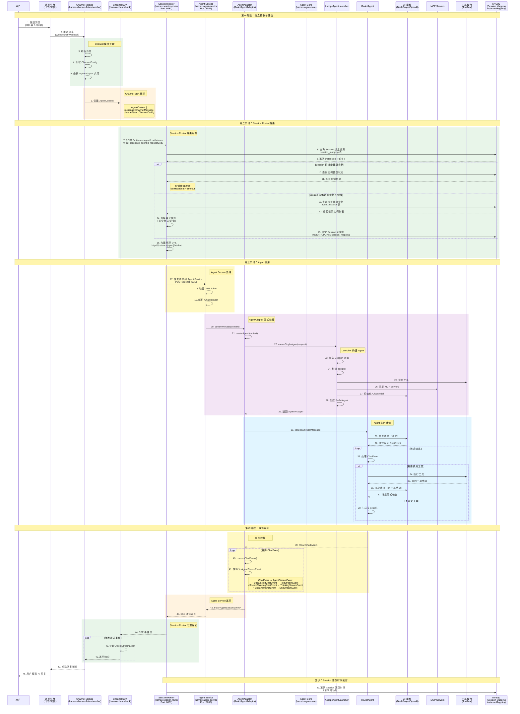
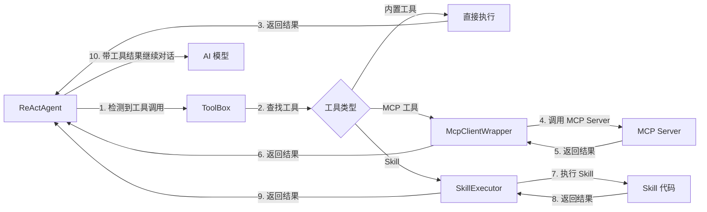
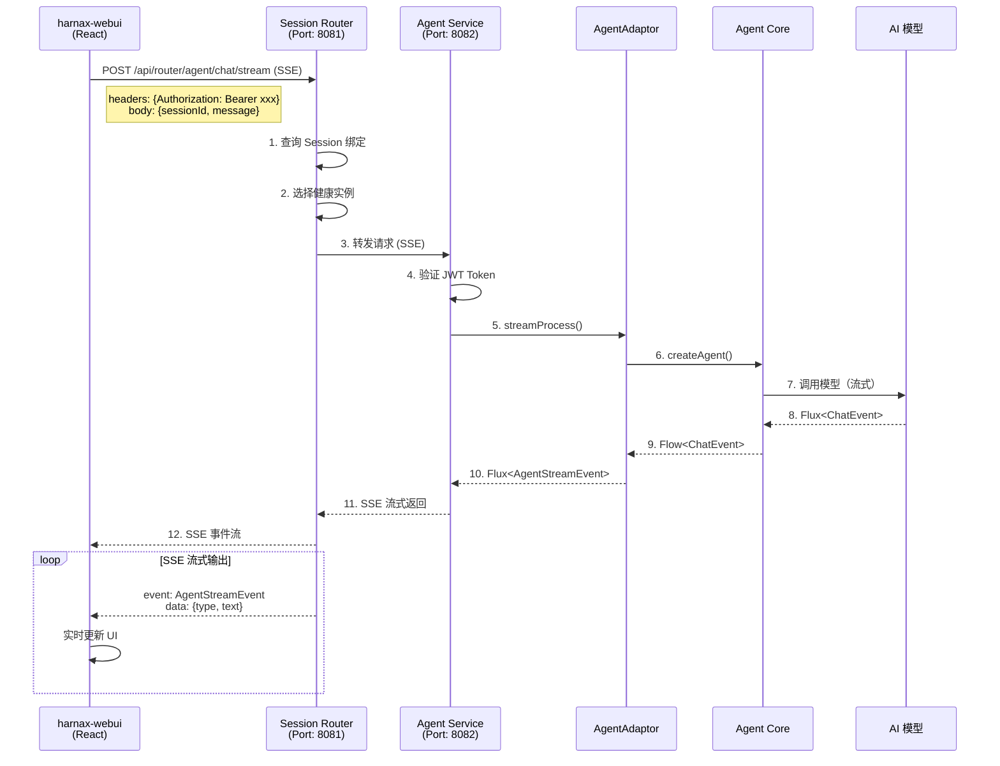
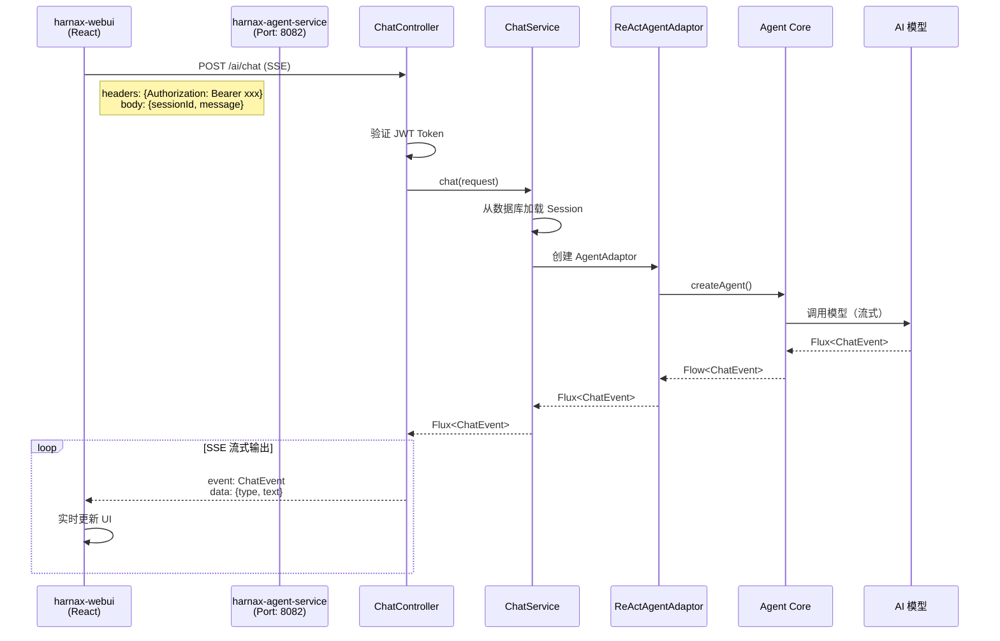

# Channel 到 Agent 调用流程详解

## 📊 完整调用时序图（含 Session Router）



## 🔄 核心调用链路详解

### Session Router 路由机制

#### 核心职责
Session Router 是一个**智能代理路由服务**，负责：

1. **Session 绑定管理**
   - 将每个 Session 绑定到一个 Agent Service 实例
   - 维护 Session → Instance 的映射关系
   - 存储在 MySQL 的 `session_mapping` 表中

2. **实例注册与心跳**
   - Agent Service 启动时注册实例
   - 定期发送心跳保持活跃状态
   - 存储在 MySQL 的 `agent_instance` 表中

3. **智能路由决策**
   ```
   收到请求 → 查询 Session 绑定 → 检查实例健康
     ↓
   健康？ → 转发到绑定实例
     ↓
   不健康？ → 选择新的健康实例 → 重新绑定 Session
   ```

4. **故障转移（Failover）**
   - 自动检测不健康实例
   - 重新路由到其他健康实例
   - 无缝切换，用户无感知

#### 路由接口

```kotlin
// SessionRouterController.kt
@RestController
@RequestMapping("/api/router")
class SessionRouterController {
    
    // SSE 流式代理（通道使用）
    @PostMapping("/agent/chat/stream")
    fun proxyChatStream(
        @RequestParam sessionId: String,
        @RequestParam(required = false) agentId: Long?,
        @RequestBody requestBody: Map<String, Any>,
    ): SseEmitter
    
    // 实例注册
    @PostMapping("/instance/register")
    fun registerInstance(
        @RequestParam instanceId: String,
        @RequestParam host: String,
        @RequestParam port: Int,
    )
    
    // 心跳刷新
    @PostMapping("/instance/heartbeat")
    fun heartbeat(@RequestParam instanceId: String)
}
```

#### 路由流程详解

```kotlin
// SessionRouterService.kt
suspend fun proxyChatRequest(
    sessionId: String,
    agentId: Long?,
    requestBody: Map<String, Any>
): ResponseEntity<String> {
    // 1. 解析实例
    val instance = resolveInstance(sessionId)
    
    // 2. 构建 URL
    val url = "${instance.getBaseUrl()}/api/agent/chat?sessionId=$sessionId"
    
    // 3. 转发请求
    val response = webClient.post()
        .uri(url)
        .bodyValue(requestBody)
        .retrieve()
        .toEntity(String::class.java)
        .awaitSingleOrNull()
    
    // 4. 刷新活跃时间
    sessionMappingService.refreshActiveTime(sessionId)
    
    return response
}

private suspend fun resolveInstance(sessionId: String): AgentInstance {
    // 1. 查询现有绑定
    val existingInstanceId = sessionMappingService.getInstanceId(sessionId)
    
    if (existingInstanceId != null) {
        val instance = instanceRegistry.getInstance(existingInstanceId)
        // 2. 检查健康状态
        if (instance != null && instance.isHealthy(heartbeatTimeoutMs)) {
            return instance  // 使用绑定实例
        }
        // 3. 实例不健康，需要重新路由
        log.warn("Instance $existingInstanceId unhealthy, rerouting...")
    }
    
    // 4. 选择新的健康实例
    val healthyInstances = instanceRegistry.getHealthyInstances()
    val newInstance = selectLeastLoadedInstance(healthyInstances)
    
    // 5. 绑定 Session
    sessionMappingService.bindSession(sessionId, newInstance.instanceId)
    
    return newInstance
}
```

#### 数据库表结构

**session_mapping 表**：
```sql
CREATE TABLE session_mapping (
    id BIGINT PRIMARY KEY AUTO_INCREMENT,
    session_id VARCHAR(255) NOT NULL UNIQUE,
    instance_id VARCHAR(255) NOT NULL,
    active_time TIMESTAMP DEFAULT CURRENT_TIMESTAMP,
    created_at TIMESTAMP DEFAULT CURRENT_TIMESTAMP,
    INDEX idx_instance_id (instance_id)
);
```

**agent_instance 表**：
```sql
CREATE TABLE agent_instance (
    id BIGINT PRIMARY KEY AUTO_INCREMENT,
    instance_id VARCHAR(255) NOT NULL UNIQUE,
    host VARCHAR(255) NOT NULL,
    port INT NOT NULL,
    status VARCHAR(50) DEFAULT 'ACTIVE',
    last_heartbeat TIMESTAMP DEFAULT CURRENT_TIMESTAMP,
    created_at TIMESTAMP DEFAULT CURRENT_TIMESTAMP
);
```

### 第一阶段：消息接收

#### 1. 飞书通道示例

```kotlin
// harnax-channel-feishu: WebSocket 模式
class FeishuWebSocketChannel : ChannelAdaptor {
    
    // 接收飞书推送的消息
    override fun onMessageReceived(message: FeishuMessage) {
        // 1. 解析消息
        val channelMessage = parseMessage(message)
        
        // 2. 获取通道配置
        val channelConfig = loadChannelConfig()
        
        // 3. 调用 AgentAdaptor
        val responseFlow = agentAdaptor.streamProcess(
            AgentContext(
                message = channelMessage,
                channelSpec = channelConfig,
            )
        )
        
        // 4. 处理流式响应
        responseFlow.collect { event ->
            when (event) {
                is TextStreamEvent -> {
                    // 发送文本到飞书
                    sendTextMessage(message.chatId, event.text)
                }
                is ThinkingStreamEvent -> {
                    // 记录思考过程（可选）
                    logThinking(event.content)
                }
                is EndStreamEvent -> {
                    // 对话结束
                    logComplete()
                }
            }
        }
    }
}
```

#### 2. 微信通道示例

```kotlin
// harnax-channel-wechat
class WechatChannel : ChannelAdaptor {
    
    override fun onMessageReceived(message: WechatMessage) {
        val responseFlow = agentAdaptor.streamProcess(
            AgentContext(
                message = parseMessage(message),
                channelSpec = loadChannelConfig(),
            )
        )
        
        responseFlow.collect { event ->
            // 类似飞书处理
        }
    }
}
```

### 第二阶段：AgentAdaptor 处理

#### ReActAgentAdaptor 实现

```kotlin
// harnax-agent-service/adaptor/ReActAgentAdaptor.kt
@Service
class ReActAgentAdaptor(
    private val launcher: AscopeAgentLauncher,
) : AgentAdaptor() {
    
    /**
     * 流式处理消息
     */
    override fun streamProcess(context: AgentContext): Flow<AgentStreamEvent> = flow {
        // 1. 创建 Agent
        val agentWrapper = createAgent(context)
        
        // 2. 获取用户消息
        val userMessage = context.message.content
        
        // 3. 调用 Agent 流式接口
        agentWrapper.callStream(userMessage)
            .asFlow()
            .collect { chatEvent: ChatEvent ->
                // 4. 转换事件
                val streamEvent = convertChatEvent(chatEvent)
                
                // 5. 发送事件
                if (streamEvent != null) {
                    emit(streamEvent)
                }
            }
    }
    
    /**
     * 创建 Agent 实例
     */
    private fun createAgent(context: AgentContext): AgentWrapper {
        return launcher.createSingleAgent(
            CreateAgentRequest(
                sessionId = context.channelSpec.sessionId,
                agentId = context.channelSpec.agentId,
            )
        )
    }
    
    /**
     * 转换 ChatEvent 为 AgentStreamEvent
     */
    private fun convertChatEvent(chatEvent: ChatEvent): AgentStreamEvent? {
        return when (chatEvent) {
            is StreamTextChatEvent -> {
                TextStreamEvent(
                    text = chatEvent.text,
                    isDelta = true,
                )
            }
            is StreamThinkingChatEvent -> {
                ThinkingStreamEvent(
                    content = chatEvent.thinking,
                )
            }
            is EndEventChatEvent -> {
                EndStreamEvent()
            }
            else -> null
        }
    }
}
```

### 第三阶段：AgentCore 执行

#### AscopeAgentLauncher 构建 Agent

```kotlin
// harnax-agent-core/AscopeAgentLauncher.kt
@Component
class AscopeAgentLauncher(
    private val sessionMapper: SessionMapper,
    private val toolProvider: ToolProvider,
    private val modelConfigAdaptor: ChatModelConfigAdaptor,
    private val mcpConfigAdaptor: McpConfigAdaptor,
    // ... 其他依赖
) {
    
    fun createSingleAgent(request: CreateAgentRequest): AgentWrapper {
        // 1. 加载 Session 配置
        val session = sessionMapper.selectById(request.sessionId)
        
        // 2. 构建工具集合
        val toolBox = ToolBox(
            tools = toolProvider.getTools(session.toolIds),
            mcpClients = mcpConfigAdaptor.loadMcpClients(session.mcpServerIds),
        )
        
        // 3. 初始化模型
        val chatModel = modelConfigAdaptor.createChatModel(session.modelId)
        
        // 4. 创建会话管理器
        val sessionManager = MysqlSession(
            jdbcUrl = sessionConfig.jdbcUrl,
            username = sessionConfig.username,
            password = sessionConfig.password,
        )
        
        // 5. 构建 ReActAgent
        val reActAgent = ReActAgent.builder()
            .name(session.name)
            .sysPrompt(session.systemPrompt)
            .model(chatModel)
            .toolBox(toolBox)
            .session(sessionManager)
            .planNotebook(planNoteAdaptor.loadPlan(session.planId))
            .build()
        
        return AgentWrapper(reActAgent)
    }
}
```

#### ReActAgent 流式执行

```kotlin
// AgentScope 框架内部实现
class ReActAgent {
    
    fun callStream(message: String): Flux<ChatEvent> {
        return Flux.create { emitter ->
            // 1. 构建消息历史
            val messages = session.loadHistory()
            messages.add(UserMessage(message))
            
            // 2. 调用模型（流式）
            model.streamChat(messages)
                .collect { response ->
                    // 3. 处理流式响应
                    when (response.type) {
                        TEXT -> {
                            emitter.next(StreamTextChatEvent(response.text))
                        }
                        THINKING -> {
                            emitter.next(StreamThinkingChatEvent(response.thinking))
                        }
                        TOOL_CALL -> {
                            // 4. 执行工具调用
                            val toolResult = executeToolCall(response.toolCall)
                            emitter.next(ToolResultChatEvent(toolResult))
                            
                            // 5. 继续对话
                            messages.add(AssistantMessage(response))
                            messages.add(ToolResultMessage(toolResult))
                            
                            // 递归调用
                            callStreamWithHistory(messages)
                        }
                        END -> {
                            emitter.next(EndEventChatEvent())
                            emitter.complete()
                        }
                    }
                }
        }
    }
    
    private fun executeToolCall(toolCall: ToolCall): String {
        return toolBox.execute(toolCall.name, toolCall.arguments)
    }
}
```

### 第四阶段：事件返回通道

#### 通道处理流式事件

```kotlin
// harnax-channel-feishu: 发送消息到飞书
class FeishuChannel {
    
    suspend fun sendStreamResponse(
        chatId: String,
        eventFlow: Flow<AgentStreamEvent>
    ) {
        var currentMessageId: String? = null
        var accumulatedText = StringBuilder()
        
        eventFlow.collect { event ->
            when (event) {
                is TextStreamEvent -> {
                    // 累积文本
                    accumulatedText.append(event.text)
                    
                    // 更新消息（飞书支持消息更新）
                    if (currentMessageId != null) {
                        updateMessage(currentMessageId, accumulatedText.toString())
                    } else {
                        // 首次创建消息
                        currentMessageId = sendMessage(chatId, event.text)
                    }
                }
                is ThinkingStreamEvent -> {
                    // 记录思考过程
                    logger.debug("Thinking: ${event.content}")
                }
                is EndStreamEvent -> {
                    // 对话结束
                    logger.info("对话完成")
                }
            }
        }
    }
}
```

## 📦 事件模型转换

### ChatEvent → AgentStreamEvent 映射表

| ChatEvent 类型 | AgentStreamEvent 类型 | 说明 |
|---------------|---------------------|------|
| `StreamTextChatEvent` | `TextStreamEvent` | AI 文本输出 |
| `StreamThinkingChatEvent` | `ThinkingStreamEvent` | 思考过程 |
| `EndEventChatEvent` | `EndStreamEvent` | 对话结束 |
| `CallToolChatEvent` | (不转换) | 工具调用（内部使用） |
| `ToolResultChatEvent` | (不转换) | 工具结果（内部使用） |

### 事件数据结构

```kotlin
// AgentCore 事件
sealed class ChatEvent {
    data class StreamTextChatEvent(val text: String) : ChatEvent()
    data class StreamThinkingChatEvent(val thinking: String) : ChatEvent()
    data class CallToolChatEvent(val toolName: String, val args: String) : ChatEvent()
    data class ToolResultChatEvent(val result: String) : ChatEvent()
    object EndEventChatEvent : ChatEvent()
}

// Channel SDK 事件
sealed class AgentStreamEvent {
    data class TextStreamEvent(
        val text: String,
        val isDelta: Boolean = true,
    ) : AgentStreamEvent()
    
    data class ThinkingStreamEvent(
        val content: String,
    ) : AgentStreamEvent()
    
    object EndStreamEvent : AgentStreamEvent()
}
```

## 🔌 工具调用流程



### 工具调用示例

```kotlin
// 工具调用流程示例
class ToolCallExample {
    
    // 1. ReActAgent 检测到工具调用
    // AI 输出: "我需要查询天气，调用 get_weather(city='北京')"
    
    // 2. ToolBox 执行工具
    val toolBox = ToolBox(
        tools = listOf(
            WeatherTool(),  // 自定义工具
            ShellCommandTool(),  // Shell 命令
        ),
        mcpClients = listOf(
            McpClientWrapper("github-mcp"),  // MCP 工具
        )
    )
    
    // 3. 执行工具
    val result = toolBox.execute(
        name = "get_weather",
        arguments = """{"city": "北京"}"""
    )
    
    // 4. 返回结果给 Agent
    // "北京今天天气晴朗，温度 25°C"
    
    // 5. Agent 将工具结果发送给 AI 模型
    // AI 继续生成: "北京今天天气晴朗，温度 25°C，适合外出活动。"
}
```

## 🌐 Web UI 调用流程

### 模式一：通过 Session Router（推荐，生产环境）



### 模式二：直连 Agent Service（开发/测试环境）



### 两种模式对比

| 特性 | 通过 Session Router | 直连 Agent Service |
|------|-------------------|------------------|
| **使用场景** | 生产环境、多实例部署 | 开发环境、单实例测试 |
| **负载均衡** | ✅ 自动负载均衡 | ❌ 无负载均衡 |
| **故障转移** | ✅ 自动 Failover | ❌ 需要手动处理 |
| **Session 绑定** | ✅ 持久化绑定 | ❌ 无绑定机制 |
| **实例管理** | ✅ 心跳检测、注册 | ❌ 无实例管理 |
| **扩展性** | ✅ 支持水平扩展 | ⚠️ 需要额外配置 |
| **端口** | Router: 8081 | Agent Service: 8082 |
| **接口路径** | `/api/router/agent/chat/stream` | `/ai/chat` |

### Web UI SSE 接口实现

```kotlin
// 模式二：直连模式（harnax-agent-service/chat/ChatController.kt）
@RestController
@RequestMapping("/ai")
class ChatController(
    private val chatService: ChatService,
    private val jwtUtil: JwtUtil,
) {
    
    @PostMapping("/chat", produces = [MediaType.TEXT_EVENT_STREAM_VALUE])
    fun chat(
        @RequestBody request: ChatRequest,
        httpServletRequest: HttpServletRequest,
    ): Flux<ChatEvent> {
        // 1. 验证 JWT Token
        validateJwtToken(httpServletRequest)
        
        // 2. 调用 ChatService
        return chatService.chat(request)
    }
}

// ChatService.kt
@Service
class ChatService(
    private val sessionMapper: SessionMapper,
    private val launcher: AscopeAgentLauncher,
) {
    
    fun chat(request: ChatRequest): Flux<ChatEvent> {
        // 1. 加载 Session
        val session = sessionMapper.selectById(request.sessionId)
        
        // 2. 创建 Agent
        val agent = launcher.createSingleAgent(
            CreateAgentRequest(sessionId = session.id)
        )
        
        // 3. 调用流式接口
        return agent.callStream(request.message)
    }
}
```

### 通道调用模式

通道（飞书/微信）**必须**通过 Session Router，因为：

1. 通道没有 JWT Token 认证
2. 需要 Session Router 的负载均衡和故障转移
3. 多实例部署时需要路由分发

```kotlin
// 通道通过 Session Router 调用
val routerUrl = "http://session-router:8081/api/router/agent/chat/stream"
    + "?sessionId=${session.id}"
    + "&agentId=${session.agentId}"

val response = webClient.post()
    .uri(routerUrl)
    .bodyValue(requestBody)
    .retrieve()
    .bodyToFlux(String::class.java)  // SSE 事件流
```

## 🔑 关键点总结

### 1. Session Router 路由服务

**核心功能**：
- ✅ Session 绑定管理（Session → Instance 映射）
- ✅ 实例注册与心跳检测
- ✅ 智能路由决策（健康检查 + 负载均衡）
- ✅ 自动故障转移（Failover）

**使用场景**：
- 通道调用（飞书/微信）**必须**通过 Router
- Web UI 生产环境**推荐**通过 Router
- 开发测试环境可直连 Agent Service

**数据库表**：
- `session_mapping`: Session 与实例绑定关系
- `agent_instance`: 实例注册与健康状态

### 2. 两种调用模式

**模式一：通过 Session Router**
```
通道/WebUI → Session Router (8081) → Agent Service (8082) → Agent → AI
```

**模式二：直连 Agent Service**
```
WebUI → Agent Service (8082) → Agent → AI
```

### 3. 异步流式处理
- 全程使用 `Flow` 和 `Flux` 实现响应式流
- 支持实时返回，无需等待完整响应

### 4. 适配器模式
- `AgentAdaptor` 桥接通道和 Agent
- 统一的事件转换逻辑

### 5. 工具调用循环
```
AI 生成 → 工具调用 → 执行工具 → 返回结果 → AI 继续生成
```

### 6. 会话管理
- 每个通道消息绑定一个 Session
- Session 包含：模型配置、工具配置、系统提示词等
- Session Router 负责将 Session 绑定到具体实例

### 7. 多通道支持
- 通过 SDK 抽象，可以轻松添加新通道
- 只需实现 `ChannelAdaptor` 和对应的消息解析

### 8. 高可用架构
- 多实例部署 + Session Router = 高可用
- 自动故障转移，服务不中断
- 水平扩展，支持更多并发

---

**文档版本**: v1.0  
**最后更新**: 2026-05-25  
**维护者**: Harnax Team
