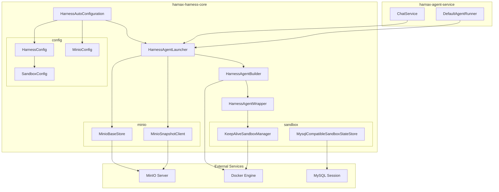
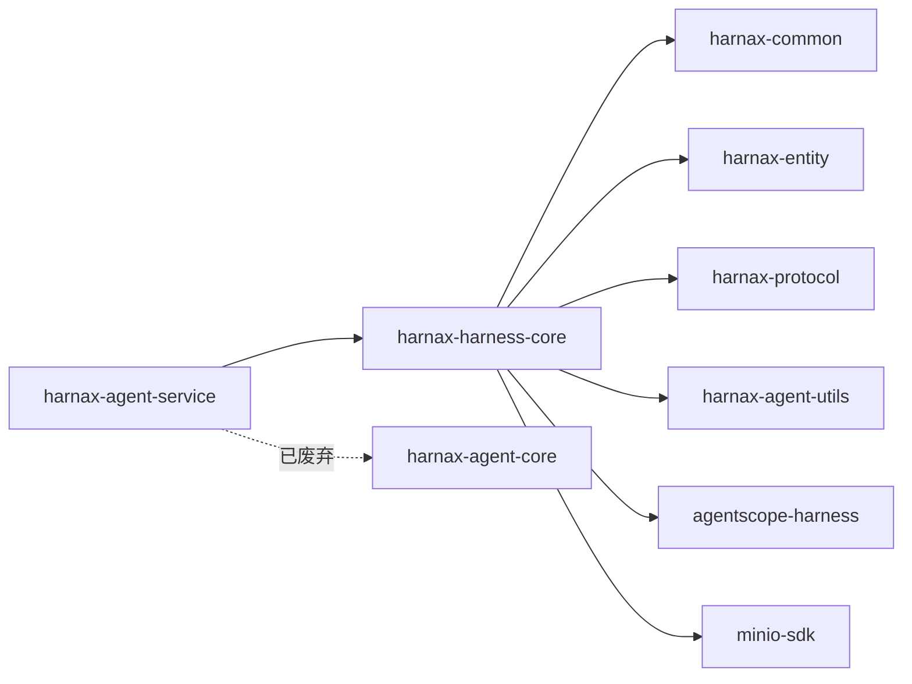
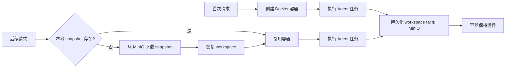

# harnax-harness-core 分布式 Agent 运行时方案

## 1. 概述

`harnax-harness-core` 是基于 `agentscope-harness` 构建的分布式 Agent 运行时模块，替代原有 `harnax-agent-core` 中的单机 Agent 执行引擎。核心目标：

- **Session 级沙箱隔离**：每个 session 自动绑定独立的 Docker 容器，确保同一 session 始终使用同一沙箱和工作空间
- **分布式文件系统**：通过 MinIO（S3 兼容）实现跨节点文件共享
- **Snapshot 自动恢复**：沙箱 workspace 自动打包为 tar 归档并发布到 MinIO，下次请求时若本地无 snapshot 则自动从 MinIO 恢复

## 2. 架构总览



## 3. 模块依赖



## 4. 核心组件

### 4.1 HarnessAgentLauncher

Agent 创建与生命周期管理的核心入口，等价于原 `AscopeAgentLauncher` 的分布式版本。

**职责：**
- 根据 `AgentSpec` + `ChatSpec` 构建 `HarnessAgentBuilder`
- 注入 ChatModel、MCP、Tools、Skills、Hooks、Plan 等配置
- 根据 `HarnessConfig` 配置沙箱（Docker）和分布式存储（MinIO）
- 提供 `createSingleAgent()` / `clearSession()` / `loadSessionMessages()` 等 API

**关键代码路径：**

```
HarnessAgentLauncher.createAgentBase()
  ├── HarnessAgentBuilder()          // 创建 builder
  ├── .model(chatModel)             // 注入 LLM
  ├── .addMcp(mcpClient)            // 注入 MCP 工具
  ├── .addTool(toolBox)             // 注入自定义工具
  ├── .addSkill(agentSkill)         // 注入技能
  ├── .addHook(hook)                // 注入钩子
  ├── .workspace(localPath)         // 设置本地工作目录
  ├── .session(session)             // 绑定分布式 Session
  ├── .filesystem(dockerSpec)       // [sandbox=true] 配置 Docker 沙箱
  ├── .sandboxDistributed(opts)     // [sandbox=true] 配置分布式沙箱选项
  ├── .filesystem(remoteFsSpec)     // [sandbox=false, minio!=null] 配置远程文件系统
  └── .build()                      // 构建 HarnessAgent
```

### 4.2 HarnessAgentBuilder

对 `HarnessAgent.Builder` 的 Kotlin fluent wrapper，暴露完整的 harness 能力集：

| 方法 | 说明 |
|------|------|
| `workspace(path)` | 设置本地工作目录 |
| `session(session)` | 绑定分布式 Session |
| `filesystem(SandboxFilesystemSpec)` | 配置 Docker 沙箱文件系统 |
| `filesystem(RemoteFilesystemSpec)` | 配置 MinIO 远程文件系统 |
| `sandboxDistributed(opts)` | 配置分布式沙箱选项 |
| `disableWorkspaceContext()` | 禁用 workspace 上下文注入 |
| `disableMemoryHooks()` | 禁用内置 memory hook |
| `disableSessionPersistence()` | 禁用 session 自动持久化 |
| `disableFilesystemTools()` | 禁用内置文件操作工具 |
| `disableShellTool()` | 禁用内置 shell 工具 |

**与 AscopeAgentBuilder 的关键差异：**
- 无 `memory()` — HarnessAgent 始终内部使用 `InMemoryMemory`
- Skills 通过 `InMemorySkillRepository` 注册，而非直接 SkillBox

### 4.3 HarnessAgentWrapper

对 `HarnessAgent` 的包装，提供与原 `ReActAgentWrapper` 兼容的流式调用 API：

```kotlin
// 文本消息
fun callStream(prompt: String, imageUrls: List<String>, options: StreamOptions): Flux<ChatEvent>

// Msg 对象（如 tool result 回传）
fun callStream(options: StreamOptions, msg: Msg?): Flux<ChatEvent>
```

**与原 ReActAgentWrapper 的差异：**
- 使用三参数 `HarnessAgent.stream(msgs, options, runtimeContext)` 重载，通过 `RuntimeContext` 传递 sessionId
- 同一 sessionId 始终绑定同一沙箱和 workspace
- 不手动调用 `sessionManager.saveSession()` — session 持久化由内置 `SessionPersistenceHook` 自动处理

## 5. 沙箱执行架构

### 5.1 沙箱模式

```mermaid
graph TB
    subgraph "Host Machine (JVM)"
        AGENT[HarnessAgent]
        TOOLS[Custom Java Tools]
        SHELL_TOOL[Shell Tool]
        FS_TOOL[Filesystem Tools]
    end

    subgraph "Docker Container (python:3.11-slim)"
        WORKSPACE[/workspace]
        SH[sh / bash]
        TAR[tar]
        FILES[skill files, workspace files]
    end

    AGENT --> TOOLS
    AGENT --> SHELL_TOOL
    AGENT --> FS_TOOL
    SHELL_TOOL -->|docker exec sh -c| SH
    FS_TOOL -->|docker exec tar| TAR
    WORKSPACE --> FILES
```

**执行边界：**

| 组件 | 执行位置 | 说明 |
|------|---------|------|
| 内置 Shell Tool | Docker 容器内 | `docker exec -w /workspace <container> sh -c <cmd>` |
| 内置 Filesystem Tools | Docker 容器内 | 通过 `tar` 进行文件读写 |
| 自定义 Java Tools (TOOL_SET) | JVM 宿主机 | Java 方法直接执行，设计特性 |
| MCP Tools | 远程 MCP Server | 通过 MCP 协议调用 |
| Skill 代码 | Docker 容器内 | Agent 将 skill 指令转化为 shell/file 操作 |

### 5.2 沙箱生命周期



### 5.3 Session 级隔离

配置 `isolationScope: SESSION` 时，每个 session 拥有独立的 Docker 容器：

- **SESSION**：每个 session 独立容器，互不干扰
- **AGENT**：同一 agent 的所有 session 共享容器
- **GLOBAL**：全局共享单个容器

## 6. MinIO 分布式存储

### 6.1 Bucket 结构

```
harnax-snapshots/           # snapshot bucket
  └── snapshots/
      ├── <sessionId-1>.tar
      ├── <sessionId-2>.tar
      └── ...

harnax-store/               # store bucket
  └── store/
      ├── agents/<agentId>/sessions/<sessionId>/MEMORY.md
      └── ...
```

### 6.2 组件

| 组件 | 接口 | 职责 |
|------|------|------|
| `MinioSnapshotClient` | `RemoteSnapshotClient` | 沙箱 workspace tar 归档的上传/下载/删除 |
| `MinioBaseStore` | `BaseStore` | 分布式 KV 存储，用于 memory 等跨节点状态 |

### 6.3 工作模式

| 场景 | sandbox=true + minio | sandbox=false + minio |
|------|---------------------|----------------------|
| 文件操作 | Docker 容器内 | MinIO RemoteFilesystem |
| Shell 执行 | Docker 容器内 | 宿主机本地执行 |
| Snapshot | MinIO RemoteSnapshotSpec | 不适用 |
| Memory 存储 | MinIO BaseStore | MinIO BaseStore |

## 7. Spring Boot 自动配置

### 7.1 配置属性

```yaml
harness:
  enable-workspace-context: true    # 注入 AGENTS.md / skills 上下文到 system prompt
  enable-memory-hooks: false        # 禁用内置 memory hook（使用 Harnax 自定义 hook）
  enable-session-persistence: true  # 启用 session 自动持久化
  minio:
    enabled: true
    endpoint: http://localhost:9000
    access-key: minioadmin
    secret-key: minioadmin
    snapshot-bucket: harnax-snapshots
    store-bucket: harnax-store
    snapshot-prefix: snapshots/
    store-prefix: store/
  sandbox:
    enabled: true
    image: python:3.11-slim
    workspace-root: /workspace
    isolation-scope: SESSION
```

### 7.2 自动配置 Bean

| Bean | 条件 | 说明 |
|------|------|------|
| `MinioClient` | `harness.minio.enabled=true` | MinIO S3 客户端 |
| `MinioConfig` | `harness.minio.enabled=true` | MinIO 配置，启动时确保 bucket 存在 |
| `HarnessConfig` | 始终 | Harness 运行时配置 |
| `HarnessAgentLauncher` | 始终 | 分布式 Agent 启动器（核心 Bean） |

### 7.3 自动配置注册

通过 Spring Boot 4.x 标准机制注册：

```
META-INF/spring/org.springframework.boot.autoconfigure.AutoConfiguration.imports
```

## 8. 已知兼容性问题

### 8.1 MysqlSession 与 SessionSandboxStateStore

**问题：** agentscope-harness 默认的 `SessionSandboxStateStore` 生成的 session key 含路径分隔符 `/`（如 `sandbox/session/<sessionId>`），而 `MysqlSession.validateSessionId()` 拒绝包含 `/` 的 ID。

**修复：** 自定义 `MysqlCompatibleSandboxStateStore`，将 `/` 替换为 `-`：

| 原始 key | 修复后 key |
|----------|-----------|
| `sandbox/session/<value>` | `sandbox-session-<value>` |
| `sandbox/user/<agentId>/<value>` | `sandbox-user-<agentId>-<value>` |
| `sandbox/agent/<agentId>` | `sandbox-agent-<agentId>` |
| `sandbox/global` | `sandbox-global` |

通过 `DockerFilesystemSpec.sandboxStateStore()` 注入自定义实现。

## 9. 文件清单

```
harnax-harness-core/src/main/kotlin/com/agnetix/harnax/
├── agent/                                    # 从 agent-core 迁移的业务类型
│   ├── AgentSpec.kt                          # Agent 规格配置
│   ├── ChatSpec.kt                           # 聊天规格 + ChatSpecBuilder
│   ├── CustomerPlanNoteStorage.kt            # 自定义 Plan 存储
│   ├── adaptor/
│   │   ├── ChatModelConfigAdaptor.kt         # 模型配置适配器接口
│   │   ├── McpConfigAdaptor.kt               # MCP 配置适配器接口
│   │   ├── PlanNoteAdaptor.kt                # Plan 适配器接口
│   │   ├── ProcessLogAdaptor.kt              # 过程日志适配器接口
│   │   ├── SkillAdaptor.kt                   # 技能加载适配器接口
│   │   ├── TokenStatAdaptor.kt               # Token 统计适配器接口
│   │   ├── ToolCallLogAdaptor.kt             # 工具调用日志适配器接口
│   │   └── token/TokenStat.kt                # Token 统计模型
│   ├── chat/
│   │   ├── MessageLog.kt                     # 消息日志模型
│   │   ├── MessageLogConverter.kt            # Msg → MessageLog 转换器
│   │   └── MsgExtractHelper.kt               # Msg 内容提取工具
│   ├── provider/
│   │   ├── ProviderConsts.kt                 # TOOL_SET / HOOK_SET 常量
│   │   ├── hook/
│   │   │   ├── ConfirmToolsHook.kt           # 工具确认钩子
│   │   │   └── ProcessLogHook.kt             # 过程日志钩子
│   │   └── tool/
│   │       ├── InterToolboxes.kt             # 内置工具箱集合
│   │       ├── ToolBox.kt                    # 工具箱抽象
│   │       └── ToolCallContext.kt             # 工具调用上下文
│   └── session/
│       ├── SessionConfig.kt                  # Session 配置（MysqlSessionConfig）
│       └── SessionLoader.kt                  # Session 加载器
└── harness/                                   # Harness 核心
    ├── HarnessAgentBuilder.kt                 # Agent 构建器（Kotlin fluent API）
    ├── HarnessAgentLauncher.kt                # Agent 启动器（核心入口）
    ├── HarnessAgentWrapper.kt                 # Agent 调用包装（流式 API）
    ├── config/
    │   ├── HarnessConfig.kt                   # Harness 全局配置
    │   ├── MinioConfig.kt                     # MinIO 连接配置
    │   └── SandboxConfig.kt                   # 沙箱配置
    ├── minio/
    │   ├── MinioBaseStore.kt                  # MinIO KV 存储（BaseStore 实现）
    │   └── MinioSnapshotClient.kt             # MinIO Snapshot 客户端
    ├── sandbox/
    │   ├── KeepAliveSandboxManager.kt         # 持久沙箱管理器
    │   └── MysqlCompatibleSandboxStateStore.kt # MySQL 兼容的沙箱状态存储
    └── spring/
        └── HarnessAutoConfiguration.kt        # Spring Boot 自动配置
```

## 10. 与原 harnax-agent-core 的对比

| 维度 | harnax-agent-core | harnax-harness-core |
|------|-------------------|---------------------|
| Agent 类型 | `ReActAgent` | `HarnessAgent` |
| Builder | `AscopeAgentBuilder` | `HarnessAgentBuilder` |
| Launcher | `AscopeAgentLauncher` | `HarnessAgentLauncher` |
| Wrapper | `ReActAgentWrapper` | `HarnessAgentWrapper` |
| Memory | 可配置（InMemoryMemory 等） | 固定 InMemoryMemory |
| Session 持久化 | 手动 SessionManager | 内置 SessionPersistenceHook |
| 沙箱 | 无 | Docker 容器（按 session 隔离） |
| 分布式存储 | 无 | MinIO（snapshot + KV store） |
| Skill 注册 | `SkillBox` | `InMemorySkillRepository` |
| Spring 集成 | 手动 @Bean | `@AutoConfiguration` |
