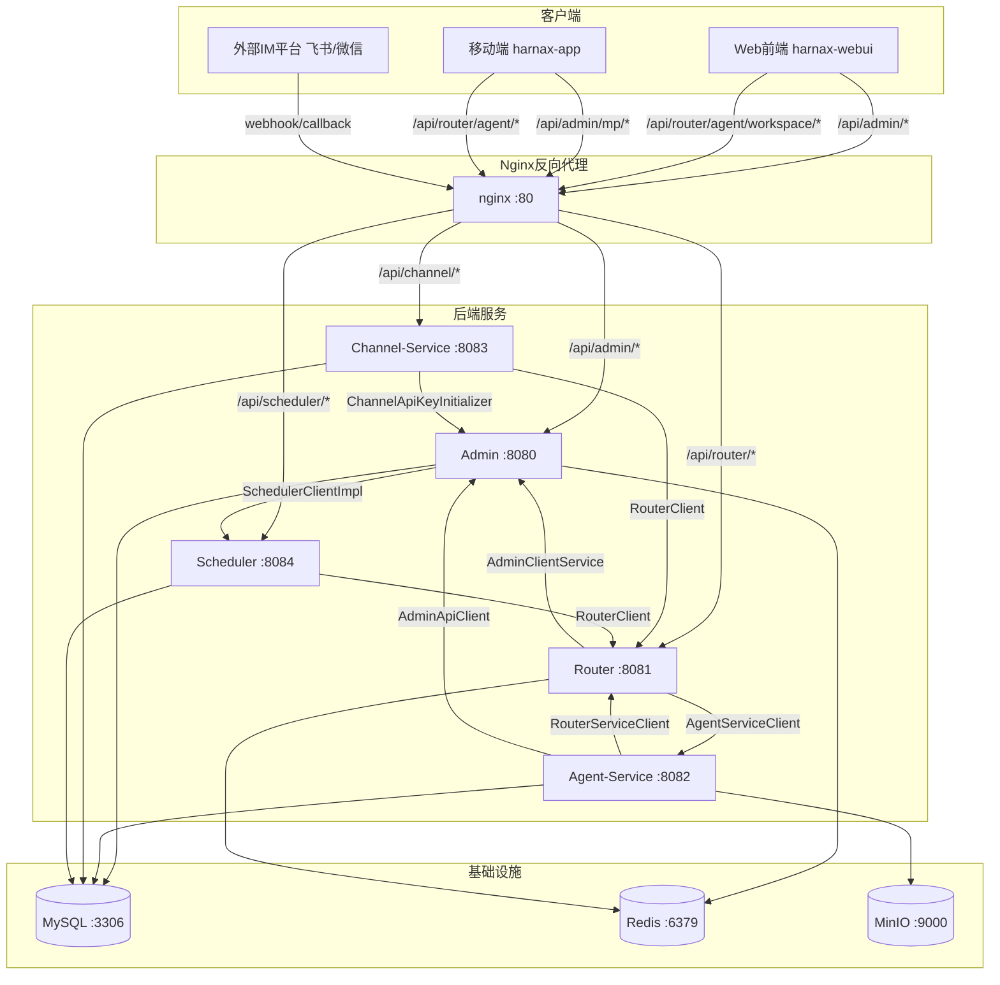

# Harnax 项目 HTTP 接口调用网络图

## 服务概览

| 服务 | 模块 | 端口 | 说明 |
|------|------|------|------|
| Nginx | 反向代理 | 80 | 统一入口，按路径前缀分发 |
| Admin | harnax-admin | 8080 | 后台管理 + 内部 API |
| Router | harnax-session-router | 8081 | 会话路由 + Agent 代理 |
| Agent-Service | harnax-agent-service | 8082 | 智能体执行引擎 |
| Channel-Service | harnax-channel-service | 8083 | 多通道消息接入 |
| Scheduler | harnax-scheduler | 8084 | 定时任务调度 |
| Frontend | harnax-webui | 80 (nginx) | Web 管理后台 |
| Mobile App | harnax-app | — | 移动端 H5 |

## 调用关系图

## 服务间调用明细

### Router → Admin

**客户端类：** `AdminClientService`（WebClient）
**认证方式：** `Authorization: Bearer <adminSecret>` 共享密钥

| 方法 | 端点 | 说明 |
|------|------|------|
| POST | `/api/admin/internal/api-keys/validate` | 验证 API Key 合法性 |
| GET | `/api/admin/internal/sessions/{sessionId}/info` | 查询 Session 关联的 Agent/Model 信息 |

---

### Router → Agent-Service

**客户端类：** `AgentServiceClient`（WebClient + RestClient）
**认证方式：** `InternalTokenProvider` HMAC Token
**特殊点：** 目标 URL 由 InstanceRegistry 动态解析

| 方法 | 端点 | 说明 |
|------|------|------|
| POST | `/api/agent/chat` | 阻塞式对话（batch） |
| POST | `/api/agent/chat/stream` | SSE 流式对话 |
| POST | `/api/agent/command` | 发送命令（clear/stop 等） |
| POST | `/api/agent/confirm` | SSE 流式确认 |
| DELETE | `/api/agent/session/{sessionId}` | 清除 Session |
| GET | `/api/agent/chat/history/{sessionId}` | 加载聊天记录 |
| GET | `/api/agent/session/{sessionId}/plans` | 加载 Plan 列表 |
| GET | `/api/agent/session/{sessionId}/current-plan` | 加载当前 Plan |
| GET | `/api/agent/workspace/{sessionId}/files` | 列出 workspace 文件 |
| GET | `/api/agent/workspace/{sessionId}/read` | 读取 workspace 文件 |
| GET | `/api/agent/workspace/status` | workspace 状态 |
| POST | `/api/agent/workspace/{sessionId}/upload` | 上传文件 |
| GET | `/api/agent/workspace/{sessionId}/download` | 下载文件 |

---

### Agent-Service → Router

**客户端类：** `RouterServiceClient`（RestTemplate）
**认证方式：** `InternalTokenProvider` HMAC Token

| 方法 | 端点 | 说明 |
|------|------|------|
| POST | `/api/router/instance/register` | 注册 Agent 实例 |
| POST | `/api/router/instance/heartbeat` | 发送心跳保活 |

---

### Agent-Service → Admin

**客户端类：** `AdminApiClient`（RestTemplate）
**认证方式：** `InternalTokenProvider` HMAC Token

| 方法 | 端点 | 说明 |
|------|------|------|
| GET | `/api/admin/internal/agent-tasks/{taskId}/spec` | 获取定时任务的 Agent 配置 |

---

### Channel-Service → Router

**客户端类：** `RouterClient`（WebClient + RestClient）
**认证方式：** `X-Api-Key` API Key

| 方法 | 端点 | 说明 |
|------|------|------|
| POST | `/api/router/agent/chat` | 阻塞式对话 |
| POST | `/api/router/agent/chat/stream` | SSE 流式对话 |
| POST | `/api/router/agent/command` | 发送命令 |

---

### Channel-Service → Admin

**客户端类：** `ChannelApiKeyInitializer`（RestClient，仅启动时调用一次）
**认证方式：** `Authorization: Bearer <adminSecret>` 共享密钥

| 方法 | 端点 | 说明 |
|------|------|------|
| POST | `/api/admin/internal/api-keys/system-key` | 自动获取系统 API Key |

---

### Admin → Scheduler

**客户端类：** `SchedulerClientImpl`（RestClient）
**认证方式：** 无（内网直连）

| 方法 | 端点 | 说明 |
|------|------|------|
| POST | `/api/scheduler/tasks/{id}/trigger` | 手动触发任务 |
| POST | `/api/scheduler/tasks/{id}/start` | 启动定时任务 |
| POST | `/api/scheduler/tasks/{id}/pause` | 暂停定时任务 |

---

### Scheduler → Router

**客户端类：** `RouterClient`（RestClient）
**认证方式：** `X-Api-Key` API Key

| 方法 | 端点 | 说明 |
|------|------|------|
| POST | `/api/router/agent/chat` | 执行定时任务对话 |
| DELETE | `/api/router/agent/session/{sessionId}` | 清理任务 Session |

---

## 客户端（前端）调用

### Web 前端 → Admin

所有 `/api/admin/*` 端点，包括 Agent/Model/Session/User/Tenant/ApiKey/Channel/MCP/Skill/AgentTask 等管理接口。

### Web 前端 → Router

| 路径前缀 | 说明 |
|----------|------|
| `/api/router/agent/workspace/*` | workspace 文件管理（列表/读取/状态/上传/下载） |

### 移动端 → Admin

| 路径前缀 | 说明 |
|----------|------|
| `/api/admin/mp/auth/*` | 登录/登出/验证码 |
| `/api/admin/mp/agents` | Agent 列表 |
| `/api/admin/mp/sessions` | Session 管理 |
| `/api/admin/mp/chat/*` | 聊天记录存取 |
| `/api/admin/mp/user/*` | 用户信息/改密 |

### 移动端 → Router

| 路径前缀 | 说明 |
|----------|------|
| `/api/router/agent/chat/stream` | SSE 流式对话 |
| `/api/router/agent/confirm` | SSE 流式确认 |
| `/api/router/agent/command` | 发送命令 |

---

## Nginx 路由规则

| location | 目标服务 | 特殊配置 |
|----------|----------|----------|
| `/api/router/agent/(chat/stream\|confirm)` | router:8081 | SSE：禁用所有缓冲，read_timeout 15min |
| `/api/router/` | router:8081 | 常规代理 |
| `/api/channel/webhook/` | channel-service:8083 | SSE：禁用缓冲，read_timeout 10min |
| `/api/channel/` | channel-service:8083 | 常规代理 |
| `/api/scheduler/` | scheduler:8084 | read_timeout 5min |
| `/api/admin/` | admin:8080 | WebSocket 支持 |
| `/ai/` | admin:8080 | SSE：禁用缓冲 |
| `/` | 静态文件 | SPA fallback |

---

## 认证方式汇总

| 方式 | 使用场景 | 说明 |
|------|----------|------|
| JWT Token | WebUI/App → Admin | 用户登录后颁发 |
| API Key (`X-Api-Key`) | Channel/Scheduler → Router，移动端 → Router | 持久化密钥，Admin 管理 |
| 共享密钥 (`Bearer <secret>`) | Router/Channel → Admin internal API | 环境变量配置的固定密钥 |
| HMAC Token (`InternalTokenProvider`) | Router ↔ Agent-Service | 基于共享密钥的动态签名 |
