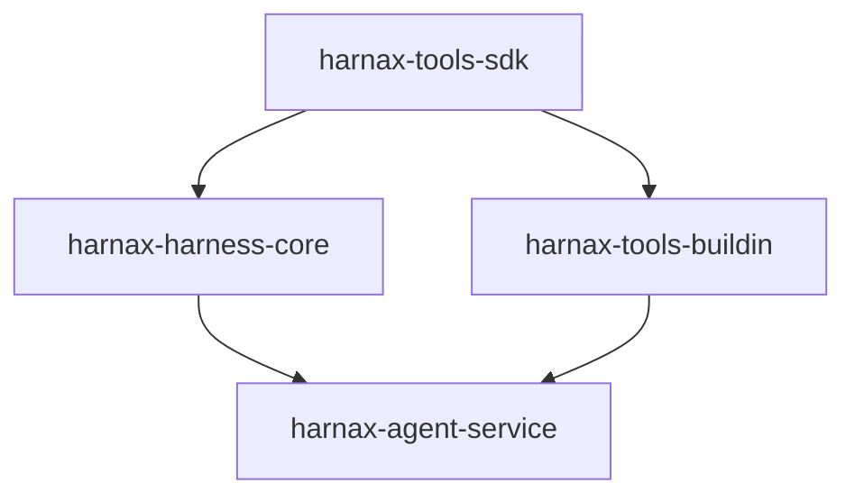

# Harnax Tools SDK 架构设计文档

## 1. 模块拆分背景与动机

在 Harnax 系统中，**工具在 admin 中配置，在 agent-service 中运行**。随着内置工具和自定义工具数量增长，将工具基础设施代码全部放在 `harnax-harness-core` 中会导致：

- 工具扩展需依赖整个 Agent 运行时，耦合过重
- 第三方开发者无法独立引用工具 SDK
- 内置工具和自定义工具没有清晰的模块边界

因此将工具相关代码拆分为独立的 SDK 模块和外部工具模块，实现**工具开发与 Agent 运行时解耦**。

## 2. 目标模块结构

```
harnax/
├── harnax-agent/                          # Agent 运行时（父 POM）
│   ├── harnax-agent-utils/                # MCP / Model 适配器工具
│   ├── harnax-tools-sdk/                  # [新建] 工具 SDK - 抽象基类 + 注册中心 + HTTP 代理
│   ├── harnax-harness-core/               # Agent 运行时核心（沙箱、会话、模型调用）
│   └── harnax-agent-service/              # Agent 推理服务（Spring Boot 应用）
├── harnax-tools-external/                 # [新建] 顶层模块 - 外部工具扩展
│   └── harnax-tools-buildin/              # [新建] 内置工具实现（TimeToolBox 等）
```

## 3. 依赖关系图



依赖方向说明：

| 模块 | 角色 | 说明 |
|---|---|---|
| `harnax-tools-sdk` | 纯 SDK | 无业务依赖，提供工具开发基础设施 |
| `harnax-harness-core` | Agent 运行时 | 依赖 SDK，提供沙箱、会话、模型调用 |
| `harnax-tools-buildin` | 内置工具 | 依赖 SDK，实现 TimeToolBox 等开箱即用的工具 |
| `harnax-agent-service` | 组装服务 | 依赖 harness-core + tools-buildin，组装完整服务 |

## 4. harnax-tools-sdk 模块说明

**Maven 坐标**：`com.agnetix:harnax-tools-sdk`
**路径**：`harnax-agent/harnax-tools-sdk/`
**基础包名**：`com.agnetix.harnax.tools.sdk`

### 核心类职责

| 类/接口 | 包路径 | 职责 |
|---|---|---|
| `ToolBox` | `sdk` | 抽象工具基类，提供 execute 模板方法、日志记录、NeedConfirmed 确认机制 |
| `NeedConfirmed` | `sdk` | 注解，标记需要用户确认的工具方法 |
| `ToolCallContext` | `sdk` | 工具调用上下文接口 |
| `SessionMetaContext` | `sdk` | 会话级上下文（agentId + sessionId） |
| `UserIdentifier` | `sdk` | 用户标识（userId） |
| `ToolSpec` | `sdk` | 工具规格数据类（toolId、toolName、skipIfMissing、needConfirm） |
| `HttpProxyToolBox` | `sdk` | HTTP 代理工具，实现 `AgentTool` 接口，将工具调用转发到 HTTP 端点 |
| `ToolRegistry` | `sdk.registry` | Spring 容器级工具注册中心，自动发现所有 `ToolBox` Bean |
| `ToolCallLogAdaptor` | `sdk.adaptor` | 工具调用日志适配器接口 |
| `ToolCallInfo` | `sdk.adaptor` | 工具调用日志数据类 |
| `ToolConfigAdaptor` | `sdk.adaptor` | 工具配置适配器接口，用于从 admin 获取工具配置 |

### SDK 依赖

- `harnax-common` — 错误码和异常类
- `harnax-entity` — AgentTool 实体
- `agentscope` — `@Tool`、`AgentTool`、`ToolCallParam`
- `spring-boot-autoconfigure` + `spring-context` — Spring 集成

## 5. harnax-tools-external 模块说明

**Maven 坐标**：`com.agnetix:harnax-tools-external`（POM 聚合模块）
**路径**：`harnax-tools-external/`

外部工具扩展的顶层容器，按工具类型划分子模块：

| 子模块 | 说明 |
|---|---|
| `harnax-tools-buildin` | 内置工具（TimeToolBox 等开箱即用的工具） |
| `harnax-tools-http`（未来） | HTTP 工具扩展 |
| `harnax-tools-custom`（未来） | 自定义工具扩展 |

## 6. harnax-tools-buildin 模块说明

**Maven 坐标**：`com.agnetix:harnax-tools-buildin`
**路径**：`harnax-tools-external/harnax-tools-buildin/`
**基础包名**：`com.agnetix.harnax.tools.builtin`

### 内置工具列表

| 工具类 | Bean 名称 | 功能 |
|---|---|---|
| `TimeToolBox` | `time-tool-box` | 获取当前日期（`getDate`）和当前时间（`getDatetime`） |

后续可扩展更多内置工具，如：
- 文件操作工具
- 计算器工具
- 网络请求工具

## 7. 工具开发指南

### 7.1 开发新的内置工具

1. 在 `harnax-tools-buildin` 中创建新类，继承 `ToolBox`：

```kotlin
package com.agnetix.harnax.tools.builtin

import com.agnetix.harnax.tools.sdk.NeedConfirmed
import com.agnetix.harnax.tools.sdk.ToolBox
import io.agentscope.core.tool.Tool
import org.springframework.stereotype.Component

@Component("my-tool-box")
class MyToolBox : ToolBox() {

    @Tool(description = "工具方法描述")
    fun myMethod(): String = execute {
        // 实现工具逻辑
        "result"
    }

    @Tool(description = "需要确认的危险操作")
    @NeedConfirmed
    fun dangerousMethod(): String = execute {
        // 危险操作，执行前需用户确认
        "done"
    }

    override fun name(): String = "my-tool-box"
}
```

2. 工具会被 `ToolRegistry` 自动发现并注册
3. 在 admin 中配置工具时，`beanName` 填写 `@Component` 的值（如 `my-tool-box`）

### 7.2 工具注册与发现机制

```
Spring 容器启动
    ↓
ToolRegistry (@PostConstruct)
    ↓ 扫描所有 ToolBox Bean
注册到内部 registry Map
    ↓
HarnessAgentLauncher 使用 toolRegistry.getToolBox(beanName)
    ↓ 根据 admin 配置中的 beanName 查找
初始化并注入到 Agent 构建器
```

### 7.3 Admin 中的工具配置

在 admin 的工具箱页面配置工具时：

- **类型**：选择 `BUILTIN`（内置）或 `HTTP`（HTTP 代理）
- **Bean Name**：对于 BUILTIN 类型，填写 Spring Bean 名称（如 `time-tool-box`）
- **需确认**：勾选后，Agent 执行该工具前会暂停等待用户确认

## 8. 迁移记录

### 从 harnax-harness-core 迁移至 harnax-tools-sdk

| 原路径 | 新路径 | 包名变更 |
|---|---|---|
| `provider/tool/ToolBox.kt` | `harnax-tools-sdk/.../sdk/ToolBox.kt` | `com.agnetix.harnax.agent.provider.tool` → `com.agnetix.harnax.tools.sdk` |
| `provider/tool/ToolRegistry.kt` | `harnax-tools-sdk/.../sdk/registry/ToolRegistry.kt` | `com.agnetix.harnax.agent.provider.tool` → `com.agnetix.harnax.tools.sdk.registry` |
| `provider/tool/HttpProxyToolBox.kt` | `harnax-tools-sdk/.../sdk/HttpProxyToolBox.kt` | `com.agnetix.harnax.agent.provider.tool` → `com.agnetix.harnax.tools.sdk` |
| `provider/tool/ToolSpec.kt` | `harnax-tools-sdk/.../sdk/ToolSpec.kt` | `com.agnetix.harnax.agent.provider.tool` → `com.agnetix.harnax.tools.sdk` |
| `provider/tool/ToolCallContext.kt` | `harnax-tools-sdk/.../sdk/ToolCallContext.kt` | `com.agnetix.harnax.agent.provider.tool` → `com.agnetix.harnax.tools.sdk` |
| `adaptor/ToolCallLogAdaptor.kt` | `harnax-tools-sdk/.../sdk/adaptor/ToolCallLogAdaptor.kt` | `com.agnetix.harnax.agent.adaptor` → `com.agnetix.harnax.tools.sdk.adaptor` |
| `adaptor/ToolConfigAdaptor.kt` | `harnax-tools-sdk/.../sdk/adaptor/ToolConfigAdaptor.kt` | `com.agnetix.harnax.agent.adaptor` → `com.agnetix.harnax.tools.sdk.adaptor` |

### 从 harnax-harness-core 迁移至 harnax-tools-buildin

| 原路径 | 新路径 | 包名变更 |
|---|---|---|
| `provider/tool/InterToolboxes.kt` (TimeToolBox) | `harnax-tools-buildin/.../builtin/TimeToolBox.kt` | `com.agnetix.harnax.agent.provider.tool` → `com.agnetix.harnax.tools.builtin` |

### 下游模块适配

- `harnax-harness-core`：pom.xml 增加 `harnax-tools-sdk` 依赖，删除迁移文件，更新 import
- `harnax-agent-service`：pom.xml 增加 `harnax-tools-buildin` 依赖，更新 import，scanBasePackages 新增 SDK 和 builtin 包
