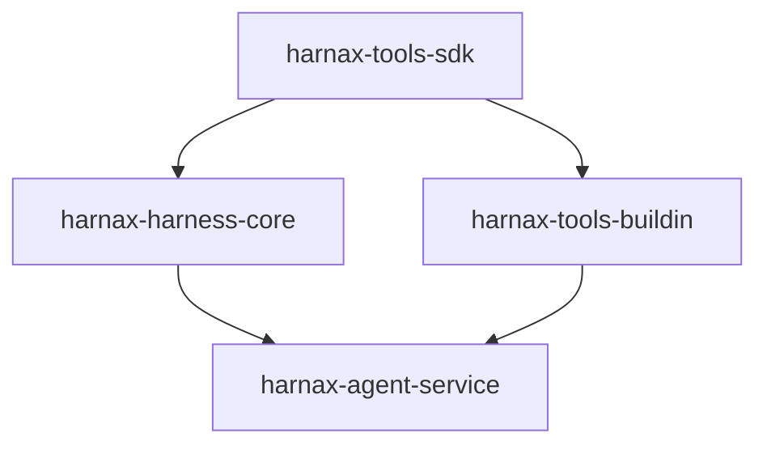

# Harnax Tools SDK 架构设计文档

## 1. 模块拆分背景与动机

在 Harnax 系统中，**工具在 admin 中配置，在 agent-service 中运行**。随着内置工具和自定义工具数量增长，将工具基础设施代码全部放在 `harnax-harness-core` 中会导致：

- 工具扩展需依赖整个 Agent 运行时，耦合过重
- 第三方开发者无法独立引用工具 SDK
- 内置工具和自定义工具没有清晰的模块边界

因此将工具相关代码拆分为独立的 SDK 模块和外部工具模块，实现**工具开发与 Agent 运行时解耦**。

## 2. 目标模块结构

```
harnax/
├── harnax-agent/                          # Agent 运行时（父 POM）
│   ├── harnax-agent-utils/                # MCP / Model 适配器工具
│   ├── harnax-tools-sdk/                  # [新建] 工具 SDK - 抽象基类 + 注册中心
│   ├── harnax-harness-core/               # Agent 运行时核心（沙箱、会话、模型调用）
│   └── harnax-agent-service/              # Agent 推理服务（Spring Boot 应用）
├── harnax-tools-external/                 # [新建] 顶层模块 - 外部工具扩展
│   └── harnax-tools-buildin/              # [新建] 内置工具实现（TimeToolBox 等）
```

## 3. 依赖关系图


```mermaid
graph TB
    A[harnax-tools-sdk] --> B[harnax-harness-core]
    B --> C[harnax-agent-service]
    A --> D[harnax-tools-buildin]
    D --> C
```

依赖方向说明：

| 模块 | 角色 | 说明 |
|---|---|---|
| `harnax-tools-sdk` | 纯 SDK | 无业务依赖，提供工具开发基础设施 |
| `harnax-harness-core` | Agent 运行时 | 依赖 SDK，提供沙箱、会话、模型调用 |
| `harnax-tools-buildin` | 内置工具 | 依赖 SDK，实现 TimeToolBox 等开箱即用的工具 |
| `harnax-agent-service` | 组装服务 | 依赖 harness-core + tools-buildin，组装完整服务 |
| `harnax-admin` | 管理面 | 依赖 SDK 与 buildin 两个模块：启动时按 `@Tool`/`@ToolMeta` 注解把工具同步进 `agent_tool` 表 |

## 4. harnax-tools-sdk 模块说明

**Maven 坐标**：`com.agnetix:harnax-tools-sdk`
**路径**：`harnax-agent/harnax-tools-sdk/`
**基础包名**：`com.agnetix.harnax.tools.sdk`

### 核心类职责

| 类/接口 | 包路径 | 职责 |
|---|---|---|
| `ToolBox` | `sdk` | 抽象工具基类，提供 execute 模板方法、日志记录，确认位由 `@ToolMeta.needConfirm` 声明 |
| `ToolMeta` | `sdk` | 方法级注解，声明展示名、环境参数定义、是否需确认、是否必须工具 |
| `ToolCallContext` | `sdk` | 工具调用上下文接口 |
| `SessionMetaContext` | `sdk` | 会话级上下文（agentId + sessionId） |
| `UserIdentifier` | `sdk` | 用户标识（userId） |
| `ToolSpec` | `sdk` | 工具规格数据类（toolId、toolName、needConfirm） |
| `ToolRegistry` | `sdk.registry` | Spring 容器级工具注册中心，自动发现所有 `ToolBox` Bean |
| `ToolCallLogAdaptor` | `sdk.adaptor` | 工具调用日志适配器接口 |
| `ToolCallInfo` | `sdk.adaptor` | 工具调用日志数据类 |
| `ToolConfigAdaptor` | `sdk.adaptor` | 工具配置适配器接口，用于从 admin 获取工具配置 |

### SDK 依赖

- `harnax-common` — 错误码和异常类
- `harnax-entity` — AgentTool 实体
- `agentscope` — `@Tool` 注解
- `spring-boot-autoconfigure` + `spring-context` — Spring 集成

## 5. harnax-tools-external 模块说明

**Maven 坐标**：`com.agnetix:harnax-tools-external`（POM 聚合模块）
**路径**：`harnax-tools-external/`

工具扩展的顶层容器，目前只有一个子模块：

| 子模块 | 说明 |
|---|---|
| `harnax-tools-buildin` | 内置工具（TimeToolBox 等开箱即用的工具） |

## 6. harnax-tools-buildin 模块说明

**Maven 坐标**：`com.agnetix:harnax-tools-buildin`
**路径**：`harnax-tools-external/harnax-tools-buildin/`
**基础包名**：`com.agnetix.harnax.tools.builtin`

### 内置工具列表

| 工具类 | Bean 名称 | 功能 |
|---|---|---|
| `TimeToolBox` | `time-tool-box` | 获取当前日期（`getDate`）和当前时间（`getDatetime`） |

后续可扩展更多内置工具，如：
- 文件操作工具
- 计算器工具
- 网络请求工具

## 7. 工具开发指南

### 7.1 开发新的内置工具

1. 在 `harnax-tools-buildin` 中创建新类，继承 `ToolBox`：

```kotlin
package com.agnetix.harnax.tools.builtin

import com.agnetix.harnax.tools.sdk.ToolBox
import com.agnetix.harnax.tools.sdk.ToolEnvContext
import com.agnetix.harnax.tools.sdk.ToolMeta
import io.agentscope.core.tool.Tool
import io.agentscope.core.tool.ToolParam
import org.springframework.stereotype.Component

@Component("my-tool-box")
class MyToolBox : ToolBox() {

    @Tool(description = "工具方法描述")
    fun myMethod(
        @ToolParam(name = "query", description = "搜索关键词")
        query: String,
        @ToolParam(name = "limit", description = "最大返回数量", required = false)
        limit: Int? = 10,
        envContext: ToolEnvContext,  // 框架自动注入，不加 @ToolParam
    ): String = execute("query" to query) {
        val apiKey = envContext.require("API_KEY")
        // 实现工具逻辑
        "result"
    }

    @Tool(description = "需要确认的危险操作")
    @ToolMeta(needConfirm = true)
    fun dangerousMethod(): String = execute {
        // 危险操作，执行前需用户确认
        "done"
    }

    override fun name(): String = "my-tool-box"
}
```

> **重要**：工具方法中所有需要 LLM 传入的参数必须加 `@ToolParam` 注解，否则不会出现在工具的 JSON Schema 中，LLM 将无法传入这些参数。
> 没有 `@ToolParam` 的参数（如 `ToolEnvContext`）会被视为框架自动注入的上下文参数。

2. 工具会被 `ToolRegistry` 自动发现并注册
3. 在 admin 中配置工具时，`beanName` 填写 `@Component` 的值（如 `my-tool-box`）

### 7.2 工具注册与发现机制

```
Spring 容器启动
    ↓
ToolRegistry (@PostConstruct)
    ↓ 扫描所有 ToolBox Bean
注册到内部 registry Map
    ↓
HarnessAgentLauncher 使用 toolRegistry.getToolBox(beanName)
    ↓ 根据 admin 配置中的 beanName 查找
初始化并注入到 Agent 构建器
```

### 7.3 Admin 中的工具配置

工具记录全部由 admin 启动时按 `@Tool`/`@ToolMeta` 注解同步写库，页面上只读展示：

- **Bean Name**：`ToolBox` 的 Spring Bean 名称（如 `time-tool-box`），来自注解同步，不需要手工填写
- **需确认**：在智能体的工具绑定上勾选后，Agent 执行该工具前会暂停等待用户确认

## 8. 工具域的代码分布与依赖

| 模块 | 包 | 内容 |
|---|---|---|
| `harnax-agent/harnax-tools-sdk` | `com.agnetix.harnax.tools.sdk`（另有 `.registry`、`.adaptor`） | 契约与注册中心：`ToolBox`、`ToolMeta`、`ToolEnvParamDef`、`ToolSpec`、`ToolCallContext`、`ToolEnvContext`、`ToolMetaDescriptor`，加 `registry/ToolRegistry`、`adaptor/ToolCallLogAdaptor`、`adaptor/ToolConfigAdaptor` |
| `harnax-tools-external/harnax-tools-buildin` | `com.agnetix.harnax.tools.builtin` | 内置实现：`TimeToolBox`、`EmailToolBox`。包名拼 `builtin`，模块与目录拼 `buildin`（`.../src/main/kotlin/com/agnetix/harnax/tools/buildin/TimeToolBox.kt:1`），两者不一致是现状，import 时以包名为准 |

注解的分工：`@Tool` 与 `@ToolParam` 来自 agentscope 框架，本域不声明；本域声明的是 `@ToolMeta`（`harnax-agent/harnax-tools-sdk/src/main/kotlin/com/agnetix/harnax/tools/sdk/ToolMeta.kt:29`）与 `@ToolEnvParamDef`（`harnax-agent/harnax-tools-sdk/src/main/kotlin/com/agnetix/harnax/tools/sdk/ToolEnvParamDef.kt:22`）。

Bean 的可见性靠组件扫描落到同一个根：`harnax-admin/src/main/kotlin/com/agnetix/harnax/admin/HarnaxAdminApplication.kt:11` 与 `harnax-agent/harnax-agent-service/src/main/kotlin/com/agnetix/harnax/agent/service/AgentServiceApplication.kt:9` 都把 `com.agnetix.harnax.tools` 列进 `scanBasePackages`，两侧因此都能实例化 `ToolBox` 子类，而不必各自再声明一遍。
