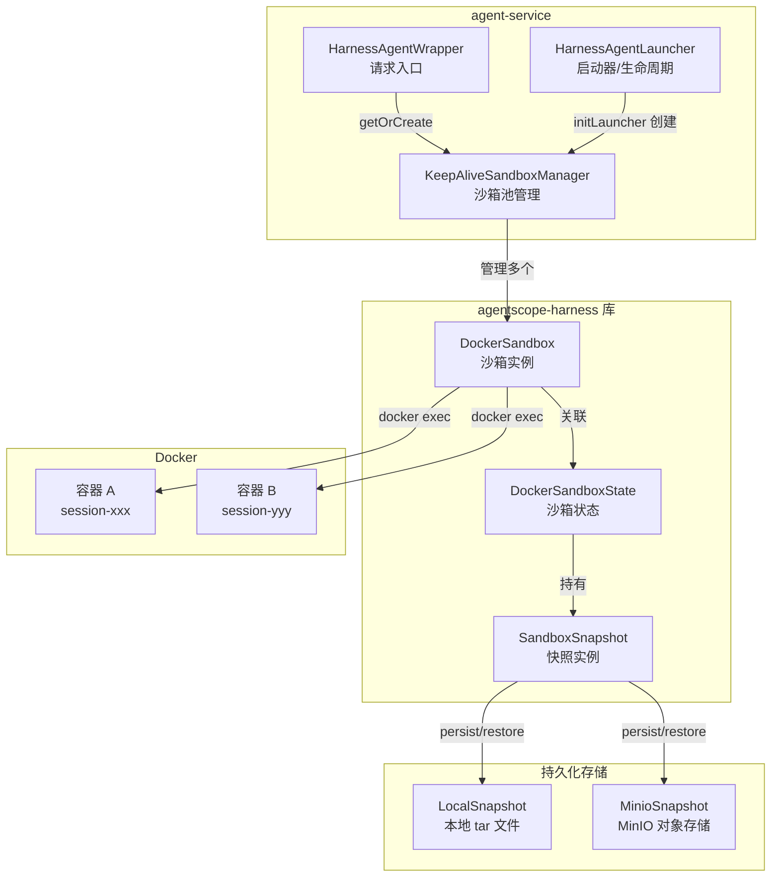
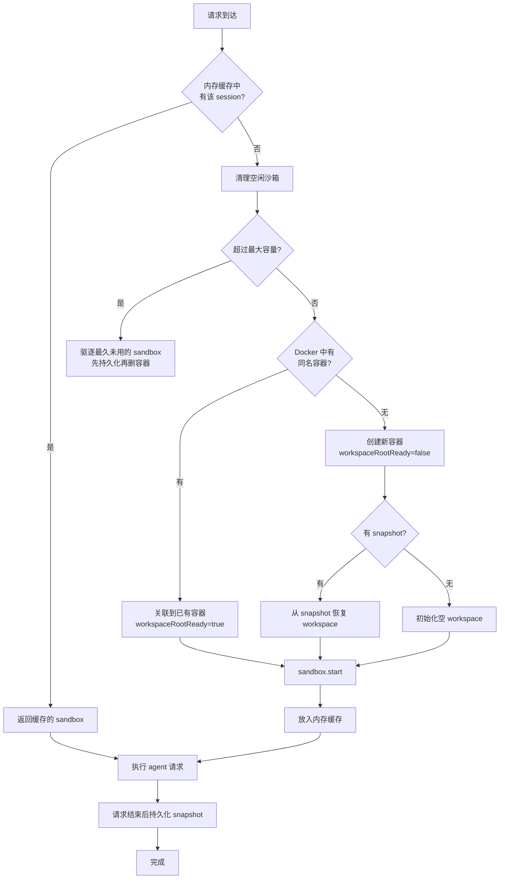
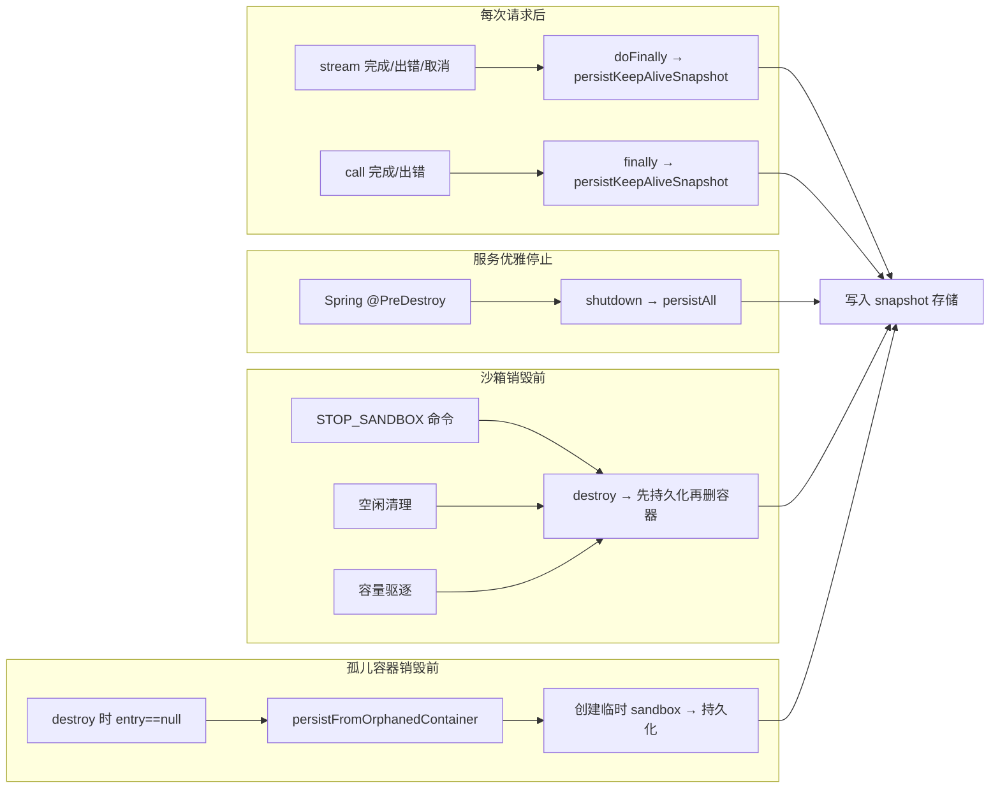
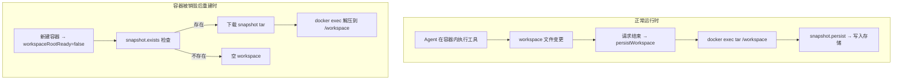
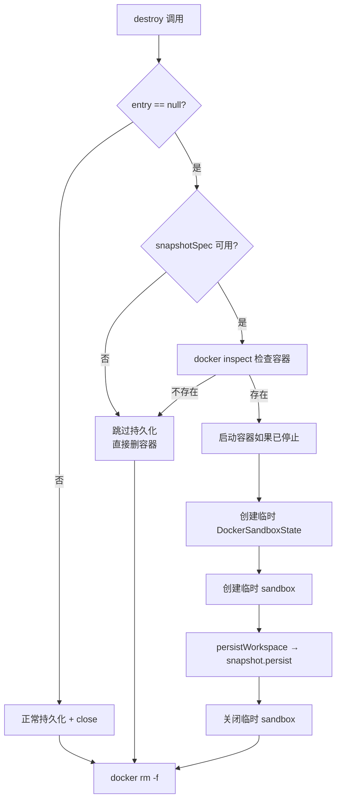
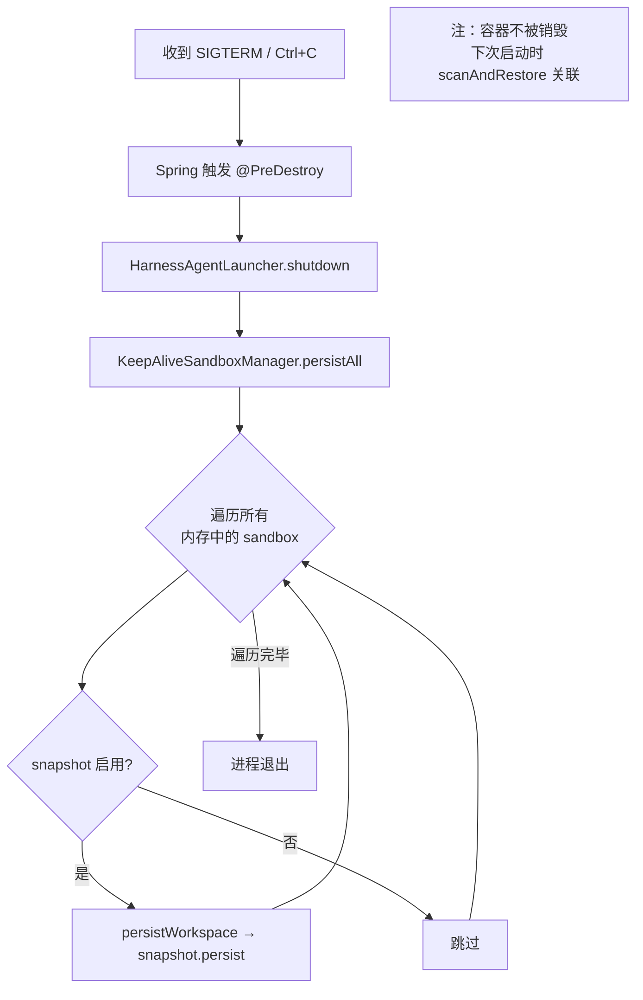

# Sandbox 与 Snapshot 机制文档

## 1. 总体架构

### 1.1 核心组件关系



### 1.2 关键设计决策

| 决策点 | 选择 | 原因 |
|--------|------|------|
| 沙箱生命周期 | Keep-Alive（容器跨请求存活） | 避免每次请求创建/销毁容器的开销 |
| 沙箱隔离粒度 | Session 级（一个 session 一个容器） | 不同会话间工作区隔离 |
| Snapshot 存储介质 | 本地文件 / MinIO（可选） | 本地开发用本地文件，生产用 MinIO |
| Snapshot 触发时机 | 每次请求后 + 优雅停止 + 销毁前 | 最大化数据持久化覆盖面 |
| 外部沙箱机制 | Priority 1 externalSandbox | agentscope 不自动 stop/shutdown，由我们管理 |

---

## 2. Sandbox 生命周期

### 2.1 完整生命周期流程



### 2.2 三种创建/关联场景

| 场景 | 触发条件 | workspaceRootReady | 是否从 snapshot 恢复 |
|------|---------|-------------------|-------------------|
| **场景 0**：缓存命中 | sandbox 在内存缓存中 | 不涉及 | 不涉及 |
| **场景 1**：新建容器 | 无缓存、无 Docker 容器 | `false` | 是（如果 snapshot 存在） |
| **场景 2**：关联已停止容器 | 无缓存、Docker 有已停止容器 | `true` | 否（容器内已有数据） |
| **场景 3**：关联运行中容器 | 无缓存、Docker 有运行中容器 | `true` | 否（容器内已有数据） |

> **关键点**：`workspaceRootReady=true` 时，agentscope 跳过 workspace 初始化（包括 snapshot 恢复），直接使用容器内已有的 `/workspace` 目录。只有 `workspaceRootReady=false`（新建容器）才会检查并恢复 snapshot。

### 2.3 容器命名规则

```
agentscope-sandbox-{sessionId}
```

由 agentscope-harness 库内部生成，`sessionId` 同时作为缓存 key 和容器名后缀。

---

## 3. Snapshot 机制

### 3.1 Snapshot 持久化时机



### 3.2 Snapshot 恢复时机

| 场景 | 恢复方式 | 说明 |
|------|---------|------|
| 新建容器（场景 1） | 从 snapshot tar 解压到 `/workspace` | `workspaceRootReady=false` 触发 |
| 关联已有容器（场景 2/3） | 不恢复，直接用容器内数据 | 容器没被删，workspace 还在 |
| 服务重启后 scanAndRestore | 同上，关联已有容器 | 容器还在运行或已停止 |

### 3.3 Snapshot 存储格式

**LocalSnapshotSpec**（MinIO 未配置时）：
```
{workspaceRoot}/snapshots/{sessionId}.tar
```
例如：`/tmp/harnax-agent/snapshots/abc-123.tar`

**RemoteSnapshotSpec**（MinIO 已配置时）：
```
s3://{bucket}/{prefix}{sessionId}.tar
```
例如：`s3://harnax-snapshots/snapshots/abc-123.tar`

> **重要**：启动时必须确保 LocalSnapshot 目录存在（`Files.createDirectories`），否则 `snapshot.persist()` 会静默失败（异常被 catch 块吞掉）。

---

## 4. Snapshot 与 Sandbox 的关系

### 4.1 数据流向



### 4.2 核心关系总结

- **Sandbox** = Docker 容器 + `/workspace` 目录 + 运行时状态
- **Snapshot** = workspace 目录的 tar 归档，存在本地或 MinIO
- **Snapshot 不是实时同步的**，它是最近一次持久化时的 workspace 快照
- **容器存活时**：workspace 数据在容器内，snapshot 是"备份"
- **容器被销毁后**：snapshot 是唯一的数据来源，下次创建容器时恢复

### 4.3 clearSession 的语义

`clearSession` **只清聊天记录**，不碰 workspace：

```
clearSession 执行流程：
1. stateStore.delete → 删除对话历史
2. planNoteAdaptor.deletePlan → 删除计划笔记
3. keepAliveSandboxManager.destroy(sessionId) → 销毁容器（先持久化 snapshot）
   → snapshot 文件保留不动
4. 下次用同一 sessionId 请求时 → 新建容器 → 从 snapshot 恢复 workspace
```

---

## 5. 边界问题处理

### 5.1 异常场景覆盖矩阵

| 异常场景 | 数据是否丢失 | 恢复机制 |
|---------|-------------|---------|
| 请求正常完成 | 否 | `doFinally`/`finally` 持久化 |
| 请求执行中出错 | 否 | `doFinally`（error 时也触发）持久化 |
| 客户端断开连接 | 否 | `doFinally`（cancel 时也触发）持久化 |
| 请求超时 | 否 | `finally`（timeout 抛异常）持久化 |
| 服务优雅停止（kill -15） | 否 | `@PreDestroy` → `persistAll` 批量持久化 |
| STOP_SANDBOX（sandbox 在内存） | 否 | `destroy` 先持久化再删容器 |
| STOP_SANDBOX（sandbox 不在内存） | 否 | `persistFromOrphanedContainer` 创建临时 sandbox 持久化 |
| 空闲清理 / 容量驱逐 | 否 | `destroy` 先持久化再删容器 |
| 服务被 kill -9 强杀 | **最后一次未完成请求的变更可能丢失** | 上次请求的 snapshot 仍在，新建容器时恢复 |
| Docker daemon 崩溃 | **未持久化的变更丢失** | 上次请求的 snapshot 仍在 |
| 服务重启后容器还在 | 否 | `scanAndRestore` 关联到已有容器，workspace 在容器内 |

### 5.2 孤儿容器处理

**场景**：服务重启后，`scanAndRestore()` 有 1 秒延迟。如果用户在这 1 秒内发送 `/stop-sandbox`，sandbox 不在内存缓存中，但 Docker 容器还存在。

**处理流程**：



### 5.3 并发安全处理

| 并发场景 | 风险 | 处理方式 |
|---------|------|---------|
| `getOrCreate` 内 `evictOldest` | `ConcurrentHashMap.compute()` 禁止在计算期间修改 map | 容量检查和驱逐移到 `compute()` 之前执行 |
| `scanAndRestore` 与 `getOrCreate` 并发 | check-then-act 竞态，可能创建重复 sandbox | `putIfAbsent` 原子操作，重复的 sandbox 关闭丢弃 |
| `attachToExisting` 与 `getOrCreate` 并发 | 同上 | 同上 |
| `persistAll` 与请求并发 | 迭代时 map 被修改 | `ConcurrentHashMap` 弱一致迭代，最多少量 sandbox 未持久化 |

### 5.4 DockerSandboxState.image 为 null 问题

agentscope 库的 `DockerSandboxState.setImage()` 在某些情况下 `getImage()` 返回 null（Kotlin/Java 互操作问题）。

**处理方式**：在新建容器场景中，设置 image 后检查 `getImage()` 返回值，如果为 null 则通过反射强制设置字段。此问题仅在新建容器时影响（关联已有容器不需要 image）。

---

## 6. 优雅停止机制



**关键点**：优雅停止只持久化 snapshot，**不销毁容器**。容器继续运行，下次服务启动时通过 `scanAndRestore` 关联到已有容器。

---

## 7. 配置说明

| 配置项 | 默认值 | 说明 |
|--------|--------|------|
| `harness.sandbox.enabled` | `false` | 是否启用 Docker 沙箱 |
| `harness.sandbox.image` | `python:3.11-slim` | 沙箱 Docker 镜像 |
| `harness.sandbox.workspace-root` | `/workspace` | 容器内工作目录 |
| `harness.sandbox.isolation-scope` | `SESSION` | 隔离粒度 |
| `harness.sandbox.keep-alive` | `false` | 是否启用 Keep-Alive 模式 |
| `harness.minio.enabled` | `false` | 是否启用 MinIO（影响 snapshot 存储介质） |
| `local.tmp-dir` | `/tmp/harnax-agent` | 本地工作目录（snapshot 存放于此） |

> **启用沙箱的最低配置**：`sandbox.enabled=true` + `sandbox.keep-alive=true` + `sandbox.image=python:3.11-slim`

---

## 8. 关键类职责

| 类 | 职责 |
|----|------|
| `KeepAliveSandboxManager` | 沙箱池管理：创建、关联、缓存、销毁、持久化、驱逐、扫描恢复 |
| `HarnessAgentWrapper` | 请求入口：构建 RuntimeContext、注入 externalSandbox、请求后持久化 |
| `HarnessAgentLauncher` | 启动器：初始化 snapshotSpec、创建 KeepAliveSandboxManager、优雅停止 |
| `HarnessAutoConfiguration` | Spring 自动配置：Bean 创建、`@Bean(destroyMethod="shutdown")` |
| `MinioSnapshotClient` | MinIO snapshot 客户端：upload/download/exists/delete |
| `DockerCommandExecutor` | Docker CLI 执行器：执行 docker 命令 |
