# Harnax Channel 模块架构文档

## 一、模块总览

harnax-channel 是 Harnax 项目的多渠道消息接入层，负责对接外部 IM 平台（微信、飞书、钉钉、企微等），将用户消息统一转换后交给 AI Agent 处理，再将 AI 回复发送回对应渠道。

### Maven 模块结构

```
harnax-channel (parent)
├── harnax-channel-sdk        # SDK 抽象层 — 定义核心接口与消息模型
├── harnax-channel-feishu     # 飞书渠道实现 — WebSocket + Webhook 双模式
├── harnax-channel-wechat     # 微信渠道实现 — 长轮询模式
└── harnax-admin              # 业务集成层 — ReActAgentAdaptor 具体实现
```

### 支持的渠道类型

| 渠道 | ChannelType | 通信模式 | 流式输出 | 输入指示 |
|------|------------|---------|---------|---------|
| 微信 | `WECHAT` | 长轮询 (getUpdates) | ❌ 不支持 | ✅ typing |
| 飞书 | `FEISHU` | WebSocket / Webhook | ❌ 不支持 | ❌ 无API |
| 企微 | `WECOM` | Webhook | ❌ 不支持 | ❌ 无API |
| 钉钉 | `DINGTALK` | Webhook | ❌ 不支持 | ❌ 无API |
| HTTP | `HTTP` | SSE | ✅ 支持 | — |

---

## 二、整体架构图

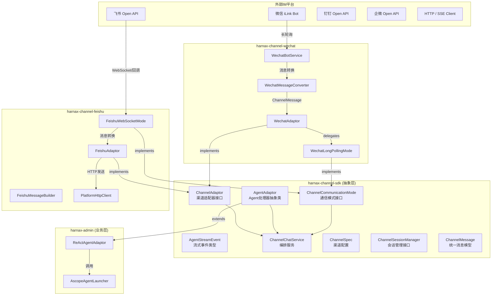

---

## 三、SDK 核心抽象层详解

### 3.1 接口关系图

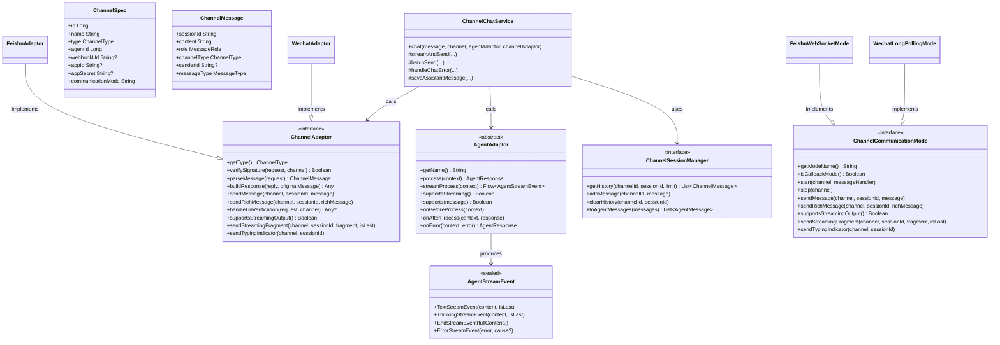

### 3.2 核心数据模型

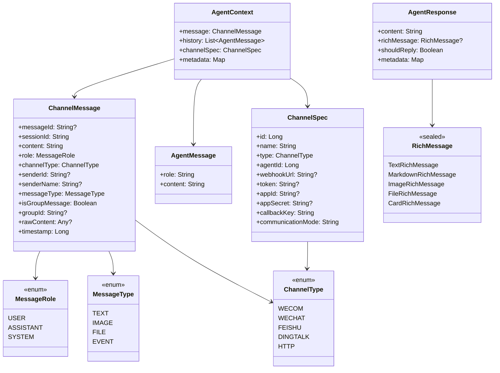

---

## 四、多渠道交互流程图

### 4.1 通用消息处理流程

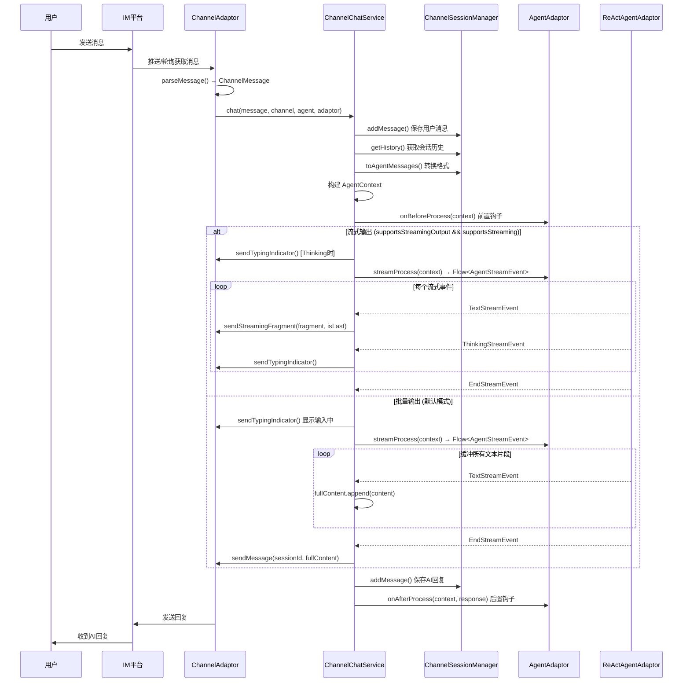

### 4.2 微信渠道（长轮询模式）交互流程

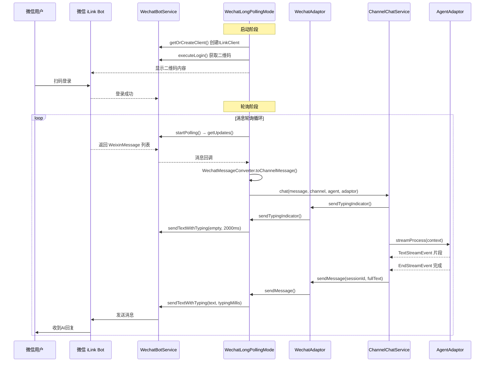

### 4.3 飞书渠道（WebSocket 模式）交互流程

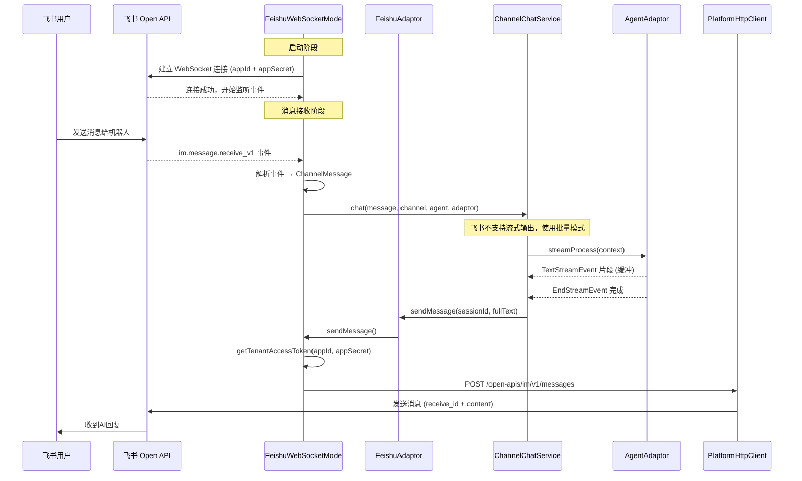

### 4.4 飞书渠道（Webhook 模式）交互流程

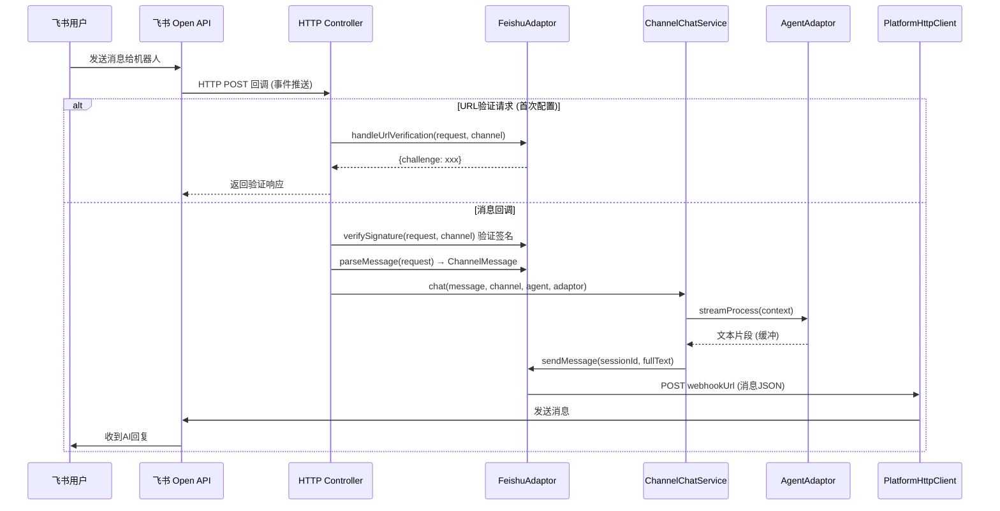

---

## 五、流式输出策略决策图

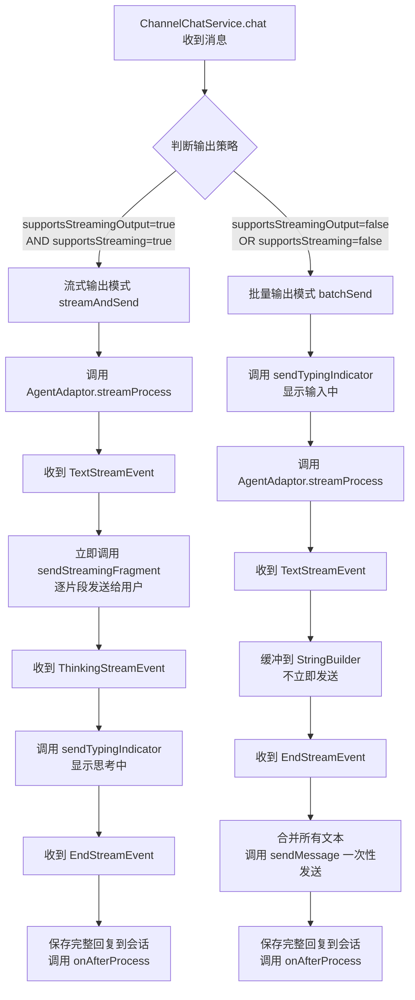

---

## 六、各渠道通信模式对比

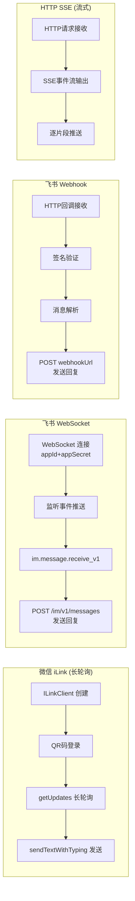

### 通信模式特性对比表

| 特性 | 微信长轮询 | 飞书 WebSocket | 飞书 Webhook | HTTP SSE |
|------|-----------|--------------|-------------|----------|
| 是否需要公网IP | ❌ 不需要 | ❌ 不需要 | ✅ 需要 | ✅ 需要 |
| 是否需要域名 | ❌ 不需要 | ❌ 不需要 | ✅ 需要 | ✅ 需要 |
| 是否需要内网穿透 | ❌ 不需要 | ❌ 不需要 | ✅ 开发时需要 | ✅ 开发时需要 |
| 签名验证方式 | ❌ 无需 | ❌ SDK自动 | ✅ HmacSHA256 | 自定义 |
| 消息获取方式 | 主动轮询 | 被动推送 | 被动回调 | 主动请求 |
| 消息发送方式 | ILinkClient | Open API | Webhook URL | SSE响应 |
| 流式输出支持 | ❌ | ❌ | ❌ | ✅ |
| 输入指示支持 | ✅ typing | ❌ | ❌ | — |
| 适用场景 | 本地开发/内网 | 本地开发/内网 | 生产环境 | Web前端 |

---

## 七、startChannelWithAgent 便捷接入流程

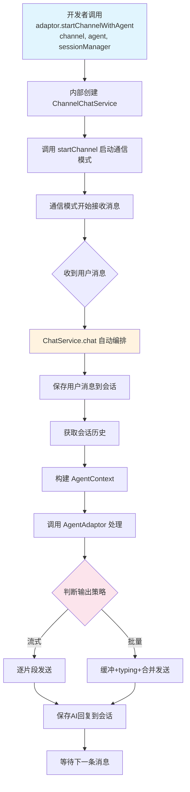

---

## 八、模块依赖关系

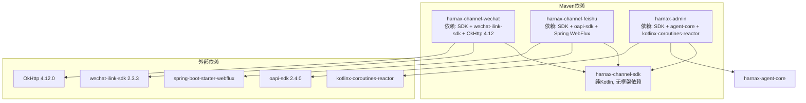

---

## 九、文件清单

### harnax-channel-sdk（抽象层）

| 包路径 | 文件 | 说明 |
|--------|------|------|
| `sdk/adaptor` | `ChannelAdaptor.kt` | 渠道适配器接口，定义统一行为契约 |
| `sdk/adaptor` | `AgentAdaptor.kt` | Agent处理器抽象类，含 process/streamProcess |
| `sdk/adaptor` | `AgentStreamEvent.kt` | 流式事件密封类（Text/Thinking/End/Error） |
| `sdk/adaptor` | `ChannelCommunicationMode.kt` | 通信模式接口（Webhook/WebSocket/长轮询） |
| `sdk/config` | `ChannelSpec.kt` | 渠道配置规格，Builder模式 |
| `sdk/config` | `ChannelType.kt` | 渠道类型枚举（WECOM/WECHAT/FEISHU/DINGTALK/HTTP） |
| `sdk/message` | `ChannelMessage.kt` | 统一消息模型，Builder模式 |
| `sdk/message` | `ChannelRequest.kt` | 平台无关请求对象（替代HttpServletRequest） |
| `sdk/message` | `RichMessage.kt` | 富消息密封类（Text/Markdown/Image/File/Card） |
| `sdk/message` | `AgentMessage.kt` | Agent消息模型（role + content） |
| `sdk/message` | `SendResult.kt` | 发送结果（Success/Failure） |
| `sdk/error` | `ChannelException.kt` | 渠道异常（SendException/NotFoundException/SignatureException） |
| `sdk/session` | `ChannelSessionManager.kt` | 会话管理接口 |
| `sdk/service` | `ChannelChatService.kt` | 核心编排服务（流式/批量策略） |

### harnax-channel-wechat（微信实现）

| 文件 | 说明 |
|------|------|
| `WechatAdaptor.kt` | ChannelAdaptor实现，含 startChannelWithAgent 便捷方法 |
| `WechatBotService.kt` | ILinkClient生命周期管理（创建/登录/轮询/发送/关闭） |
| `WechatLongPollingMode.kt` | 长轮询通信模式，含 sendTypingIndicator |
| `WechatMessageConverter.kt` | WeixinMessage → ChannelMessage 转换器 |

### harnax-channel-feishu（飞书实现）

| 文件 | 说明 |
|------|------|
| `FeishuAdaptor.kt` | ChannelAdaptor实现，含 WebSocket/Webhook 双模式 + startChannelWithAgent |
| `FeishuWebSocketMode.kt` | WebSocket长连接模式，含消息发送与事件处理 |
| `FeishuMessageBuilder.kt` | 飞书消息JSON构建器 |
| `client/PlatformHttpClient.kt` | 基于WebFlux的HTTP客户端 |
| `client/PlatformResponse.kt` | HTTP响应封装 |

### harnax-admin（业务层）

| 文件 | 说明 |
|------|------|
| `adaptor/ReActAgentAdaptor.kt` | AgentAdaptor具体实现，桥接ChatEvent → AgentStreamEvent |